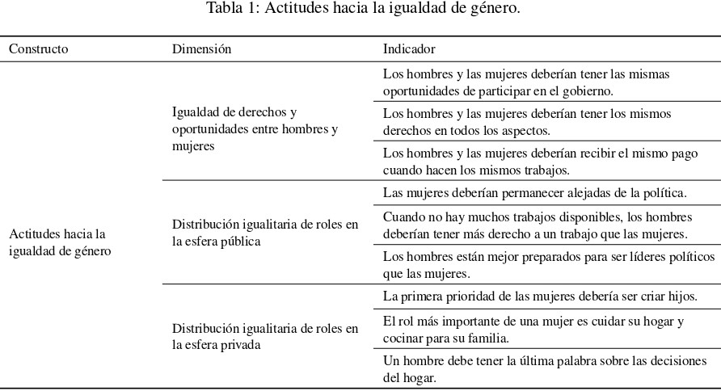
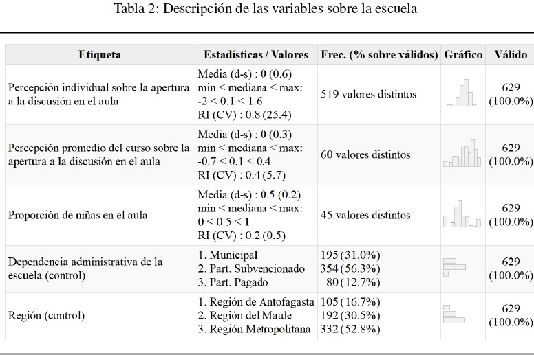
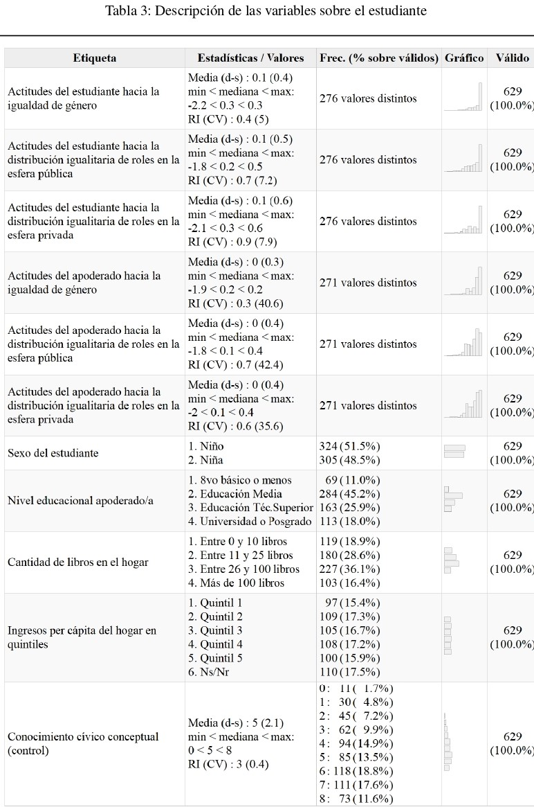
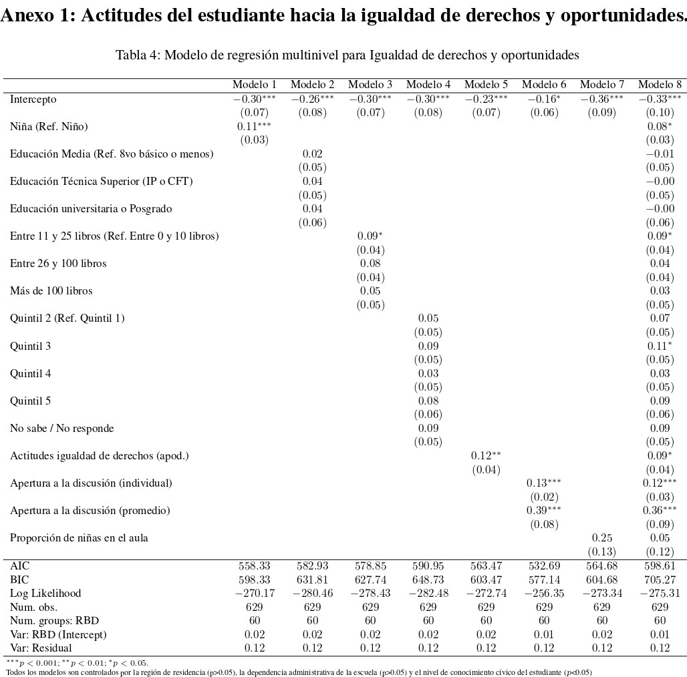
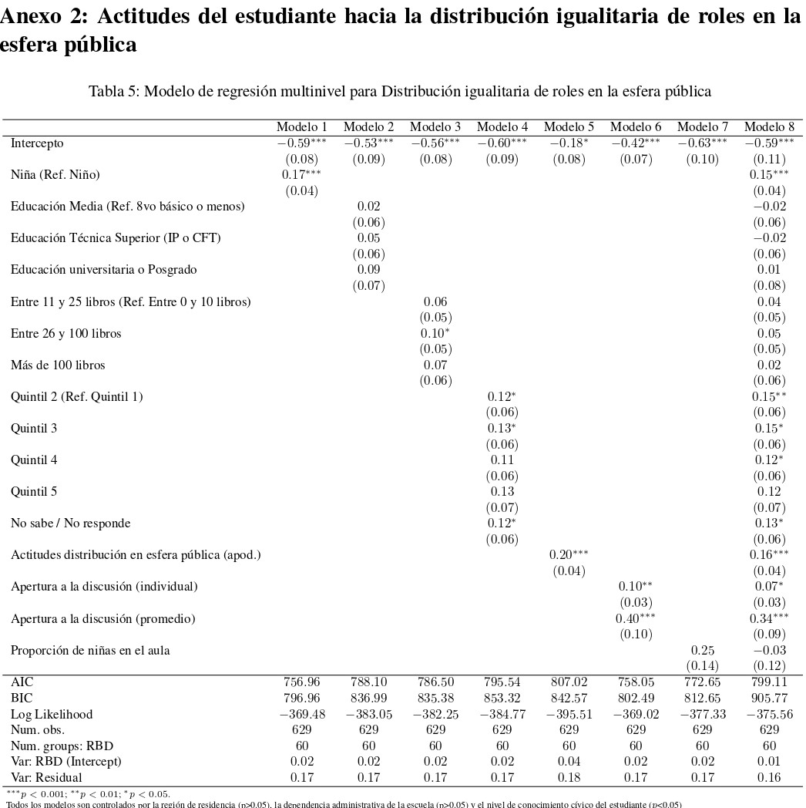
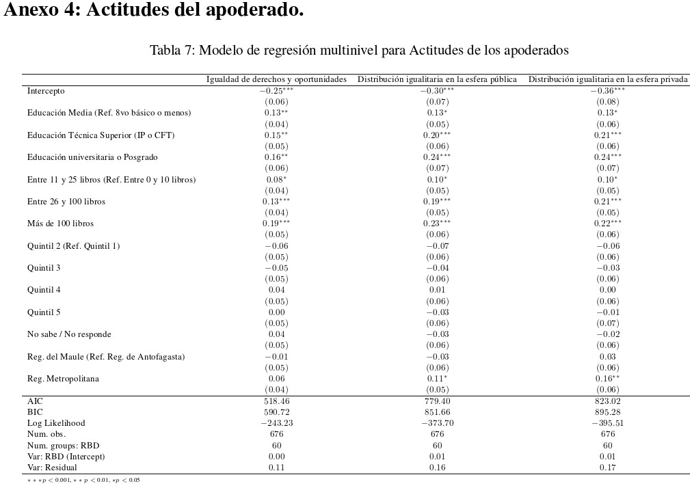
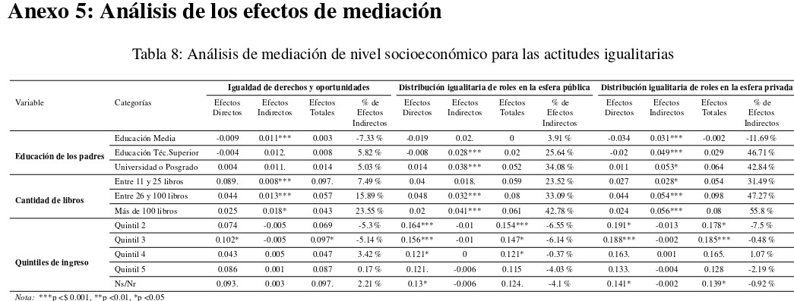

```{r setup, echo=FALSE}
knitr::opts_chunk$set(
	error = TRUE,
	message = FALSE,
	warning = FALSE
)
```

# Actitudes hacia la igualdad de género: relevancia y antecedentes teórico-empíricos

Actualmente existe un amplio esfuerzo por promover desde edades tempranas el reconocimiento activo de la igualdad de derechos entre hombres y mujeres [@unesco_Declaracion_1995] como un principio básico de la democracia. La importancia de la igualdad traspasa los ámbitos puramente éticos, encontrándose íntimamente relacionada con las posibilidades de desarrollo social y económico de los países [@onu_IGUALDAD_2016; @pnud_Desiguales_2017], con el sentimiento de plenitud y valía de las personas [@onu_IGUALDAD_2016] y con la vida democrática, la convivencia y la cohesión social en general [@pnud_Desiguales_2017]. A pesar de ello, persisten amplias desigualdades entre hombres y mujeres, siendo esto particularmente relevante en sociedades latinoamericanas y caribeñas que aún enfrentan grandes desafíos en términos de desigualdades sociales, políticas y económicas [@barcena_matriz_2016]. 

En este contexto, comprender la forma en que las creencias o actitudes hacia la igualdad de género son socializadas es un tópico que no ha recibido suficiente atención, particularmente en contextos como el chileno. La presente investigación busca aportar en la comprensión de los factores que influyen en el desarrollo de actitudes hacia la igualdad de género en jóvenes en edad escolar, indagando principalmente en el rol que cumplen dos agentes de socialización: la familia y la escuela.

Por un lado, el rol de la familia como agente de socialización política ha sido analizado a partir de dos teorías. La primera se relaciona con la importancia de los recursos socioeconómicos, evidenciándose que estudiantes con más recursos tienen actitudes más positivas hacia la igualdad de género [@miranda_Political_2018; @dottisani_Best_2017]. La segunda tiene que ver con la transmisión intergeneracional de actitudes de apoderados a hijos, constatándose que las actitudes de apoderados hacia la igualdad de género en la esfera pública se relacionan a las de sus hijos [@spierings_Gender_2015].

Por otro lado, se ha destacado el rol de la educación en el fomento del reconocimiento activo de los derechos universales debido a que puede contribuir a formar actitudes vitalicias [@unesco_Declaracion_1995b]. Estudios previos han evidenciado que la apertura a la discusión en el aula se asocia con las actitudes hacia la igualdad de género [@schulz_Students_2018a]. Asimismo, se ha constatado que la proporción de inmigrantes en el aula aumenta el apoyo hacia la igualdad de derechos para inmigrantes [@isac_Native_2012a], por lo que se espera que la proporción de niñas en el aula se relacionará con las actitudes hacia la igualdad de género.

En referencia a investigaciones anteriores, este estudio aportará antecedentes en dos direcciones. En primer lugar, se aúnan distintos enfoques utilizados sobre las actitudes hacia la igualdad de género, incorporando en la medición de estas actitudes tanto elementos relativos a la igualdad de derechos y oportunidades entre hombres y mujeres, como indicadores orientados a la distribución de roles en las esferas pública y privada. En segundo lugar, se pretende aportar antecedentes sobre el posible rol mitigador de la escuela en la transmisión intergeneracional, que no ha sido abordado en los estudios revisados, evaluando si algunas características de la escuela permiten moderar la relación entre los recursos socioeconómicos y las actitudes del estudiante, y la relación entre las actitudes de los apoderados y las de sus hijos.

# Metodología

Se utilizaron datos del estudio PACES 2019, producidos por el Fondecyt n°1181239, que cuenta con una muestra de estudiantes de segundo medio y sus apoderados de tres regiones chilenas: Antofagasta, Metropolitana y Maule. Los análisis se realizaron con 629 casos de 60 escuelas. Dada la estructura jerárquica de los datos se estimaron regresiones multinivel. Las hipótesis y el plan de análisis fueron pre-registrados en la plataforma OSF, puede acceder al documento en [este enlace](https://osf.io/jg6ub).

La operacionalización de las variables principales del estudio se muestra en la Tabla 1. Se estimaron puntuaciones factoriales para generar las variables con las que se trabajó. Las respuestas de los estudiantes a las tres dimensiones corresponden a las tres variables dependientes. 



# Análisis
En las tablas 2 y 3 se presenta un análisis descriptivo de las variables utilizadas en los análisis posteriores, con el objetivo de transparentar la distribución de los datos.





Los distintos análisis realizados se encuentran como anexos en el documento. 

Los principales resultados de esta investigación permiten avanzar en la comprensión del rol preponderante que posee la transmisión intergeneracional de las actitudes hacia la igualdad de género entre padres e hijos dentro del proceso de socialización familiar. Estos resultados demuestran que existe una consistencia actitudinal, que se transmite dentro de la familia, para las tres dimensiones de la igualdad de género analizadas.

A diferencia de investigaciones anteriores, el efecto de los recursos socioeconómicos de la familia sobre las actitudes de los jóvenes es principalmente indirecto, al estar mediado por las actitudes de los apoderados. Por lo tanto, sigue siendo la transmisión intergeneracional de actitudes la que influye de manera decisiva sobre las actitudes de los estudiantes. 

Adicionalmente, se destaca la relevancia del género, el nivel de conocimiento cívico y la apertura a la discusión en el aula de clases (tanto la percepción individual como grupal), demostrando la importancia de la escuela como un agente de socialización.

# Conclusión

De esta forma, se puede evidenciar que, aunque ambos agentes de socialización muestran un rol relevante en el desarrollo de las actitudes de los estudiantes, es el efecto de la familia el que predomina. Además, la escuela no interviene en lo que ocurre familiarmente. En ese sentido, la formación de actitudes igualitarias depende más de las condiciones de origen, que de lo que ocurre en un espacio más transversal como la escuela. Como tal, se hace necesario generar mecanismos dentro de la escuela que logren mitigar efectivamente la transmisión intergeneracional de actitudes, ya que de ello depende formar ciudadanos con una opinión favorable a la promoción y garantía de los derechos de todas las personas. Así, al formar ciudadanos con una opinión favorable hacia la igualdad de género se avanzará también en la construcción de sociedades más democráticas, tolerantes y cohesionadas.

\newpage



\newpage



\newpage


\newpage



\newpage



\newpage


# Referencias bibliográficas
