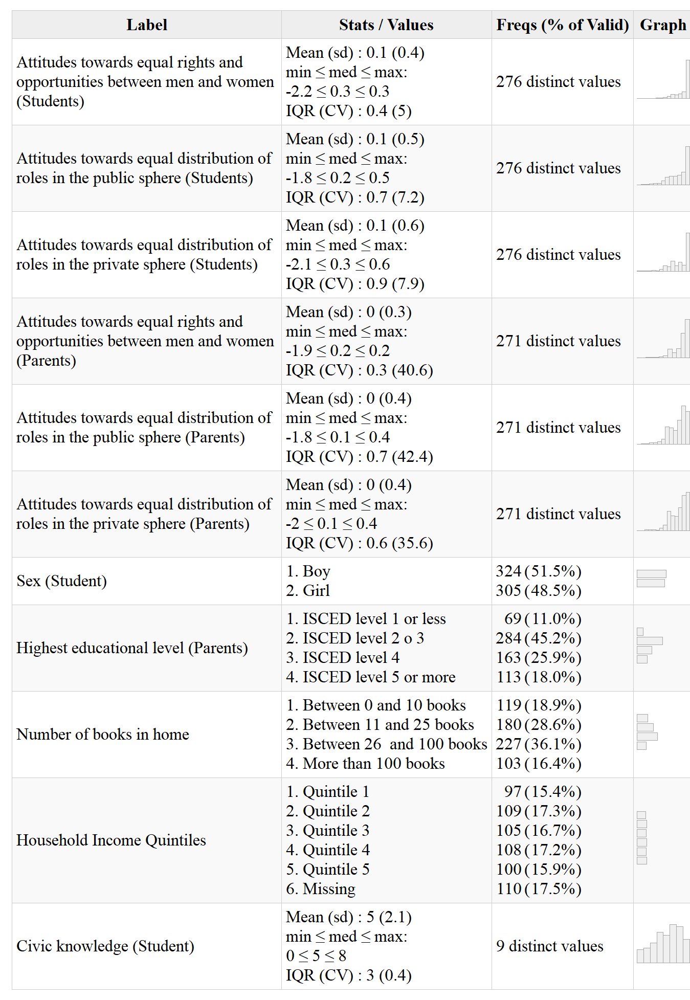
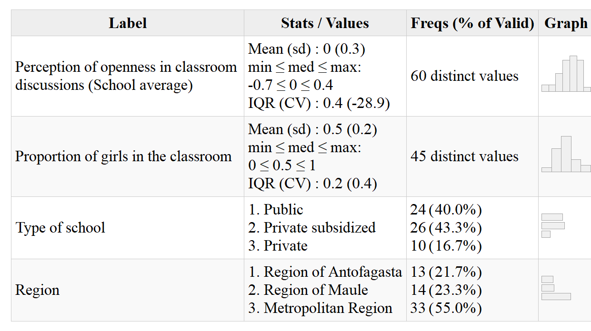

```{r setup, echo=FALSE}
knitr::opts_chunk$set(
	error = TRUE,
	message = FALSE,
	warning = FALSE
)
```


# Introducción
En la actualidad existe una amplio esfuerzo en el mundo por promover desde edades tempranas el reconocimiento activo de los derechos y libertades fundamentales entre hombres y mujeres [@unesco_Declaracion_1995]  como un principio básico de la democracia A pesar de ello persisten amplias desigualdades entre hombres y mujeres, siendo esto particularmente relevante en sociedades latinoamericanas y caribeñas que aún enfrentan grandes desafíos en términos de desigualdades sociales, políticas y económicas que afectan principalmente a grupos tradicionalmente desfavorecidos, como las mujeres [@barcena_matriz_2016]. En ese contexto, comprender la forma en que las creencias o actitudes hacia la igualdad de género son socializadas es un tópico que no ha recibido suficiente atención, párticularmente en contextos como el chileno. Así, la presente investigación busca aportar a la comprensión de los factores que influyen en el desarrollo de actitudes hacia la igualdad de género en jóvenes en edad escolar, indagando principalmente en el rol que cumplen dos agentes de socialización: la familia y la escuela.

A pesar de los esfuerzos de promoción de igualdad de género, amplia evidencia muestra que las desigualdades se sostienen en diversos espacios de la vida pública y privada. [Datos sobre la persistencia de la desigualdad en diferentes espacios: representación política, participación laboral en altos cargos, diferencias de ingreso, distribución de tareas del hogar, brechas eductivas STEM, persistencia de actitudes sexistas en la población]. Estas brechas existentes en diversos ambitos presentan ciertas dispariades. En algunos hay mayor grado de avance en acortar las brechas, como se desprende de las inciativas orientadas a normar igual remuneración ante iguales funciones (citas); mientras que en otros se observan menores avances, como es el caso de violencia de género o distribución de las tareas de cuidado (citas). Por lo tanto, resulta relevante distiniguir entre los diferentes ambitos al indagar la socialización de las actitudes en cuestión. 
[Diferencias individuales]
[Rol de la familia: la familia como agente socializador en general (modelamiento - Bandura, Transmisión normativa - Durkheim; consistencia actitudinal como modelamiento, rol de los recursos]
[Rol de la escuela: transmisión normativa, rientación explícita curricular, escuela como contexto]
[Este estudio: combina diferentes aspectos de la familia y la escuela como agentes de socialización de actitudes hacia la igauldad de género en diversos ambitos (público-privado). Destacar aquello que puede ser considerado novedoso - avance en conocimiento - por ejemplo, evaluar dos agentes relevantes de manera simulatanea, combina dos modelos explicativos (recursos y prácticas de socialización), etc.]
[Objetivos]
Dentro del área de investigación sobre el proceso de socialización de actitudes de jóvenes estudiantes se ha indagado extensamente en las características individuales asociadas con actitudes más positivas hacia la igualdad de derechos. En este sentido, se ha destacado que mujeres y quienes tienen un mayor conocimiento cívico poseen actitudes más positivas hacia la igualdad de género [ej. @sampermans_Teachers_2018a; @schulz_Students_2018a] y hacia la igualdad de derechos en general [ej. @torney-purta_How_2008a; @miranda_Political_2018].
 
Asimismo, al indagar en el rol que juega la escuela y la familia como agentes de socialización, se han encontrado múltiples estudios que abordan las características de la escuela que influyen en la socialización política de las actitudes de los estudiantes [ej. @isac_Native_2012a; @schulz_Students_2018a; @maurissen_Classroom_2020] y, pese a ser más escasa la literatura al respecto, también es posible encontrar una serie de estudios que abordan el rol de la socialización política familiar.. En este último ámbito la investigación se ha enfocado en la transmisión intergeneracional de la desigualdad política [@miranda_Political_2018; @villalobos_School_2018a; @isac_Native_2012a], y en la transmisión intergeneracional de actitudes, tanto actitudes tolerantes y/o prejuiciosas [@meeusen_ParentChild_2015; @miklikowska_parent_2016; @miklikowska_Development_2017], como actitudes hacia la igualdad de género [@spierings_Gender_2015; @cunningham_Influence_2001].

Más específicamente, hasta ahora el estudio del rol de la familia y la escuela como agentes de socialización política ha abarcado distintos aspectos. Por un lado, en relación con el rol de la escuela se ha evidenciado la relevancia de la apertura a la discusión en el aula [@schulz_Students_2018a; @trevino_Influence_2017b], el clima escolar [@maurissen_Classroom_2020; @sampermans_Teachers_2018a], la confianza en el valor de la participación de los estudiantes en la escuela (es decir, la confianza de los estudiantes en que su participación en la escuela puede influir en su organización) [@torney-purta_How_2008a; @degroof_Influence_2008a] y las características de los compañeros que comparten en el aula, en términos de la proporción de estudiantes inmigrantes [@isac_Native_2012a; @miklikowska_Driven_2019], y en relación con las actitudes y prejuicios de los compañeros [@miklikowska_Development_2017; @miklikowska_Driven_2019]. 
Por otro lado, la literatura sobre la transmisión intergeneracional de las actitudes tolerantes se ha aproximado al fenómeno de dos formas distintas. Mientras algunas investigaciones analizan la importancia de las características de la familia a partir del reporte de los estudiantes, otros estudios la analizan a partir de las respuestas de los apoderados. El primer grupo de investigaciones ha generado evidencias sobre la transmisión intergeneracional de la desigualdad política, destacando el efecto de los recursos socioeconómicos de la familia en las actitudes tolerantes de los estudiantes [@miranda_Political_2018; @isac_Native_2012a]. El segundo grupo de estudios ha abordado la transmisión intergeneracional de las actitudes, constatando que las actitudes tolerantes y/o intolerantes de los padres se asocian con las de sus hijos. La mayoría de los artículos relativos a esta asociación refieren a actitudes intolerantes hacia inmigrantes [@meeusen_ParentChild_2015; @miklikowska_parent_2016], homosexuales, musulmanes y prejuicios sexistas [@meeusen_ParentChild_2015], actitudes antiinmigrantes [@miklikowska_Development_2017; @miklikowska_Driven_2019] y actitudes hacia los inmigrantes en términos generales [@miklikowska_parent_2016]. Mientras que, en menor medida,  existen algunas investigaciones en esta área que han constatado esta asociación en las actitudes hacia la igualdad de género en la esfera pública [@spierings_Gender_2015] y privada [@cunningham_Influence_2001]. 
Adicionalmente, es relevante destacar que se han generado evidencias sobre el efecto moderador de la composición del aula de clases en la relación entre los prejuicios de los padres hacia inmigrantes y los prejuicios de su hijo, mostrando que este efecto es menos pronunciado entre los estudiantes pertenecientes a aulas donde hay una mayor proporción de estudiantes inmigrantes [@miklikowska_Driven_2019]. Sin embargo, esta asociación no ha sido analizada en relación con las actitudes hacia la igualdad de género.

La presente investigación pretende aportar a las líneas de estudio referentes a la influencia de la familia y la escuela en la socialización de actitudes tolerantes y prejuiciosas, analizando la relación entre las actitudes de los apoderados hacia la igualdad de género y las actitudes de sus hijos hacia la igualdad de género. En referencia a investigaciones anteriores, este estudio aportará nuevos antecedentes en dos direcciones. En primer lugar, se pretende aunar los distintos enfoques utilizados en estudios previos sobre las actitudes hacia la igualdad de género, incorporando en la medición de estas actitudes tanto elementos relativos a la igualdad de derechos y oportunidades entre hombres y mujeres, así como indicadores orientados a comprender las actitudes de los jóvenes hacia la distribución de roles de género en las esferas pública y privada. De este modo se busca aportar con antecedentes sobre la transmisión intergeneracional de las actitudes hacia la igualdad de género abordando distintas dimensiones del constructo a la vez. En segundo lugar, este estudio pretende aportar antecedentes sobre el posible rol mitigador de la escuela en la transmisión intergeneracional de actitudes hacia la igualdad de género, cuestión que no ha sido abordada en los estudios revisados, evaluando si algunas características de la escuela permiten moderar la relación entre los recursos socioeconómicos de la familia y las actitudes de los estudiantes, y la relación entre las actitudes de los apoderados y las actitudes de sus hijos.

Los principales objetivos de esta investigación son: a) evaluar en qué medida los recursos de la familia se relacionan con las actitudes hacia la igualdad de género de los jóvenes y de los apoderados; b) evaluar en qué medida las actitudes de los apoderados hacia la igualdad de género se relacionan con las actitudes de sus hijos hacia la igualdad de género; c) evaluar en qué medida características de la escuela a la que asiste el estudiante (más precisamente, la proporción de niñas y la apertura a la discusión en el aula) se relacionan con sus actitudes hacia la igualdad de género; y finalmente, d) evaluar el rol de estas características de la escuela dentro del proceso de socialización como posibles mitigadores de la trasmisión intergeneracional. 

# Actitudes hacia la igualdad de género en jóvenes estudiantes chilenos
La igualdad de género se concreta tanto en el espacio privado como en el espacio público y, “en la medida en que se requiere de un reconocimiento social y de la existencia de ciertas condiciones para su concreción en todos los ámbitos de la vida de las mujeres, constituye un pacto social” [@cepal_Planes_2017, p. 12]. Así, se ha avanzado en la concreción de políticas que establezcan condiciones y oportunidades igualitarias, pero se mantienen problemas para asegurar una correcta incorporación de las mujeres al mundo público y su no discriminación, ya que las mujeres acceden a la esfera pública sin dejar sus responsabilidades en el ámbito privado [@cepal_Planes_2017].

Dicho lo anterior, la familia es el primer régimen político en que se transmiten normas relativas a los roles de género que deberían tener hombres y mujeres en la sociedad [@mayer_Gendered_2004]. Estos roles pueden ser definidos como todas las expectativas y creencias en torno a la conducta  de  hombres y mujeres en las esfera pública y privada [@dottisani_Best_2017,, lo cual se traduce en situaciones de desigualdad que favorecen la discriminación, especialmente para las mujeres [azorinabellan_Actitudes_2017]. Por este motivo, la igualdad de género busca  contextos de acuerdo social y condiciones para el ejercicio de los derechos en todos los ámbitos de la vida social, ya que “la falta de garantía de derechos en algún área de la vida de las mujeres incide negativamente en su autonomía como un todo” [@cepal_Planes_2017, p. 12].

El estudio de las actitudes hacia la igualdad de género ha sido abordado desde distintas perspectivas teóricas, por lo que la evidencia empírica sobre esta temática ha operacionalizado este constructo enfocándose en distintos aspectos. Algunos estudios han comprendido las actitudes hacia la igualdad de género como las actitudes hacia la igualdad de derechos y oportunidades entre hombres y mujeres [@miranda_Political_2018; @dottisani_Best_2017; @sampermans_Teachers_2018a], otras investigaciones han abordado la problemática poniendo el énfasis en las actitudes sexistas y en los estereotipos de género [ej. @azorinabellan_Actitudes_2017; @gutierrez_Heroes_2020; @solbes-canales_Socialization_2020], mientras que otros estudios se han enfocado en la distribución de roles de género en las esferas pública y privada [@kaufman_Enduring_2017; @sapiro_Gender_2001; @yu_Decomposing_2013]. Como se enunció anteriormente, en esta investigación se ha intentado aunar los distintos enfoques, incorporando en la medición de las actitudes hacia la igualdad de género tanto elementos relativos a la igualdad de derechos y oportunidades entre hombres y mujeres, como indicadores orientados a comprender las actitudes de los jóvenes en relación con la distribución de roles en las esferas pública y privada. Para ello, se han distinguido tres dimensiones: (1) igualdad de derechos y oportunidades entre hombres y mujeres; (2) distribución igualitaria de roles en la esfera pública; y (3) distribución igualitaria de roles en la esfera privada. Las dos últimas dimensiones incorporan elementos que en otras investigaciones se han abordado como actitudes sexistas y/o estereotipos de género, pero diferenciándolos entre las esferas pública y privada. 

Diversos autores han indagado en los factores que inciden en las actitudes hacia la igualdad de género en la población adulta. Se ha evidenciado que  características individuales como el género, la edad, el nivel educacional y el estatus ocupacional son factores que inciden en estas actitudes [ @kyoore_Educational_2019; @charles_Gender_2020a], . Mientras que otro conjunto de investigaciones ha puesto el énfasis en analizar las actitudes hacia la igualdad de género entre los jóvenes, principalmente estudiantes, en relación con sus características individuales y los procesos de socialización política que influyen en sus actitudes hacia distintos grupos sociales tradicionalmente desfavorecidos en general [@miranda_Political_2018] y hacia la igualdad de género en particular [@sampermans_Teachers_2018a; @azorinabellan_Actitudes_2017; @dottisani_Best_2017]. El presente estudio es parte de este segundo conjunto de investigaciones que aborda las actitudes de jóvenes estudiantes, por lo que en este apartado se profundizará en estos antecedentes.

Las principales características individuales de los estudiantes que han sido indagadas en la literatura previa y que se asocian con sus actitudes tolerantes son el nivel de conocimiento cívico y el género. En primer lugar, diversas investigaciones han evidenciado que existe una asociación positiva entre el nivel de conocimiento cívico y las actitudes de los estudiantes hacia la igualdad de derechos para personas inmigrantes [@torney-purta_How_2008a; @isac_Native_2012a; @degroof_Influence_2008a], hacia la igualdad de género y la igualdad de derechos para todos los grupos étnicos y raciales [@schulz_Students_2018a], hacia la igualdad de derechos y oportunidades entre hombres y mujeres [@sampermans_Teachers_2018a] y hacia la igualdad de derechos para personas homosexuales [@schulz_Percepciones_2018a]. En segundo lugar, varias investigaciones han evidenciado que ser mujer se asocia con tener actitudes más positivas hacia la igualdad de derechos para personas inmigrantes [@torney-purta_How_2008a; @isac_Native_2012a; @miranda_Political_2018], con actitudes más positivas hacia minorías étnicas [@degroof_Influence_2008a], hacia la igualdad de derechos para todos los grupos étnicos y raciales [@schulz_Students_2018a; @miranda_Political_2018], hacia la igualdad de derechos para personas homosexuales [@schulz_Percepciones_2018a] y, en específico, hacia la igualdad de derechos y oportunidades entre hombres y mujeres [@miranda_Political_2018; @dottisani_Best_2017] y hacia un reparto equitativo de roles de género en el espacio público [@sapiro_Gender_2001; @kyoore_Educational_2019; @spierings_Gender_2015] y en el espacio privado [@yu_Decomposing_2013]. En consideración de la evidencia disponible, se ha decidido poner atención en la influencia del género en las actitudes de los estudiantes.l. Por lo tanto, se plantea la siguiente hipótesis:

>__*H1*__: Las niñas presentarán actitudes más positivas hacia la igualdad de género que los niños.

\newpage

## El rol de la familia en la socialización política de actitudes hacia la igualdad de género
La comprensión de la familia como un agente de socialización política ha sido analizado a partir de dos teorías. La primera de ellas tiene que ver con la explicación de las diferencias en las actitudes de los estudiantes a partir de la importancia de los recursos socioeconómicos de la familia.  Los recursos socioeconómicos indican que, por ejemplo, al poseer un mayor nivel educacional, “más probable es que creamos en los valores democráticos y apoyemos las prácticas de igual tipo” [@lipset_hombre_1997, p. 50]. Esto es definido por @bobo_Education_1989 como “sofisticación cognitiva”, dando cuenta de la educación como un proceso por medio del cual el conocimiento y las habilidades cognitivas son adquiridas y, por lo tanto, incrementan la tolerancia hacia diferentes grupos u opiniones. En esta línea, @miranda_Political_2018 al estudiar la participación de los jóvenes en las actividades políticas, señalan que el modelo de recursos está fuertemente asociado con el estatus social  del individuo, el cual refiere a su nivel educacional, el ingreso y/o  su ocupación, así como por recursos como el tiempo, las habilidades sociales y el dinero. Así, un mayor nivel educacional estaría relacionado con una mayor tolerancia al tener más tiempo dentro del sistema educativo para internalizar las normas y valores sociales [@weber_educational_2020]. Por lo tanto, los recursos socioeconómicos afectan de dos formas en el proceso de socialización de actitudes.

Por un lado, algunos autores han demostrado que los recursos socioeconómicos de la familia influyen de manera positiva en las actitudes hacia la igualdad de derechos de inmigrantes [@miranda_Political_2018; @villalobos_School_2018a; @isac_Native_2012a] y sobre los cambios en las actitudes antiinmigrantes de los estudiantes [@miklikowska_Development_2017], en las actitudes de los estudiantes hacia la igualdad de derechos y oportunidades entre hombres y mujeres [@miranda_Political_2018; @dottisani_Best_2017] y en las creencias generales de los jóvenes con respecto a los comportamientos apropiados de hombres y mujeres en la familia [@cunningham_Influence_2001], aunque @schulz_Students_2018a señalan que no existe una relación significativa entre estos antecedentes y las actitudes hacia la igualdad de género y hacia la igualdad de derechos de todos los grupos étnicos y raciales. Por otro lado, también se ha demostrado que, en población adulta, mayores recursos socioeconómicos afectan de manera positiva las actitudes hacia un reparto equitativo de roles de género en el espacio público [@kyoore_Educational_2019] y en el espacio privado [@ojeda_Actitudes_2018; @yu_Decomposing_2013]. 

La segunda teoría que aborda la comprensión de la familia como un agente de socialización política, aunque menos estudiada en sociología, tiene que ver con la importancia de la transmisión intergeneracional de las actitudes entre padres e hijos sobre las actitudes de los estudiantes hacia grupos tradicionalmente desfavorecidos.Como señala @bandura_Sociallearning_1969, siguiendo la teoría del aprendizaje social, las actitudes y comportamientos de los padres y, en específico, los comportamientos de roles sexuales son un excelente ejemplo de entrenamiento activo de los padres sobre los intereses y modos de comportamiento apropiados de los niños pequeños. Desde esta perspectiva intergeneracional, la evidencia indica que una asociación positiva entre los recursos de los padres y la tolerancia política podrían ser transmitidos a las siguientes generaciones [@brady_Political_2015a].

Por ejemplo, @miklikowska_parent_2016 en un estudio longitudinal señala que las actitudes de los padres logran influir en las actitudes de los hijos al transmitirles parte de sus creencias ante el prejuicio y la tolerancia sobre inmigrantes, así como también los cambios en estas actitudes de los padres logran predecir cambios en los prejuicios y la tolerancia de los adolescentes sobre los inmigrantes. Por su parte, @spierings_Gender_2015 en un estudio comparativo entre jóvenes de Turquía y jóvenes turcos residentes en Europa, señala que las actitudes de los padres son una de las variables explicativas más fuertes de las actitudes de los jóvenes hacia la igualdad de género en el espacio público y que existen diferencias significativas al pertenecer a familias con padres que apoyan menos la igualdad de género en el espacio público entre los jóvenes de Turquía y aquellos residentes en Europa. De la misma forma, @cunningham_Influence_2001 señala que las actitudes de la madre hacia la igualdad en la distribución de roles de género en la familia influyen positivamente en las creencias generales de sus hijos con respecto a los comportamientos apropiados de hombres y mujeres en la familia. 

En línea no lo anterior,  tenemos, por un lado @meeusen_ParentChild_2015 sostienen que la similitud intergeneracional sobre el prejuicio hacia inmigrantes, musulmanes, homosexuales y mujeres está arraigada en las actitudes ideológicas de los padres y que el traspaso de actitudes prejuiciosas y hacia la tolerancia sobre estos grupos se acentúa según la frecuencia de la discusión sobre temas políticos y problemáticas sociales con sus hijos. Por otro lado, @miklikowska_Driven_2019 enfatizan en que los padres afectan la formación de las actitudes antiinmigrantes de los adolescentes a través de la socialización activa a largo plazo y mediante la gestión del mudo social de sus hijos, sentado la base del prejuicio. Sumado a lo anterior, como los recursos socioeconómicos de la familia influyen tanto en las actitudes de los padres como en las actitudes de los hijos y debido a que los padres juegan un rol preponderante en la socialización familiar de sus hijos, es esperable que las actitudes de los padres cumplan un rol mediador en la relación entre los recursos socioeconómicos de la familia y las actitudes de los estudiantes. Por lo tanto, a partir de estos antecedentes se desprenden cuatro hipótesis que abordan la relevancia del proceso de socialización familiar:

>__*H2*__: Estudiantes que provienen de familias con mayores recursos socioeconómicos presentarán actitudes más positivas hacia la igualdad de género.

>__*H3*__: Estudiantes con apoderados que poseen actitudes más positivas hacia la igualdad de género presentarán actitudes más positivas hacia la igualdad de género.

>__*H4*__: Apoderados con mayores recursos socioeconómicos presentarán actitudes más positivas hacia la igualdad de género.

>__*H4a*__: La relación entre los recursos de la familia y las actitudes de los estudiantes hacia la igualdad de género estará mediada por las actitudes de sus apoderados hacia la igualdad de género.

## El rol de la escuela en la socialización política de actitudes hacia la igualdad de género
Tradicionalmente se la ha adjudicado a la educación el objetivo de “suscitar y desarrollar en el niño un cierto número de estados físicos, intelectuales y morales, que exigen de él tanto la sociedad política tomada en conjunto como el medio especial al que está destinado particularmente” [@durkheim_Educacion_1999, p.4], y que la función socializadora de la escuela “consiste en el desarrollo dentro de cada individuo de aquellas habilidades y actitudes que constituyen los requisitos esenciales para su futuro desenvolvimiento en la vida” [@parsons_clase_1976, p. 65]. En este sentido, investigaciones recientes continúan analizando este rol de la escuela como agente formador de ciudadanos. 

En primer lugar, varios autores han evidenciado que tener un ambiente abierto a la discusión dentro el aula promueve las actitudes de los estudiantes hacia la igualdad de derechos de personas inmigrantes [@isac_Native_2012a; @degroof_Influence_2008a; @torney-purta_How_2008a] y hacia la igualdad de derechos de inmigrantes, grupos étnicos y mujeres [@schulz_Students_2018a], mientras que @maurissen_Classroom_2020 plantean que la apertura a la discusión en el aula no se asocia significativamente con las actitudes hacia la igualdad de derechos de personas inmigrantes. 

En segundo lugar, otros autores señalan que el clima del aula influye de manera positiva en las actitudes de los estudiantes hacia la igualdad de derechos de personas inmigrantes [@maurissen_Classroom_2020] y hacia la igualdad de derechos de inmigrantes, grupos étnicos y mujeres [@schulz_Students_2018a]. 

En tercer lugar, algunas investigaciones indican que la confianza de los estudiantes en los procesos deliberativos en que participan y la confianza en que estas discusiones puedan influir en la organización y funcionamiento de la escuela también se asocia con actitudes positivas hacia las minorías étnicas [@degroof_Influence_2008a] y hacia la igualdad de derechos para personas inmigrantes [@torney-purta_How_2008a]. 

En cuarto lugar, también se señala que las actitudes antiinmigrantes de los compañeros en general tendrían un efecto sobre las actitudes antiinmigrantes de los estudiantes [@miklikowska_Development_2017] y que los cambios en estas actitudes antiinmigrantes de los compañeros durante el tiempo afectan las actitudes de los estudiantes [@miklikowska_Driven_2019]. 

En quinto lugar, algunos estudios evidencian la influencia de la composición de la escuela sobre las actitudes tolerantes de los estudiantes. Más precisamente, se ha constatado que la presencia de estudiantes de diversos orígenes étnicos y/o raciales, siguiendo lo planteado por la teoría del contacto, generan un mayor apoyo hacia la tolerancia e igualdad de derechos para inmigrantes [@villalobos_School_2018a; @gorodzeisky_Terms_2009]. Asimismo, algunos estudios señalan que, en aulas con una mayor proporción de estudiantes inmigrantes, se logra moderar el efecto del prejuicio de los padres [@miklikowska_Driven_2019] y moderar la asociación entre no ser inmigrante y estar a favor de la igualdad de derechos para inmigrantes [@isac_Native_2012a]. Sin embargo, no se posee suficiente evidencia sobre el efecto que podría tener la proporción de niñas en el aula sobre las actitudes de los estudiantes hacia la igualdad de género, ya que esta característica se incluye en el estudio de @sampermans_Teachers_2018a, pero esta asociación no es significativa al controlar por el género de los estudiantes y las relaciones que existen entre alumnos y maestros. Debido a que en la mayoría de las investigaciones previas el grupo en que se enfoca el estudio de los efectos de la composición del aula refieren al mismo grupo sobre el cual se están investigando las actitudes hacia la igualdad de derechos (por ej., la relación entre proporción de inmigrantes y actitudes hacia la igualdad de derechos para los inmigrantes), en este estudio corresponde indagar en el posible efecto de la proporción de niñas en las actitudes hacia la igualdad de género.

En miras de lograr una mayor parsimonia en este estudio, se ha decidido centrar el análisis del efecto de las características de la escuela en sólo dos variables: la apertura a la discusión en el aula y la proporción de niñas en el aula. Se espera que ambas características continúen la tendencia general revisada en la evidencia, por lo que se plantean dos hipótesis que analizan los efectos directos de las características de la escuela y su efecto mitigador sobre el proceso de socialización familiar, respectivamente:

>__*H5*__: Las características de la escuela (proporción de niñas; apertura a la discusión en el aula) se asocian positivamente con las actitudes de los estudiantes hacia la igualdad de género.

>__*H6*__: Las características de la escuela (proporción de niñas; apertura a la discusión en el aula) mitigan la influencia de los recursos familiares y actitudes de los apoderados sobre las actitudes de los estudiantes hacia la igualdad de género.

Finalmente, debido a la especificidad que representa el género dentro de este estudio, se plantea una última hipótesis que pretende abordar los diferentes efectos que esta característica puede representar sobre las distintas hipótesis antes planteadas:

>__*H7*__: Los efectos planteados en las hipótesis 2, 3, 5 y 6 estarán condicionados por el género del estudiante.

# Datos, variables y métodos
## Datos
Para abordar estos objetivos se ha realizado una investigación cuantitativa a partir de datos provenientes del Estudio de Ciudadanía Escolar, correspondientes a una muestra representativa de estudiantes de segundo año medio (décimo grado) que asisten a escuelas de tres regiones chilenas: Región de Antofagasta, Región Metropolitana y Región del Maule. La muestra es representativa de los distintos tipos de establecimientos educacionales existentes en el país, tanto en relación con los distintos tipos de dependencia administrativa (particulares pagados, particulares subvencionados y municipales o públicos), como en relación con el tipo de enseñanza que se imparte (Humanistas/Científicos y Técnicos-Profesionales). En total se seleccionaron 64 escuelas (14 establecimientos de la Región de Antofagasta, 35 de la Región Metropolitana y 15 de la Región del Maule). En cada establecimiento educacional seleccionado se consideró encuestar a un curso completo, sus apoderados y sus docentes de historia, ciencias sociales y/o formación ciudadana. En concreto, se cuenta con los datos de 1635 estudiantes, 744 apoderados y 103 profesores. Los datos fueron producidos entre agosto y diciembre del año 2019. La muestra final utilizada en los análisis considera 629 casos de 60 escuelas, correspondientes a casos con respuestas completas de estudiantes y apoderados.

## Variables
El foco principal del estudio está en las actitudes hacia la igualdad de género, las cuales fueron medidas a partir de una escala que posteriormente se subdividió en tres dimensiones. Se presentó la misma batería de preguntas a estudiantes y apoderados. Las variables dependientes corresponden a las respuestas de los estudiantes, mientras que las respuestas de los apoderados son parte de las variables independientes de nivel individual. Se estimaron Análisis Factoriales Confirmatorios (AFC) para evaluar el grado de ajuste del modelo de medida de la escala en la muestra de estudiantes y apoderados, logrando un ajuste adecuado al dividirla en las tres dimensiones enunciadas previamente: (1) Igualdad de derechos y oportunidades entre hombres y mujeres; (2) distribución igualitaria de roles en la esfera pública; y (3) distribución igualitaria de roles en la esfera privada. En consecuencia, se utilizaron 6 variables para medir las actitudes de estudiantes y apoderados hacia la igualdad de género, las cuales fueron generadas utilizando puntuaciones factoriales.

En términos generales la escala de actitudes hacia la igualdad de género sigue la propuesta de medición del Estudio Internacional de Educación Cívica y Formación Ciudadana (ICCS) del año 2009, aunque se han incorporado algunos nuevos indicadores del Programa de Encuestas Sociales Internacionales (ISSP). Más específicamente, a los encuestados se les presentaron 9 frases precedidas por la pregunta “Existen diferentes visiones sobre el papel de las mujeres y los hombres en la sociedad. ¿Cuán de acuerdo o en desacuerdo estás con las siguientes afirmaciones?”. Las alternativas van de “Muy en desacuerdo” (1) a “Muy de acuerdo” (4). Con el objetivo de facilitar el análisis de los resultados, aquellos indicadores que representaban actitudes contrarias a la igualdad de género fueron invertidos para que las tres dimensiones hicieran alusión a actitudes favorables a la igualdad de género. A continuación se expone la batería de preguntas:

```{r message=FALSE, warning=FALSE, include=FALSE, echo=FALSE}
pacman::p_load(knitr, kableExtra, dplyr)
```
```{r echo=FALSE}
table_format = if(is_html_output()) {
  "html"
} else if(is_latex_output()) {
  "latex"
}
```
```{r echo=FALSE}
tab <- read.csv(file = "input/tables/table.csv",
                header = 1,sep = ";",encoding = "UTF-8")

kable(tab,
      format = table_format,
      booktabs = T, 
      linesep = "",
      col.names =  c("Constructo","Dimensión","Indicador"),
      caption = "Actitudes hacia la igualdad de género.") %>%
  kable_styling(
    full_width = T,
    latex_options = c("hold_position"),
    position = "center",
    font_size = 8,
    bootstrap_options=c("striped", "bordered")) %>%
  column_spec(column = 1, width = "3 cm", ) %>%
  column_spec(column = 2,width = "4 cm") %>%
  column_spec(column = 3,width = "7 cm") %>%
  collapse_rows(columns = 1:2,valign = "middle")
```

\newpage

En relación con las variables independientes, cabe destacar que a grandes rasgos el estudio cuenta con dos tipos de variables independientes: variables de nivel individual y variables de nivel escolar (en las cuales todos los estudiantes de una misma escuela tienen el mismo valor).

Por un lado, se incorporaron tres tipos de variables independientes de nivel individual. El primero corresponde al sexo del estudiante. El segundo corresponde a las actitudes de los apoderados hacia la igualdad de género, que fueron medidas a partir de tres variables basadas en los indicadores presentados en la Tabla 1 (cada variable corresponde a una dimensión del constructo y sólo fue utilizada como predictor de las actitudes del estudiante hacia la misma dimensión). El tercero corresponde a los recursos socioeconómicos de la familia, que fueron medidos a través de tres variables: (a) nivel educacional del apoderado; (b) cantidad de libros en el hogar; y (c) quintiles de ingresos mensuales per cápita. Para dos de estas tres preguntas (cantidad de libros en el hogar y nivel educacional de los padres) se poseen dos fuentes de información: las respuestas de los estudiantes y las respuestas de los apoderados. La pregunta sobre los ingresos sólo es presentada a los apoderados. Por esta razón, se utilizaron las respuestas de los apoderados a las preguntas correspondientes a estas tres variables. El nivel educacional fue medido a partir de la pregunta “¿Cuál es el último curso o nivel de estudios que completó usted?”, ante la cual se presentaron 4 alternativas: (1) 8vo básico o menos; (2) Educación Media; (3) Educación Técnica Superior (IP o CFT); y (4) Una carrera en la Universidad o estudios de Posgrado. Para la cantidad de libros en el hogar se les preguntó a los apoderados “Aproximadamente ¿Cuántos libros hay en su hogar?” y las respuestas se distribuyeron en cuatro alternativas: (1) Entre 0 y 10 libros; (2) Entre 11 y 25 libros; (3) Entre 26 y 100 libros; y (4) Más de 100 libros. La variable quintiles de ingresos per cápita fue construida por el equipo de investigación a partir de las respuestas a dos preguntas, una referida a los ingresos mensuales de los miembros del hogar (líquidos) y otra referida a la cantidad de personas que residen en el domicilio. En esta variable se agregó la categoría “No sabe / No responde” para disminuir los casos perdidos (n=109). Adicionalmente, se agregaron tres variables de control: el nivel de conocimiento cívico, la región de residencia y el tipo de dependencia administrativa.

Por otro lado, se incorporaron dos variables independientes de nivel escolar. Una de las variables refiere a la proporción de niñas en el aula, la cual fue estimada a partir de la pregunta sobre el sexo del estudiante. La segunda variable refiere a la percepción general sobre la apertura a la discusión en el aula (se calculó un promedio por aula) a partir de las respuestas de los estudiantes a una batería de preguntas basada en la propuesta de medición utilizada en el estudio ICCS. A los estudiantes se les presentaron seis afirmaciones precedidas por la pregunta “Cuando se discuten temas políticos y sociales durante las clases, ¿Con qué frecuencia suceden las siguientes situaciones?” con cuatro alternativas: (1) Nunca; (2) Casi nunca; (3) A veces; y (4) Siempre. Las frases son las siguientes: (a) Los(as) profesores(as) estimulan a los estudiantes a expresar sus opiniones; (b) Los estudiantes plantean hechos políticos de actualidad para ser discutidos en clases; (c) Los estudiantes expresan sus opiniones en clases, aún cuando sean distintas a las de los demás; (d) Los(as) profesores(as) estimulan a los estudiantes a conversar los temas con gente que opina distinto; (e) Los(as) profesores(as) exponen los temas desde distintos puntos de vista al explicarlos en clases; (f) Los(as) profesores(as) fomentan la reflexión y la crítica. Cabe destacar que, al igual que con las actitudes hacia la igualdad de derechos, la variable fue generada utilizando puntuaciones factoriales. Adicionalmente, siguiendo las recomendaciones de @campbell_Voice_2008 se agregó la percepción individual sobre la apertura a la discusión en el aula como variable de control.

## Métodos
Las hipótesis y el plan de análisis de esta investigación fueron pre registrados en la plataforma Open Science Framework del Centro de Ciencia Abierta (OSF, Center for Open Science), puede acceder al documento en el siguiente [enlace](https://osf.io/jg6ub). El análisis estadístico de esta investigación fue realizado mediante el software libre R versión 4.0.0.

Debido a que la muestra posee una estructura jerárquica (estudiantes anidados en escuelas), los principales análisis de datos fueron realizados mediante la estimación de regresiones multinivel, evaluándose las pendientes aleatorias, interacciones entre variables y efectos de mediación, siguiendo los pasos recomendados para este tipo de modelos [@aguinis_BestPractice_2013]. Previamente, la validez de las variables latentes utilizadas en los análisis fue evaluada a través de la estimación de modelos de análisis factorial confirmatorio, utilizando la librería “lavaan” [@rosseel_lavaan_2012]. Todas las variables presentaron un ajuste adecuado según los criterios de @brown_Confirmatory_2015, por lo que posteriormente se crearon nuevas variables a partir de puntuaciones factoriales. Para testear las hipótesis se realizaron distintos análisis utilizando la librería “lme4” [@bates_Fitting_2015].

Hay cinco tipos de hipótesis a testear:

1. Hipótesis de efectos directos a nivel individual (1, 2, 3 y 4). Estas fueron testeadas estimando una serie de modelos que incorporan las respectivas variables independientes de nivel individual y se evaluó su significancia estadística.
2. Hipótesis de efectos directos a nivel agregado (5). Estas fueron testeadas estimando una serie de modelos que incorporan las respectivas variables independientes de nivel escuela y se evaluó su significancia estadística.
3. Hipótesis de mediación (4a). Para testear esta hipótesis se descompuso el efecto de los recursos familiares sobre las actitudes hacia la igualdad de género, diferenciando entre el efecto directo y el efecto indirecto. Para corroborar que la relación de mediación corresponde efectivamente a una relación intragrupo. 
4. Hipótesis de moderación (6 y 7). 
    * Moderación a nivel 1: se estimaron múltiples modelos de regresión que incorporan las variables y los respectivos términos de interacción. Esto permitió evaluar el efecto moderador del género sobre las asociaciones evaluadas en los modelos anteriores, como se plantea en la hipótesis 7.
    * Moderación entre niveles: se estimaron modelos de regresión multinivel con interacción cruzada entre niveles, siguiendo los pasos recomendados por @aguinis_BestPractice_2013. Esto implicó incluir los términos de interacción doble para la hipótesis 6 y términos de interacción triple para la hipótesis 7. 


# Resultados
## Análisis descriptivo

En relación con las tres dimensiones de actitudes hacia la igualdad de género de estudiantes y apoderados, el análisis descriptivo presentado en la Tabla 2 muestra que, en términos generales, las puntuaciones factoriales obtenidas poseen una media de 0.1 (sd=0.5 aproximadamente) para los estudiantes y de 0 (sd=0.4 aproximadamente) para los apoderados. Las actitudes de los estudiantes hacia las tres dimensiones de la igualdad de género poseen, en general, valores entre -2 y 0.5, y la mayoría de las respuestas de los estudiantes se concentran en el valor máximo o en valores cercanos al máximo. En cuanto a las actitudes de los apoderados, las puntuaciones factoriales obtenidas poseen valores entre -2 y 0.4, con al menos un 50% de estudiantes que poseen un valor cercano al máximo en sus respuestas (mediana=0.1).

En cuanto a las variables independientes que aluden a ambos procesos de socialización, por un lado, los recursos socioeconómicos de la familia se distribuyen de la siguiente manera en la muestra final del estudio. En relación con el nivel educacional de los apoderados, 11% de ellos poseen una educación de 8vo básico o menos; un 45.2% de los apoderados posee educación media completa; un 25.9% de los apoderados posee educación técnica superior; y un 18% de los apoderados posee educación universitaria o posgrado. En cuanto a la cantidad de libros en el hogar reportada por los apoderados, un 18.9% de los hogares poseen entre 0 y 10 libros; un 28,6% de los hogares poseen entre 11 y 25 libros; un 36.1% de los hogares poseen entre 26 y 100 libros; y un 16.4% de los hogares poseen más de 100 libros. Finalmente, los ingresos per cápita del hogar al estar distribuidos en quintiles no poseen una mayor diferencia en sus categorías.

Por otro lado, en la Tabla 3 se muestra que las características de la escuela se distribuyen de la siguiente manera: la percepción individual sobre la apertura a la discusión en el aula, calculada a partir de puntuaciones factoriales, posee valores entre -2 y 1.6, con una  mediana de 0.1 (media=0, sd=0.6); la percepción promedio del curso sobre la apertura en el aula, calculada a partir de las percepciones individuales de los estudiantes que comparten en un aula, posee valores entre -0.7 y 0.4, con una mediana de 0.1 (media=0, sd=0.3); mientras que la proporción de niñas en el aula posee valores entre 0 y 1, donde 0 representa un curso completamente de niños y 1 representa un curso completamente de niñas.

Finalmente, en relación con las variables de control del estudio, el nivel de conocimiento cívico conceptual de los estudiantes varía entre 0 y 8, con una mediana de 5 (media=5, sd=2.1). En cuanto a la dependencia administrativa, un 31% de los estudiantes asisten a escuelas municipales; un 56.3% a escuelas particulares subvencionadas y un 12.7% a escuelas privadas. Asimismo, un 16.7% de los estudiantes viven en la Región de Antofagasta; un 30.5% vive en la Región del Maule; y un 52.8% vive en la Región Metropolitana.


\newpage

```{r include=FALSE, results='asis'}
pacman::p_load(summarytools,haven,sjPlot,dplyr,htmlwidgets, webshot, sjlabelled)
st_css()
st_options(lang = "es",
           footnote = NA,
           bootstrap.css = F,
           custom.css = "input/css/dfsummary.css")
load(file = "input/data-proc/data_proc.rda")

data_proc$igualdad.est <- set_label(x = data_proc$igualdad.est,label = "Actitudes del estudiante hacia la igualdad de género")
data_proc$esp_publico.est <- set_label(x = data_proc$esp_publico.est,label = "Actitudes del estudiante hacia la distribución igualitaria de roles en la esfera pública")
data_proc$esp_privado.est <- set_label(x = data_proc$esp_privado.est,label = "Actitudes del estudiante hacia la distribución igualitaria de roles en la esfera privada")
data_proc$igualdad.pad <- set_label(x = data_proc$igualdad.pad,label = "Actitudes del apoderado hacia la igualdad de género")
data_proc$esp_publico.pad <- set_label(x = data_proc$esp_publico.pad,label = "Actitudes del apoderado hacia la distribución igualitaria de roles en la esfera pública")
data_proc$esp_privado.pad <- set_label(x = data_proc$esp_privado.pad,label = "Actitudes del apoderado hacia la distribución igualitaria de roles en la esfera privada")
data_proc$Sexo <- set_label(x = data_proc$Sexo,label = "Sexo del estudiante")
data_proc$Educacion <- set_label(x = data_proc$Educacion,label = "Nivel educacional apoderado/a") # Etiquetar variable
data_proc$Libros_apod_rec <- set_label(x = data_proc$Libros_apod_rec,label = "Cantidad de libros en el hogar")
data_proc$quintiles_ingresos_pc_factor <- set_label(x = data_proc$quintiles_ingresos_pc_factor, label = "Ingresos per cápita del hogar en quintiles")
data_proc$ap_discusion <- set_label(x = data_proc$ap_discusion,label = "Percepción individual sobre la apertura a la discusión en el aula")
data_proc$mean_discusion <- set_label(x = data_proc$mean_discusion,label = "Percepción promedio del curso sobre la apertura a la discusión en el aula")
data_proc$num_fem <- set_label(x = data_proc$num_fem,label = "Proporción de niñas en el aula")
data_proc$dependencia <- set_label(x=data_proc$dependencia, label = "Dependencia administrativa de la escuela")
data_proc$REGION <- set_label(x=data_proc$REGION, label = "Región")
#data_proc$RBD <- set_label(x=data_proc$RBD, label = "RBD")
data_proc$c_civic <- set_label(x = data_proc$c_civic, label = "Conocimiento cívico conceptual")

descr <-
  data_proc %>% 
  dplyr::select(
    igualdad.est,
    esp_publico.est,
    esp_privado.est,
    igualdad.pad,
    esp_publico.pad,
    esp_privado.pad,
    Sexo,
    Educacion,
    Libros_apod_rec,
    quintiles_ingresos_pc_factor,
    c_civic,
    ap_discusion,
    mean_discusion,
    num_fem,
    #RBD,
    dependencia,
    REGION) %>% ungroup()

df<- dfSummary(select(descr,igualdad.est:c_civic),
               plain.ascii = FALSE,
               style = "grid",
               tmp.img.dir = "/tmp",
               graph.magnif = 0.75,
               headings = F,  # encabezado
               varnumbers = F, # num variable
               labels.col = T, # etiquetas
               na.col = F,    # missing
               graph.col = T, # plot
               valid.col = T, # n valido
               col.widths = c(1000,10,10,10,10))
df$Variable <- NULL # delete variable column
view(df,file = "desc01.html")
webshot(url ="desc01.html" ,file ="output/desc01.png")
df02<- dfSummary(select(descr,ap_discusion:REGION),
               plain.ascii = FALSE,
               style = "grid",
               tmp.img.dir = "/tmp",
               graph.magnif = 0.75,
               headings = F,  # encabezado
               varnumbers = F, # num variable
               labels.col = T, # etiquetas
               na.col = F,    # missing
               graph.col = T, # plot
               valid.col = T, # n valido
               col.widths = c(1000,10,10,10,10))
df02$Variable <- NULL # delete variable column
view(df02,file = "desc02.html")
webshot(url ="desc02.html" ,file ="output/desc02.png",vheight = 10)
file.remove(c("desc01.html","desc02.html"))
```

```{r desc01, echo=FALSE, results='asis'}
kable(data.frame(image='{width="500"}'),    # generar tabla
             caption="Descripción de las variables sobre el estudiante",
             col.names = "",
             row.names = F,
             format = "pipe") %>%  kable_styling(latex_options = c("HOLD_position"),full_width = T)
```

```{r desc01-esc, echo=FALSE, results='asis'}
kable(data.frame(image='{width="500"}'), # generar tabla
             caption="Descripción de las variables sobre la escuela",
             col.names = "",
             row.names = F,
             format = "pipe") %>%  kable_styling(latex_options = c("HOLD_position"),full_width = T)
```

## Análisis bivariado

Se estimaron distintas correlaciones como primera aproximación al testeo de las hipótesis planteadas. El método de estimación y el tipo de correlación estimada se corresponden con el nivel de medición de las variables incorporadas. Se estimaron correlaciones biseriales, parcializadas, correlaciones estimadas con el método de Spearman y con el método de Pearson. Adicionalmente, en el Anexo 1 se adjuntan gráficos correspondientes a las hipótesis directas, con el objetivo de facilitar la visualización de los resultados bivariados. 

En términos generales estos resultados presentan evidencias a favor de cada una de las hipótesis planteadas, para las tres dimensiones en análisis.  En primer lugar, se muestra que ser niña posee una correlación positiva con las actitudes de los estudiantes hacia la igualdad de género. En relación con la segunda hipótesis, se evidencia que los recursos socioeconómicos de la familia (el nivel educacional del apoderado, la cantidad de libros en el hogar y los quintiles de ingreso per cápita ) poseen una asociación positiva con las actitudes de los estudiantes hacia la igualdad de género.En tercer lugar, se evidencia que las actitudes de los apoderados hacia cada una de las dimensiones de las actitudes hacia la igualdad de género se correlacionan positivamente con las actitudes de sus hijos hacia las mismas dimensiones. En cuarto lugar, la evidencia muestra que los recursos socioeconómicos (el nivel educacional, la cantidad de libros en el hogar y los quintiles de ingreso per cápita ) poseen una asociación positiva con las actitudes de los apoderados hacia la igualdad de género.En relación con la hipótesis 4a, los resultados de las correlaciones parciales indican que la intensidad de la correlación entre los recursos socioeconómicos de la familia y las actitudes de los estudiantes disminuyen al controlar por las actitudes de los apoderados (las correlaciones directas  siguen siendo significativas).
Por último, en relación con la quinta hipótesis, la percepción sobre la apertura a la discusión en el aula (tanto individual como general) y la proporción de niñas en el curso  se asocian positivamente con las actitudes de los estudiantes hacia la igualdad de género. 

```{r message=FALSE, warning=FALSE, include=FALSE, echo=FALSE}
pacman::p_load(knitr, kableExtra, dplyr)
```
```{r echo=FALSE}
table_format = if(is_html_output()) {
  "html"
} else if(is_latex_output()) {
  "latex"
}
```
```{r echo=FALSE}
tab <- read.csv(file = "input/tables/table1.csv",
                header = 1,sep = ";",encoding = "UTF-8")

kable(tab,
      format = table_format,
      booktabs = T, 
      linesep = "",
      col.names =  c("Variables independientes","Igualdad de derechos y oportunidades","Distribución igualitaria de roles en el espacio público", "Distribución igualitaria de roles en el espacio privado"),
      caption = "Correlaciones principales.",
      align=c('l','c','c','c')) %>%
  kable_styling(
    full_width = T,
    latex_options = c("hold_position"),
    position = "center",
    font_size = 8,
    bootstrap_options=c("striped", "bordered")) %>%
  column_spec(column = 1, width = "5.5 cm") %>%
  column_spec(column = 2,width = "3.5 cm") %>%
  column_spec(column = 3,width = "3.5 cm") %>%
  column_spec(column = 4,width = "3.5 cm") %>%
  footnote("***p < 0.001; **p < 0.01; *p < 0.05", footnote_as_chunk=T, general_title="Nota:") %>%
  add_header_above(c(" ", "Variables dependientes: Actitudes del estudiante hacia la igualdad de género" = 3)) #%>%
  #collapse_rows(columns = 1:2,valign = "middle")
```

\newpage 

## Modelos multinivel
```{r, echo=FALSE}
pacman::p_load(summarytools,haven,sjPlot,dplyr,lme4,haven,texreg,knitr,kableExtra,bda,lmerTest)
load("input/data-proc/data.rda")
data_proc <- data %>% dplyr::select(
    igualdad.est,
    esp_publico.est,
    esp_privado.est,
    igualdad.pad,
    esp_publico.pad,
    esp_privado.pad,
    ap_discusion,
    mean_discusion,
    c_civic,
    Sexo,
    num_fem,
    Educacion,
    quintiles_ingresos_pc_factor,
    Libros_apod_rec,
    dependencia,
    RBD,
    REGION
) %>% as.data.frame() %>%  na.omit()

coef_names <- c(
          "Intercepto",
          "Niña (Ref. Niño)",
          "Educación Media (Ref. 8vo básico o menos)",
          "Educación Técnica Superior (IP o CFT)",
          "Educación universitaria o Posgrado",
          "Entre 11 y 25 libros (Ref. Entre 0 y 10 libros)",
          "Entre 26 y 100 libros",
          "Más de 100 libros",
          "Quintil 2 (Ref. Quintil 1)",
          "Quintil 3",
          "Quintil 4",
          "Quintil 5",
          "No sabe / No responde"
          )
omit_coef <- "(dependencia)|(REGION)|(c_civic)"
footnote<- "\\item %stars. \\item Todos los modelos son controlados por la región de residencia (p>0.05), la dependencia administrativa de la escuela (p>0.05) y el nivel de conocimiento cívico del estudiante ($p$<0.05)"
scale_box <- 0.825
```

### Actitudes del estudiante hacia la igualdad de derechos y oportunidades entre hombres y mujeres
En la Tabla 6 se presentan los principales resultados obtenidos a partir del análisis multinivel realizado para la dimensión de actitudes de los estudiantes hacia la igualdad de derechos y oportunidades entre hombres y mujeres. Para esta dimensión la correlación intraclase obtenida representa que la variación entre escuelas corresponde a un 23% de la varianza de las actitudes de los estudiantes.
 
Primero, en el modelo 1 se puede observar que ser niña se asocia con actitudes más positivas hacia la igualdad de derechos y oportunidades entre hombres y mujeres en comparación con los niños ($\beta$=0.11, SE=0.03, $p$<0.001). Este efecto sigue siendo significativo al controlar por el resto de las variables en el modelo 8 ($\beta$=0.08, SE=0.03, $p$<0.05).
 
Segundo, con respecto a las hipótesis que abordan el rol de la familia en la socialización política de las actitudes de los estudiantes, estos efectos se presentan en los modelos dos, tres, cuatro y cinco. Por un lado, en relación con las variables socioeconómicas, sólo una categoría de la cantidad de libros en el hogar es significativa ($\beta_{entre11y25libros}$=0.09, SE=0.04, $p$<0.05), efecto que se mantiene al controlar por el resto de las variables en el modelo 8. Por otro lado, los resultados muestran que existe una transmisión intergeneracional de las actitudes, que se observa en la consistencia actitudinal de ambas generaciones. En el modelo 5 se puede observar que las actitudes de los apoderados hacia la dimensión de igualdad de derechos afectan positivamente las actitudes de los estudiantes hacia esta dimensión ($\beta$=0.12, SE=0.04, $p$<0.01), efecto que sigue siendo significativo al controlar por el resto de las variables en el modelo 8. Finalmente, los análisis de las actitudes de los apoderados expuestos en el Anexo 1 evidencian que aquellos con más recursos socioeconómicos poseen actitudes más positivas hacia esta dimensión que aquellos con menos recursos socioeconómicos.
 
Tercero, con respecto a las hipótesis que abordan el rol de la escuela en la socialización política de las actitudes de los estudiantes, estos efectos se presentan en los modelos 6 y 7. Los resultados muestran que tanto la percepción individual de apertura a la discusión en el aula ($\beta$=0.13, SE=0.02, $p$<0.001), como la percepción general del curso (el promedio por aula) ($\beta$=0.39, SE=0.08, $p$<0.001) afectan positivamente las actitudes de los estudiantes hacia la dimensión de igualdad de derechos. Ambos efectos mantienen su significancia al controlar por el resto de las variables en el modelo 8.

```{r, echo=FALSE, results='asis'}
reg_igualdad1 <- lmer(igualdad.est ~ 1 + Sexo + factor(dependencia) + factor(REGION) + c_civic + (1 | RBD), data=data_proc)
reg_igualdad2 <- lmer(igualdad.est ~ 1 + factor(Educacion) + factor(dependencia) + factor(REGION) + c_civic + (1 | RBD), data=data_proc)
reg_igualdad3 <- lmer(igualdad.est ~ 1 + factor(Libros_apod_rec) + factor(dependencia) + factor(REGION) + c_civic + (1 | RBD), data=data_proc)
reg_igualdad4 <- lmer(igualdad.est ~ 1 + factor(quintiles_ingresos_pc_factor) + factor(dependencia) + factor(REGION) + c_civic + (1 | RBD), data=data_proc)
reg_igualdad5 <- lmer(igualdad.est ~ 1 + igualdad.pad + factor(dependencia) + factor(REGION) + c_civic + (1 | RBD), data=data_proc)
reg_igualdad6 <- lmer(igualdad.est ~ 1 + ap_discusion + mean_discusion + factor(dependencia) + factor(REGION) + c_civic + (1 | RBD), data=data_proc)
reg_igualdad7 <- lmer(igualdad.est ~ 1 + num_fem + factor(dependencia) + factor(REGION) + c_civic + (1 | RBD), data=data_proc)
reg_igualdad8 <- lmer(igualdad.est ~ 1 + Sexo + factor(Educacion) + factor(Libros_apod_rec) + factor(quintiles_ingresos_pc_factor) + igualdad.pad + ap_discusion + mean_discusion + num_fem + factor(dependencia) + factor(REGION) + c_civic + (1 | RBD), data=data_proc)

caption <- "Modelo de regresión multinivel para Igualdad de derechos y oportunidades"
knitreg(list(reg_igualdad1,reg_igualdad2,reg_igualdad3,reg_igualdad4,
             reg_igualdad5,reg_igualdad6,reg_igualdad7,reg_igualdad8),
        custom.model.names = c("Modelo 1",  "Modelo 2",  "Modelo 3",  "Modelo 4",  
                               "Modelo 5",  "Modelo 6",  "Modelo 7",  "Modelo 8"),
        custom.note = footnote,
        threeparttable = TRUE,
        omit.coef = omit_coef, 
        custom.coef.names = c(coef_names,
          "Actitudes igualdad de derechos (apod.)",
          "Apertura a la discusión (individual)",
          "Apertura a la discusión (promedio)",
          "Proporción de niñas en el aula"
        ),
       scalebox = scale_box,
       caption.above = T,
       caption=caption,
       float.pos="h!"
       )
```
\newpage

### Actitudes del estudiante hacia la distribución igualitaria de roles en la esfera pública
En la Tabla 5 se presentan los resultados obtenidos de las actitudes de los estudiantes hacia la dimensión de distribución igualitaria de roles en la esfera pública. Para esta dimensión la correlación intraclase obtenida representa que la variación entre escuelas corresponde a un 26% de la varianza de las actitudes de los estudiantes.
 
En primer lugar, se puede observar que las niñas, en comparación con los niños, poseen actitudes más positivas hacia la distribución igualitaria de roles en la esfera pública ($\beta$=0.17, SE=0.04, $p$<0.001). En el modelo 8 se puede ver que este efecto se mantiene estable al controlar por el resto de las variables ($\beta$=0.15, SE=0.04, $p$<0.001).
 
En segundo lugar, en relación con las hipótesis que abordan el rol de la familia en la socialización política de las actitudes de los estudiantes, solo una categoría de la cantidad de libros en el hogar ($\beta_{entre26y100libros}$=0.1, SE=0.05, $p$<0.05) y algunas categorías de los quintiles de ingreso per cápita ($\beta_{quintil3}$=0.013, SE=0.06, $p$<0.05) poseen un efecto significativo sobre esta dimensión. Sin embargo, al controlar por el resto de las variables en el modelo 8, solo estas categorías de los quintiles de ingreso per cápita siguen siendo significativas. En cuanto a la relación entre las actitudes de los estudiantes y las actitudes de sus apoderados, en el modelo cinco se puede observar una consistencia actitudinal de ambas generaciones en las actitudes hacia una distribución igualitaria de roles en la esfera pública ($\beta$=0.2, SE=0.04, $p$<0.001), y que este efecto mantiene su significancia en el modelo 8 al controlar por el resto de las variables ($\beta$=0.16, SE=0.04, $p$<0.001). Finalmente, en el Anexo 1 se puede ver que, en relación con las actitudes de los apoderados, aquellos con mayores recursos socioeconómicos poseen actitudes más positivas hacia una distribución igualitaria de roles en la esfera pública que aquellos con menos recursos socioeconómicos.
 
En tercer lugar, con respecto a las hipótesis que abordan el rol de la escuela en la socialización política de las actitudes de los estudiantes, en el modelo 6 se puede observar que tanto la percepción individual de apertura a la discusión en el aula ($\beta$=0.1, SE=0.03, $p$<0.01), como la percepción general del curso (el promedio por aula) ($\beta$=0.4, SE=0.1, $p$<0.001) afectan positivamente las actitudes de los estudiantes hacia esta dimensión y que ambos efectos se mantienen consistentes al controlar por el resto de las variables en el modelo 8.

```{r, echo=FALSE}
reg_esp.pub1 <- lmer(esp_publico.est ~ 1 + Sexo + factor(dependencia) + factor(REGION) + c_civic + (1 | RBD), data=data_proc)
reg_esp.pub2 <- lmer(esp_publico.est ~ 1 + factor(Educacion) + factor(dependencia) + factor(REGION) + c_civic + (1 | RBD), data=data_proc)
reg_esp.pub3 <- lmer(esp_publico.est ~ 1 + factor(Libros_apod_rec) + factor(dependencia) + factor(REGION) + c_civic + (1 | RBD), data=data_proc)
reg_esp.pub4 <- lmer(esp_publico.est ~ 1 + factor(quintiles_ingresos_pc_factor) + factor(dependencia) + factor(REGION) + c_civic + (1 | RBD), data=data_proc)
reg_esp.pub5 <- lmer(esp_publico.est ~ 1 + esp_publico.pad + factor(dependencia) + factor(REGION) + (1 | RBD), data=data_proc)
reg_esp.pub6 <- lmer(esp_publico.est ~ 1 + ap_discusion + mean_discusion + factor(dependencia) + factor(REGION) + c_civic + (1 | RBD), data=data_proc)
reg_esp.pub7 <- lmer(esp_publico.est ~ 1 + num_fem + factor(dependencia) + factor(REGION) + c_civic + (1 | RBD), data=data_proc)
reg_esp.pub8 <- lmer(esp_publico.est ~ 1 + Sexo + factor(Educacion) + factor(Libros_apod_rec) + factor(quintiles_ingresos_pc_factor) + esp_publico.pad + ap_discusion + mean_discusion + num_fem + factor(dependencia) + factor(REGION) + c_civic + (1 | RBD), data=data_proc)
```
```{r, echo=FALSE,results='asis'}
caption <- "Modelo de regresión multinivel para Distribución igualitaria de roles en la esfera pública"
knitreg(list(reg_esp.pub1,reg_esp.pub2,reg_esp.pub3,reg_esp.pub4,reg_esp.pub5,
             reg_esp.pub6,reg_esp.pub7,reg_esp.pub8), 
        custom.model.names = c("Modelo 1","Modelo 2","Modelo 3","Modelo 4",
                               "Modelo 5","Modelo 6","Modelo 7","Modelo 8"), 
        custom.note = footnote,
        threeparttable = TRUE,        
        omit.coef = omit_coef, 
        custom.coef.names = c(coef_names,
          "Actitudes distribución en esfera pública (apod.)",
          "Apertura a la discusión (individual)",
          "Apertura a la discusión (promedio)",
          "Proporción de niñas en el aula"
        ),
        scalebox = scale_box,
        caption.above = T,
        caption=caption,
        float.pos="h!"
        )
```

\newpage

### Actitudes del estudiante hacia la distribución igualitaria de roles en la esfera privada
En la Tabla 7 están presentes los resultados obtenidos del análisis de las actitudes de los estudiantes hacia la dimensión de distribución igualitaria de roles en la esfera privada. Para esta dimensión la correlación intraclase obtenida representa que la variación entre escuelas corresponde a un 25% de la varianza de las actitudes de los estudiantes.
 
Primero en el modelo 1 es posible observar que ser niña se asocia con actitudes más positivas hacia esta dimensión, en comparación con los niños ($\beta$=0.19, SE=0.04, $p$<0.001). Este efecto se mantiene estable al controlar por el resto de las variables en el modelo 8 ($\beta$=0.17, SE=0.04, $p$<0.001).
 
Segundo, en relación con las hipótesis que abordan el rol de la familia en la socialización política de las actitudes de los estudiantes, solo una categoría de la cantidad de libros en el hogar ($\beta_{entre26y100libros}$=0.12, SE=0.06, $p$<0.05) y todas las categorías de los quintiles de ingreso per cápita ($\beta_{Q5}$=0.16, SE=0.08, $p$<0.05) poseen un efecto significativo sobre esta dimensión. Sin embargo, al controlar por el resto de las variables en el modelo 8, solo los efectos de los quintiles 2, 3 y 4 siguen siendo significativos. En cuanto a la relación entre las actitudes de los estudiantes y las actitudes de sus apoderados, en el modelo cinco se puede observar una consistencia actitudinal de ambas generaciones en las actitudes hacia una distribución igualitaria de roles en la esfera privada ($\beta$=0.29, SE=0.05, $p$<0.001), y que este efecto mantiene su significancia en el modelo 8 al controlar por el resto de las variables ($\beta$=0.24, SE=0.05, $p$<0.001). Finalmente, en el Anexo 1 se puede ver que, en relación con las actitudes de los apoderados, aquellos con mayores recursos socioeconómicos poseen actitudes más positivas hacia una distribución igualitaria de roles en la esfera pública que aquellos con menos recursos socioeconómicos.
 
Tercero, con respecto a las hipótesis que abordan el rol de la escuela en la socialización política de las actitudes de los estudiantes, el modelo 6 muestra que tanto la percepción individual de apertura a la discusión en el aula ($\beta$=0.09, SE=0.04, $p$<0.05) como la percepción general del curso (el promedio por aula) ($\beta$=0.46, SE=0.11, $p$<0.001) afectan positivamente las actitudes de los estudiantes hacia esta dimensión de la igualdad de género, pero que al controlar por el resto de las variables en el modelo 8 la percepción individual pierde su significancia.
### Interacción entre variables
En relación con las hipótesis 6 y 7, los efectos de las interacciones entre las variables propuestas no resultaron estadísticamente significativas para ninguna de las tres dimensiones de la igualdad de género. Más precisamente, las características de la escuela si bien logran afectar positivamente las actitudes de los estudiantes hacia la igualdad de género de forma directa, no logran mitigar el efecto de la transmisión intergeneracional de las actitudes tolerantes de los padres hacia los hijos. Asimismo, no hay ninguna interacción significativa entre el género del estudiante y las variables analizadas en los modelos. 
Cabe destacar que antes de testear las hipótesis de interacción se aleatorizaron las pendientes para evaluar cómo varían entre escuelas los efectos de las variables independientes de nivel individual. En la dimensión de igualdad de derechos y oportunidades entre hombres y mujeres solo dos variables presentaron un efecto que variaba entre escuelas: el sexo y las actitudes del apoderado hacia la igualdad de derechos; mientras que en las dimensiones de distribución igualitaria de roles en la esfera pública y en la esfera privada solo las variables de las actitudes del apoderado hacia estas dimensiones presentaron un efecto que variaba entre escuelas.

```{r echo=FALSE}
reg_esp.priv1 <- lmer(esp_privado.est ~ 1 + Sexo + factor(dependencia) + factor(REGION) + c_civic + (1 | RBD), data=data_proc)
reg_esp.priv2 <- lmer(esp_privado.est ~ 1 + factor(Educacion) + factor(dependencia) + factor(REGION) + c_civic + (1 | RBD), data=data_proc)
reg_esp.priv3 <- lmer(esp_privado.est ~ 1 + factor(Libros_apod_rec) + factor(dependencia) + factor(REGION) + c_civic + (1 | RBD), data=data_proc)
reg_esp.priv4 <- lmer(esp_privado.est ~ 1 + factor(quintiles_ingresos_pc_factor) + factor(dependencia) + factor(REGION) + c_civic + (1 | RBD), data=data_proc)
reg_esp.priv5 <- lmer(esp_privado.est ~ 1 + esp_privado.pad + factor(dependencia) + factor(REGION) + (1 | RBD), data=data_proc)
reg_esp.priv6 <- lmer(esp_privado.est ~ 1 + ap_discusion + mean_discusion + factor(dependencia) + factor(REGION) + c_civic + (1 | RBD), data=data_proc)
reg_esp.priv7 <- lmer(esp_privado.est ~ 1 + num_fem + factor(dependencia) + factor(REGION) + c_civic + (1 | RBD), data=data_proc)
reg_esp.priv8 <- lmer(esp_privado.est ~ 1 + Sexo + factor(Educacion) + factor(Libros_apod_rec) + factor(quintiles_ingresos_pc_factor) + esp_privado.pad + ap_discusion + mean_discusion + num_fem + factor(dependencia) + factor(REGION) + c_civic + (1 | RBD), data=data_proc)
```
```{r, echo=FALSE,results='asis'}
caption <- "Modelo de regresión multinivel Distribución igualitaria de roles en la esfera privada"
knitreg(list(reg_esp.priv1,reg_esp.priv2,reg_esp.priv3,reg_esp.priv4,reg_esp.priv5,
             reg_esp.priv6,reg_esp.priv7,reg_esp.priv8), 
        custom.model.names = c("Modelo 1","Modelo 2","Modelo 3","Modelo 4",
                               "Modelo 5","Modelo 6","Modelo 7","Modelo 8"),
        custom.note = footnote,
        omit.coef = omit_coef, 
        custom.coef.names = c(coef_names,
          "Actitudes distribución en esfera privada (apod.)",
          "Apertura a la discusión (individual)",
          "Apertura a la discusión (promedio)",
          "Proporción de niñas en el aula"
        ),
        scalebox = scale_box,
        threeparttable = TRUE,
        caption.above = T,
        caption=caption,
        float.pos="h!"
        )
```

\newpage

### Análisis de los efectos de mediación
En la Tabla 8 se muestra un análisis de mediación realizado para evaluar la hipótesis 4a. Este análisis tiene como objetivo general evaluar si el efecto que tienen las variables de recursos socioeconómicos sobre las actitudes de los estudiantes es mediado por las actitudes de sus apoderados. En otras palabras, se evaluará si existe un mecanismo causal de tres etapas en que mayores recursos en la familia fomentan creencias más favorables a la igualdad de género en los apoderados, los que a su vez transmiten estos valores a sus pupilos. La tabla venidera expone los efectos totales de las variables de recursos sobre las actitudes de estudiantes; los efectos directos correspondientes a los efectos totales controlados por las demás variables de esta investigación; y los efectos indirectos, es decir, el efecto de las variables de recursos sobre las actitudes de los estudiantes que pasa a través de las creencias de los apoderados. Además, para exponer la magnitud de la mediación, se expone el porcentaje de efectos indirectos sobre los efectos totales, lo cual señala el porcentaje de la relación que es explicado por la mediación señalada.

Preliminarmente, este análisis de mediación indica que las actitudes de los apoderados hacia la igualdad de género funcionan como un mediador de la relación entre los recursos socioeconómicos de la familia y las actitudes de los estudiantes hacia la igualdad de género. En los distintos modelos referidos a las tres dimensiones el patrón es el mismo. Padres con mayores recursos socioeconómicos (nivel educacional y cantidad de libros en el hogar) presentan actitudes más favorables hacia cada dimensión y, al mismo tiempo, esas actitudes igualitarias de los apoderados se asocian con actitudes más igualitarias por parte de los estudiantes. 


```{r models-mediation, include=FALSE,cache=TRUE}
pacman::p_load(stargazer, ggplot2, sjmisc, car, sjlabelled, haven, cowplot,
               sjPlot, summarytools, kableExtra, corrplot, coefplot, ltm,
               polycor,psych, lme4, ppcor, texreg, skimr, gtools, bda, 
               lmerTest, Matrix, extrafont, sessioninfo, dplyr,mediation,
               fastDummies,gtools)
load("input/data-proc/data.rda")
data_proc=data %>% 
  dplyr::select(
    igualdad.est,
    esp_publico.est,
    esp_privado.est,
    Sexo,
    ap_discusion,
    mean_discusion,
    num_fem,
    RBD,
    igualdad.pad,
    esp_publico.pad,
    esp_privado.pad,
    Educacion,
    Libros_apod,
    Libros_apod_rec,
    quintiles_ingresos_pc_factor,
    dependencia,
    REGION,
    c_civic
  ) %>% as.data.frame() 
data_proc <- na.omit(data_proc)

data_proc$Educacion <- factor(data_proc$Educacion, 
                              levels = c("8vo básico o menos", 
                                         "Educación Media", 
                                         "Educación Téc.Superior", 
                                         "Universidad o Posgrado"),
                              labels = c("ed_basica", "ed_media", 
                                         "ed_tecni", "ed_supe"))

data_proc$Libros_apod_rec <- factor(data_proc$Libros_apod_rec, 
                                    levels = c("Entre 0 y 10 libros",
                                               "Entre 11 y 25 libros",
                                               "Entre 26 y 100 libros",
                                               "Más de 100 libros"), 
                                    labels = c("libros1", "libros2", 
                                               "libros3", "libros4"))

data_proc$quintiles_ingresos_pc_factor <- factor(data_proc$quintiles_ingresos_pc_factor, 
                                                 levels = c("Quintil 1",
                                                            "Quintil 2",
                                                            "Quintil 3",
                                                            "Quintil 4",
                                                            "Quintil 5",
                                                            "Ns/Nr"),
                                                 labels = c("quintil1",
                                                            "quintil2",
                                                            "quintil3",
                                                            "quintil4",
                                                            "quintil5",
                                                            "quintilna"))

data_proc <- fastDummies::dummy_cols(data_proc, 
                                     select_columns = "Educacion")
data_proc <- fastDummies::dummy_cols(data_proc, 
                                     select_columns = "Libros_apod_rec")
data_proc <- fastDummies::dummy_cols(data_proc, 
                                     select_columns = "quintiles_ingresos_pc_factor")

reg_med_ig1 <- lme4::lmer(igualdad.pad ~ Educacion_ed_media + Educacion_ed_tecni + Educacion_ed_supe + Libros_apod_rec_libros2 + Libros_apod_rec_libros3 + Libros_apod_rec_libros4 + quintiles_ingresos_pc_factor_quintil2 + quintiles_ingresos_pc_factor_quintil3 + quintiles_ingresos_pc_factor_quintil4 + quintiles_ingresos_pc_factor_quintil5 + quintiles_ingresos_pc_factor_quintilna + REGION + dependencia + (1 | RBD), data = data_proc)

reg_out_ig1 <- lme4::lmer(igualdad.est ~ igualdad.pad + Educacion_ed_media + Educacion_ed_tecni + Educacion_ed_supe + Libros_apod_rec_libros2 + Libros_apod_rec_libros3 + Libros_apod_rec_libros4 + quintiles_ingresos_pc_factor_quintil2 + quintiles_ingresos_pc_factor_quintil3 + quintiles_ingresos_pc_factor_quintil4 + quintiles_ingresos_pc_factor_quintil5 + quintiles_ingresos_pc_factor_quintilna + Sexo + ap_discusion + mean_discusion + num_fem + c_civic + REGION + dependencia + (1 | RBD), data=data_proc)
# Educacion
set.seed(123)
med_out_iged1 <- mediate(reg_med_ig1, reg_out_ig1,
                         treat = "Educacion_ed_media", 
                         mediator = "igualdad.pad", sims = 100)
med_out_iged2 <- mediate(reg_med_ig1, reg_out_ig1,
                         treat = "Educacion_ed_tecni", 
                         mediator = "igualdad.pad", sims = 100)
med_out_iged3 <- mediate(reg_med_ig1, reg_out_ig1, 
                         treat = "Educacion_ed_supe", 
                         mediator = "igualdad.pad", sims = 100)
# Libros
med_out_iglib1 <- mediate(reg_med_ig1, reg_out_ig1, 
                          treat = "Libros_apod_rec_libros2", 
                          mediator = "igualdad.pad", sims = 100)
med_out_iglib2 <- mediate(reg_med_ig1, reg_out_ig1, 
                          treat = "Libros_apod_rec_libros3", 
                          mediator = "igualdad.pad", sims = 100)
med_out_iglib3 <- mediate(reg_med_ig1, reg_out_ig1, 
                          treat = "Libros_apod_rec_libros4",
                          mediator = "igualdad.pad", sims = 100)
summary(med_out_iglib1)
summary(med_out_iglib2)
summary(med_out_iglib3)
# Ingresos
med_out_iging1 <- mediate(reg_med_ig1, reg_out_ig1, 
                          treat = "quintiles_ingresos_pc_factor_quintil2", 
                          mediator = "igualdad.pad", sims = 100)
med_out_iging2 <- mediate(reg_med_ig1, reg_out_ig1, 
                          treat = "quintiles_ingresos_pc_factor_quintil3", 
                          mediator = "igualdad.pad", sims = 100)
med_out_iging3 <- mediate(reg_med_ig1, reg_out_ig1, 
                          treat = "quintiles_ingresos_pc_factor_quintil4", 
                          mediator = "igualdad.pad", sims = 100)
med_out_iging4 <- mediate(reg_med_ig1, reg_out_ig1, 
                          treat = "quintiles_ingresos_pc_factor_quintil5", 
                          mediator = "igualdad.pad", sims = 100)
med_out_iging5 <- mediate(reg_med_ig1, reg_out_ig1, 
                          treat = "quintiles_ingresos_pc_factor_quintilna", 
                          mediator = "igualdad.pad", sims = 100)

#### Espacio público
reg_med_pub1 <- lme4::lmer(esp_publico.pad ~ Educacion_ed_media + Educacion_ed_tecni + Educacion_ed_supe + Libros_apod_rec_libros2 + Libros_apod_rec_libros3 + Libros_apod_rec_libros4 + quintiles_ingresos_pc_factor_quintil2 + quintiles_ingresos_pc_factor_quintil3 + quintiles_ingresos_pc_factor_quintil4 + quintiles_ingresos_pc_factor_quintil5 + quintiles_ingresos_pc_factor_quintilna + REGION + dependencia + (1 | RBD), data = data_proc)

reg_out_pub1 <- lme4::lmer(esp_publico.est ~ esp_publico.pad + Educacion_ed_media + Educacion_ed_tecni + Educacion_ed_supe + Libros_apod_rec_libros2 + Libros_apod_rec_libros3 + Libros_apod_rec_libros4 + quintiles_ingresos_pc_factor_quintil2 + quintiles_ingresos_pc_factor_quintil3 + quintiles_ingresos_pc_factor_quintil4 + quintiles_ingresos_pc_factor_quintil5 + quintiles_ingresos_pc_factor_quintilna + Sexo + ap_discusion + mean_discusion + num_fem + c_civic + REGION + dependencia + (1 | RBD), data=data_proc)

# Educacion
med_out_pubed1 <- mediate(reg_med_pub1, reg_out_pub1, 
                          treat = "Educacion_ed_media", 
                          mediator = "esp_publico.pad", sims = 100)
med_out_pubed2 <- mediate(reg_med_pub1, reg_out_pub1, 
                          treat = "Educacion_ed_tecni", 
                          mediator = "esp_publico.pad", sims = 100)
med_out_pubed3 <- mediate(reg_med_pub1, reg_out_pub1, 
                          treat = "Educacion_ed_supe", 
                          mediator = "esp_publico.pad", sims = 100)

# Libros
med_out_publib1 <- mediate(reg_med_pub1, reg_out_pub1, 
                           treat = "Libros_apod_rec_libros2", 
                           mediator = "esp_publico.pad", sims = 100)
med_out_publib2 <- mediate(reg_med_pub1, reg_out_pub1, 
                           treat = "Libros_apod_rec_libros3",
                           mediator = "esp_publico.pad", sims = 100)
med_out_publib3 <- mediate(reg_med_pub1, reg_out_pub1, 
                           treat = "Libros_apod_rec_libros4",
                           mediator = "esp_publico.pad", sims = 100)

# Ingresos
med_out_pubing1 <- mediate(reg_med_pub1, reg_out_pub1, 
                           treat = "quintiles_ingresos_pc_factor_quintil2", 
                           mediator = "esp_publico.pad", sims = 100)
med_out_pubing2 <- mediate(reg_med_pub1, reg_out_pub1, 
                           treat = "quintiles_ingresos_pc_factor_quintil3", 
                           mediator = "esp_publico.pad", sims = 100)
med_out_pubing3 <- mediate(reg_med_pub1, reg_out_pub1, 
                           treat = "quintiles_ingresos_pc_factor_quintil4", 
                           mediator = "esp_publico.pad", sims = 100)
med_out_pubing4 <- mediate(reg_med_pub1, reg_out_pub1, 
                           treat = "quintiles_ingresos_pc_factor_quintil5", 
                           mediator = "esp_publico.pad", sims = 100)
med_out_pubing5 <- mediate(reg_med_pub1, reg_out_pub1, 
                           treat = "quintiles_ingresos_pc_factor_quintilna", 
                           mediator = "esp_publico.pad", sims = 100)

#### Espacio privado
reg_med_priv1 <- lme4::lmer(esp_privado.pad ~ Educacion_ed_media + Educacion_ed_tecni + Educacion_ed_supe + Libros_apod_rec_libros2 + Libros_apod_rec_libros3 + Libros_apod_rec_libros4 + quintiles_ingresos_pc_factor_quintil2 + quintiles_ingresos_pc_factor_quintil3 + quintiles_ingresos_pc_factor_quintil4 + quintiles_ingresos_pc_factor_quintil5 + quintiles_ingresos_pc_factor_quintilna + REGION + dependencia + (1 | RBD), data = data_proc)

reg_out_priv1 <- lme4::lmer(esp_privado.est ~ esp_privado.pad + Educacion_ed_media + Educacion_ed_tecni + Educacion_ed_supe + Libros_apod_rec_libros2 + Libros_apod_rec_libros3 + Libros_apod_rec_libros4 + quintiles_ingresos_pc_factor_quintil2 + quintiles_ingresos_pc_factor_quintil3 + quintiles_ingresos_pc_factor_quintil4 + quintiles_ingresos_pc_factor_quintil5 + quintiles_ingresos_pc_factor_quintilna + Sexo + ap_discusion + mean_discusion + num_fem + c_civic + REGION + dependencia + (1 | RBD), data=data_proc)

# Educacion
med_out_prived1 <- mediate(reg_med_priv1, reg_out_priv1, 
                           treat = "Educacion_ed_media", 
                           mediator = "esp_privado.pad", sims = 100)
med_out_prived2 <- mediate(reg_med_priv1, reg_out_priv1, 
                           treat = "Educacion_ed_tecni", 
                           mediator = "esp_privado.pad", sims = 100)
med_out_prived3 <- mediate(reg_med_priv1, reg_out_priv1, 
                           treat = "Educacion_ed_supe", 
                           mediator = "esp_privado.pad", sims = 100)

# Libros
med_out_privlib1 <- mediate(reg_med_priv1, reg_out_priv1, 
                            treat = "Libros_apod_rec_libros2", 
                            mediator = "esp_privado.pad", sims = 100)
med_out_privlib2 <- mediate(reg_med_priv1, reg_out_priv1, 
                            treat = "Libros_apod_rec_libros3",
                            mediator = "esp_privado.pad", sims = 100)
med_out_privlib3 <- mediate(reg_med_priv1, reg_out_priv1, 
                            treat = "Libros_apod_rec_libros4", 
                            mediator = "esp_privado.pad", sims = 100)
# Ingresos
med_out_priving1 <- mediate(reg_med_priv1, reg_out_priv1,
                            treat = "quintiles_ingresos_pc_factor_quintil2", 
                            mediator = "esp_privado.pad", sims = 100)
med_out_priving2 <- mediate(reg_med_priv1, reg_out_priv1, 
                            treat = "quintiles_ingresos_pc_factor_quintil3", 
                            mediator = "esp_privado.pad", sims = 100)
med_out_priving3 <- mediate(reg_med_priv1, reg_out_priv1, 
                            treat = "quintiles_ingresos_pc_factor_quintil4", 
                            mediator = "esp_privado.pad", sims = 100)
med_out_priving4 <- mediate(reg_med_priv1, reg_out_priv1, 
                            treat = "quintiles_ingresos_pc_factor_quintil5", 
                            mediator = "esp_privado.pad", sims = 100)
med_out_priving5 <- mediate(reg_med_priv1, reg_out_priv1, 
                            treat = "quintiles_ingresos_pc_factor_quintilna", 
                            mediator = "esp_privado.pad", sims = 100)

directos.DV1 = 
  c(paste0(round(med_out_iged1[["z0"]],3), stars.pval(med_out_iged1[["z0.p"]])),
    paste0(round(med_out_iged2[["z0"]],3), stars.pval(med_out_iged2[["z0.p"]])),
    paste0(round(med_out_iged3[["z0"]],3), stars.pval(med_out_iged3[["z0.p"]])),
    paste0(round(med_out_iglib1[["z0"]],3),stars.pval(med_out_iglib1[["z0.p"]])),
    paste0(round(med_out_iglib2[["z0"]],3),stars.pval(med_out_iglib2[["z0.p"]])),
    paste0(round(med_out_iglib3[["z0"]],3),stars.pval(med_out_iglib3[["z0.p"]])),
    paste0(round(med_out_iging1[["z0"]],3),stars.pval(med_out_iging1[["z0.p"]])),
    paste0(round(med_out_iging2[["z0"]],3),stars.pval(med_out_iging2[["z0.p"]])),
    paste0(round(med_out_iging3[["z0"]],3),stars.pval(med_out_iging3[["z0.p"]])),
    paste0(round(med_out_iging4[["z0"]],3),stars.pval(med_out_iging4[["z0.p"]])),
    paste0(round(med_out_iging5[["z0"]],3),stars.pval(med_out_iging5[["z0.p"]])))
indirecto.DV1 = 
  c(paste0(round(med_out_iged1[["d0"]],3), stars.pval(med_out_iged1[["d0.p"]])),
    paste0(round(med_out_iged2[["d0"]],3), stars.pval(med_out_iged2[["d0.p"]])),
    paste0(round(med_out_iged3[["d0"]],3), stars.pval(med_out_iged3[["d0.p"]])),
    paste0(round(med_out_iglib1[["d0"]],3),stars.pval(med_out_iglib1[["d0.p"]])),
    paste0(round(med_out_iglib2[["d0"]],3),stars.pval(med_out_iglib2[["d0.p"]])),
    paste0(round(med_out_iglib3[["d0"]],3),stars.pval(med_out_iglib3[["d0.p"]])),
    paste0(round(med_out_iging1[["d0"]],3),stars.pval(med_out_iging1[["d0.p"]])),
    paste0(round(med_out_iging2[["d0"]],3),stars.pval(med_out_iging2[["d0.p"]])),
    paste0(round(med_out_iging3[["d0"]],3),stars.pval(med_out_iging3[["d0.p"]])),
    paste0(round(med_out_iging4[["d0"]],3),stars.pval(med_out_iging4[["d0.p"]])),
    paste0(round(med_out_iging5[["d0"]],3),stars.pval(med_out_iging5[["d0.p"]])))
totales.DV1 =
  c(paste0(round(med_out_iged1[["tau.coef"]],3), stars.pval(med_out_iged1[["tau.p"]])),
    paste0(round(med_out_iged2[["tau.coef"]],3), stars.pval(med_out_iged2[["tau.p"]])),
    paste0(round(med_out_iged3[["tau.coef"]],3), stars.pval(med_out_iged3[["tau.p"]])),
    paste0(round(med_out_iglib1[["tau.coef"]],3),stars.pval(med_out_iglib1[["tau.p"]])),
    paste0(round(med_out_iglib2[["tau.coef"]],3),stars.pval(med_out_iglib2[["tau.p"]])),
    paste0(round(med_out_iglib3[["tau.coef"]],3),stars.pval(med_out_iglib3[["tau.p"]])),
    paste0(round(med_out_iging1[["tau.coef"]],3),stars.pval(med_out_iging1[["tau.p"]])),
    paste0(round(med_out_iging2[["tau.coef"]],3),stars.pval(med_out_iging2[["tau.p"]])),
    paste0(round(med_out_iging3[["tau.coef"]],3),stars.pval(med_out_iging3[["tau.p"]])),
    paste0(round(med_out_iging4[["tau.coef"]],3),stars.pval(med_out_iging4[["tau.p"]])),
    paste0(round(med_out_iging5[["tau.coef"]],3),stars.pval(med_out_iging5[["tau.p"]])))
pct_ind.DV1 =
  c(paste0(round(med_out_iged1[["n.avg"]]*100,2),"%"), 
    paste0(round(med_out_iged2[["n.avg"]]*100,2),"%"),
    paste0(round(med_out_iged3[["n.avg"]]*100,2),"%"),
    paste0(round(med_out_iglib1[["n.avg"]]*100,2),"%"),
    paste0(round(med_out_iglib2[["n.avg"]]*100,2),"%"),
    paste0(round(med_out_iglib3[["n.avg"]]*100,2),"%"),
    paste0(round(med_out_iging1[["n.avg"]]*100,2),"%"),
    paste0(round(med_out_iging2[["n.avg"]]*100,2),"%"),
    paste0(round(med_out_iging3[["n.avg"]]*100,2),"%"),
    paste0(round(med_out_iging4[["n.avg"]]*100,2),"%"),
    paste0(round(med_out_iging5[["n.avg"]]*100,2),"%"))
directos.DV2 = 
  c(paste0(round(med_out_pubed1[["z0"]],3),stars.pval(med_out_pubed1[["z0.p"]])),
    paste0(round(med_out_pubed2[["z0"]],3),stars.pval(med_out_pubed2[["z0.p"]])),
    paste0(round(med_out_pubed3[["z0"]],3),stars.pval(med_out_pubed3[["z0.p"]])),
    paste0(round(med_out_publib1[["z0"]],3),stars.pval(med_out_publib1[["z0.p"]])),
    paste0(round(med_out_publib2[["z0"]],3),stars.pval(med_out_publib2[["z0.p"]])),
    paste0(round(med_out_publib3[["z0"]],3),stars.pval(med_out_publib3[["z0.p"]])),
    paste0(round(med_out_pubing1[["z0"]],3),stars.pval(med_out_pubing1[["z0.p"]])),
    paste0(round(med_out_pubing2[["z0"]],3),stars.pval(med_out_pubing2[["z0.p"]])),
    paste0(round(med_out_pubing3[["z0"]],3),stars.pval(med_out_pubing3[["z0.p"]])),
    paste0(round(med_out_pubing4[["z0"]],3),stars.pval(med_out_pubing4[["z0.p"]])),
    paste0(round(med_out_pubing5[["z0"]],3),stars.pval(med_out_pubing5[["z0.p"]])))
indirecto.DV2 = 
  c(paste0(round(med_out_pubed1[["d0"]],3),stars.pval(med_out_pubed1[["d0.p"]])),
    paste0(round(med_out_pubed2[["d0"]],3),stars.pval(med_out_pubed2[["d0.p"]])),
    paste0(round(med_out_pubed3[["d0"]],3),stars.pval(med_out_pubed3[["d0.p"]])),
    paste0(round(med_out_publib1[["d0"]],3),stars.pval(med_out_publib1[["d0.p"]])),
    paste0(round(med_out_publib2[["d0"]],3),stars.pval(med_out_publib2[["d0.p"]])),
    paste0(round(med_out_publib3[["d0"]],3),stars.pval(med_out_publib3[["d0.p"]])),
    paste0(round(med_out_pubing1[["d0"]],3),stars.pval(med_out_pubing1[["d0.p"]])),
    paste0(round(med_out_pubing2[["d0"]],3),stars.pval(med_out_pubing2[["d0.p"]])),
    paste0(round(med_out_pubing3[["d0"]],3),stars.pval(med_out_pubing3[["d0.p"]])),
    paste0(round(med_out_pubing4[["d0"]],3),stars.pval(med_out_pubing4[["d0.p"]])),
    paste0(round(med_out_pubing5[["d0"]],3),stars.pval(med_out_pubing5[["d0.p"]])))
totales.DV2 = 
  c(paste0(round(med_out_pubed1[["tau.coef"]],3),stars.pval(med_out_pubed1[["tau.p"]])),
    paste0(round(med_out_pubed2[["tau.coef"]],3),stars.pval(med_out_pubed2[["tau.p"]])),
    paste0(round(med_out_pubed3[["tau.coef"]],3),stars.pval(med_out_pubed3[["tau.p"]])),
    paste0(round(med_out_publib1[["tau.coef"]],3),stars.pval(med_out_publib1[["tau.p"]])),
    paste0(round(med_out_publib2[["tau.coef"]],3),stars.pval(med_out_publib2[["tau.p"]])),
    paste0(round(med_out_publib3[["tau.coef"]],3),stars.pval(med_out_publib3[["tau.p"]])),
    paste0(round(med_out_pubing1[["tau.coef"]],3),stars.pval(med_out_pubing1[["tau.p"]])),
    paste0(round(med_out_pubing2[["tau.coef"]],3),stars.pval(med_out_pubing2[["tau.p"]])),
    paste0(round(med_out_pubing3[["tau.coef"]],3),stars.pval(med_out_pubing3[["tau.p"]])),
    paste0(round(med_out_pubing4[["tau.coef"]],3),stars.pval(med_out_pubing4[["tau.p"]])),
    paste0(round(med_out_pubing5[["tau.coef"]],3),stars.pval(med_out_pubing5[["tau.p"]])))
pct_ind.DV2 = 
  c(paste0(round(med_out_pubed1[["n.avg"]]*100,2),"%"),
    paste0(round(med_out_pubed2[["n.avg"]]*100,2),"%"),
    paste0(round(med_out_pubed3[["n.avg"]]*100,2),"%"),
    paste0(round(med_out_publib1[["n.avg"]]*100,2),"%"),
    paste0(round(med_out_publib2[["n.avg"]]*100,2),"%"),
    paste0(round(med_out_publib3[["n.avg"]]*100,2),"%"),
    paste0(round(med_out_pubing1[["n.avg"]]*100,2),"%"),
    paste0(round(med_out_pubing2[["n.avg"]]*100,2),"%"),
    paste0(round(med_out_pubing3[["n.avg"]]*100,2),"%"),
    paste0(round(med_out_pubing4[["n.avg"]]*100,2),"%"),
    paste0(round(med_out_pubing5[["n.avg"]]*100,2),"%"))

directos.DV3 = 
  c(paste0(round(med_out_prived1[["z0"]],3),stars.pval(med_out_prived1[["z0.p"]])),
    paste0(round(med_out_prived2[["z0"]],3),stars.pval(med_out_prived2[["z0.p"]])),
    paste0(round(med_out_prived3[["z0"]],3),stars.pval(med_out_prived3[["z0.p"]])),
    paste0(round(med_out_privlib1[["z0"]],3),stars.pval(med_out_privlib1[["z0.p"]])),
    paste0(round(med_out_privlib2[["z0"]],3),stars.pval(med_out_privlib2[["z0.p"]])),
    paste0(round(med_out_privlib3[["z0"]],3),stars.pval(med_out_privlib3[["z0.p"]])),
    paste0(round(med_out_priving1[["z0"]],3),stars.pval(med_out_priving1[["z0.p"]])),
    paste0(round(med_out_priving2[["z0"]],3),stars.pval(med_out_priving2[["z0.p"]])),
    paste0(round(med_out_priving3[["z0"]],3),stars.pval(med_out_priving3[["z0.p"]])),
    paste0(round(med_out_priving4[["z0"]],3),stars.pval(med_out_priving4[["z0.p"]])),
    paste0(round(med_out_priving5[["z0"]],3),stars.pval(med_out_priving5[["z0.p"]])))
indirecto.DV3 = 
  c(paste0(round(med_out_prived1[["d0"]],3),stars.pval(med_out_prived1[["d0.p"]])),
    paste0(round(med_out_prived2[["d0"]],3),stars.pval(med_out_prived2[["d0.p"]])),
    paste0(round(med_out_prived3[["d0"]],3),stars.pval(med_out_prived3[["d0.p"]])),
    paste0(round(med_out_privlib1[["d0"]],3),stars.pval(med_out_privlib1[["d0.p"]])),
    paste0(round(med_out_privlib2[["d0"]],3),stars.pval(med_out_privlib2[["d0.p"]])),
    paste0(round(med_out_privlib3[["d0"]],3),stars.pval(med_out_privlib3[["d0.p"]])),
    paste0(round(med_out_priving1[["d0"]],3),stars.pval(med_out_priving1[["d0.p"]])),
    paste0(round(med_out_priving2[["d0"]],3),stars.pval(med_out_priving2[["d0.p"]])),
    paste0(round(med_out_priving3[["d0"]],3),stars.pval(med_out_priving3[["d0.p"]])),
    paste0(round(med_out_priving4[["d0"]],3),stars.pval(med_out_priving4[["d0.p"]])),
    paste0(round(med_out_priving5[["d0"]],3),stars.pval(med_out_priving5[["d0.p"]])))
totales.DV3 = 
  c(paste0(round(med_out_prived1[["tau.coef"]],3),stars.pval(med_out_prived1[["tau.p"]])),
    paste0(round(med_out_prived2[["tau.coef"]],3),stars.pval(med_out_prived2[["tau.p"]])),
    paste0(round(med_out_prived3[["tau.coef"]],3),stars.pval(med_out_prived3[["tau.p"]])),
    paste0(round(med_out_privlib1[["tau.coef"]],3),stars.pval(med_out_privlib1[["tau.p"]])),
    paste0(round(med_out_privlib2[["tau.coef"]],3),stars.pval(med_out_privlib2[["tau.p"]])),
    paste0(round(med_out_privlib3[["tau.coef"]],3),stars.pval(med_out_privlib3[["tau.p"]])),
    paste0(round(med_out_priving1[["tau.coef"]],3),stars.pval(med_out_priving1[["tau.p"]])),
    paste0(round(med_out_priving2[["tau.coef"]],3),stars.pval(med_out_priving2[["tau.p"]])),
    paste0(round(med_out_priving3[["tau.coef"]],3),stars.pval(med_out_priving3[["tau.p"]])),
    paste0(round(med_out_priving4[["tau.coef"]],3),stars.pval(med_out_priving4[["tau.p"]])),
    paste0(round(med_out_priving5[["tau.coef"]],3),stars.pval(med_out_priving5[["tau.p"]])))
pct_ind.DV3 = 
  c(paste0(round(med_out_prived1[["n.avg"]]*100,2),"%"),
    paste0(round(med_out_prived2[["n.avg"]]*100,2),"%"),
    paste0(round(med_out_prived3[["n.avg"]]*100,2),"%"),
    paste0(round(med_out_privlib1[["n.avg"]]*100,2),"%"),
    paste0(round(med_out_privlib2[["n.avg"]]*100,2),"%"),
    paste0(round(med_out_privlib3[["n.avg"]]*100,2),"%"),
    paste0(round(med_out_priving1[["n.avg"]]*100,2),"%"),
    paste0(round(med_out_priving2[["n.avg"]]*100,2),"%"),
    paste0(round(med_out_priving3[["n.avg"]]*100,2),"%"),
    paste0(round(med_out_priving4[["n.avg"]]*100,2),"%"),
    paste0(round(med_out_priving5[["n.avg"]]*100,2),"%"))

collapse_rows_dt2 <-
  data.frame(vars = c(rep("Educación de los padres", 3),
                    rep("Cantidad de libros", 3),
                    rep("Quintiles de ingreso", 5)),
           catego = c(sjlabelled::get_labels(data$Educacion)[-1],
                      sjlabelled::get_labels(data$Libros_apod_rec)[-1],
                      sjlabelled::get_labels(data$quintiles_ingresos_pc_factor)[-1]),
           directos.DV1,indirecto.DV1,totales.DV1,pct_ind.DV1, #derechos y oport
           directos.DV2,indirecto.DV2,totales.DV2,pct_ind.DV2, #espacio publico
           directos.DV3,indirecto.DV3,totales.DV3,pct_ind.DV3) #espacio privado
```

```{r table-mediation, echo=FALSE}
kbl(collapse_rows_dt2, 
    caption = "Análisis de mediación de nivel socioeconómico para las actitudes igualitarias",
    align = "llcccccccccccccccc", booktabs = T,
    col.names =  c("Variable",
                   "Categorías", 
                   "Efectos Directos", "Efectos Indirectos", "Efectos Totales",
                   "% de Efectos Indirectos", 
                   "Efectos Directos", "Efectos Indirectos", "Efectos Totales", 
                   "% de Efectos Indirectos", 
                   "Efectos Directos", "Efectos Indirectos", "Efectos Totales",
                   "% de Efectos Indirectos")) %>%
  add_header_above(c(" " = 2,
                     "Igualdad de derechos y oportunidades"=4, 
                     "Distribución igualitaria de roles en la esfera pública"=4, 
                     "Distribución igualitaria de roles en la esfera privada"=4), 
                   bold = T)%>%  
  kable_styling(latex_options = c("scale_down","HOLD_position"),
                full_width = F) %>%
  column_spec(1, bold = T) %>%
  column_spec(column = 3:14,width = "1.5cm") %>%
  collapse_rows(columns = 1:2, valign = "middle") %>% 
  footnote(general = "***p <$ 0.001, **p < 0.01, *p < 0.05",
           footnote_as_chunk = T,general_title = "Nota: ")
```

# Discusión
Este trabajo permite avanzar en la comprensión del rol preponderante que posee la transmisión intergeneracional de las actitudes hacia la igualdad de género entre padres e hijos dentro del proceso de socialización familiar. Como se ha demostrado en esta investigación, las actitudes de los apoderados poseen un efecto significativo sobre las actitudes de los estudiantes para las tres dimensiones analizadas. Por lo tanto, existe una consistencia actitudinal, que se transmite dentro de la familia, para las tres dimensiones de la igualdad de género analizadas.

A diferencia de investigaciones anteriores, si bien en el análisis bivariado es posible visualizar una asociación entre los recursos socioeconómicos de la familia y las actitudes de los estudiantes hacia la igualdad de género, en las tres dimensiones esta influencia desaparece casi en su totalidad al controlar los efectos por el resto de las variables en los modelos de regresión multinivel, manteniéndose sólo el efecto de algunas de las categorías de los quintiles de ingreso per cápita en las dimensiones de la distribución igualitaria de roles en el espacio público y privado. De modo que el efecto de los recursos socioeconómicos de la familia sobre las actitudes de los jóvenes es principalmente indirecto, al estar mediado por las actitudes de los apoderados. Por lo tanto, sigue siendo la transmisión intergeneracional de actitudes la que influye de manera decisiva sobre las actitudes de los estudiantes. 

Adicionalmente, se han generado una serie de evidencias que van en consonancia con estudios anteriores, destacándose la relevancia del género, el nivel de conocimiento cívico y la apertura a la discusión en el aula (tanto la percepción individual como grupal), demostrando la importancia de la escuela como un agente de socialización. Por último, se han testeado diversos efectos de interacción para evaluar si las características de la escuela mitigan (o aceleran) los procesos de socialización familiar y para evaluar si el género del estudiante interactúa con el resto de las variables analizadas en los modelos, pero ninguna de las interacciones analizadas fue significativa.

De esta forma, se puede evidenciar que, aunque ambos agentes de socialización muestran un rol relevante en el desarrollo de las actitudes de los estudiantes, es el efecto de la familia el que predomina. Además, la escuela no interviene en lo que ocurre familiarmente. En ese sentido, la formación de actitudes igualitarias depende más de las condiciones de origen, que de lo que ocurre en un espacio más transversal como la escuela. Como tal, se hace necesario generar mecanismos dentro de la escuela que logren mitigar efectivamente la transmisión intergeneracional de actitudes, ya que de ello depende formar ciudadanos con una opinión favorable a la promoción y garantía de los derechos de todas las personas. Así, al formar ciudadanos con una opinión favorable hacia la igualdad de género se avanzará también en la construcción de sociedades más democráticas, tolerantes y cohesionadas

Una de las principales limitantes de este estudio es la baja cantidad de respuestas recopiladas de los apoderados, que alcanza 744 casos en comparación con los 1634 casos de los estudiantes y que alcanza una muestra final de 629 observaciones completas para los modelos de regresión. Esto condiciona la varianza de la variable dependiente y, además, genera pocas respuestas dentro de las categorías más altas de los recursos socioeconómicos de la familia, lo que podría estar influyendo en los análisis generados al no tener una muestra suficiente de estas variables. 

En este sentido, se hace necesario generar más estudios que sigan en esta línea y analicen otros factores de la socialización familiar que podrían estar influyendo en la formación de actitudes de los estudiantes y, al mismo tiempo, explorar otras características de la escuela que podrían mitigar efectivamente esta relación, ya que la correlación intra-clase presente en este estudio es alta, indicando que gran parte de la variación de las dimensiones hacia la igualdad de género se produce entre las escuelas. Así, la escuela posee un rol potencial en la formación de actitudes de los estudiantes, pero que no se ha logrado demostrar.

\newpage

# Anexo 1: Gráficos bivariados de las relaciones directas.
En todos los gráficos la línea representa el promedio general de la escala actitudinal.
\newline
**H1: Las niñas presentarán actitudes más positivas hacia la igualdad de género que los niños.**
```{r echo=FALSE, fig.cap="Actitudes de los estudiantes hacia la igualdad de género según el sexo del estudiante.", fig.align = 'center', out.width = '97%',out.height='97%'}
knitr::include_graphics(path = "output/general_h1.png")
```

**H2: Estudiantes que provienen de familias con mayores recursos socioeconómicos presentarán actitudes más positivas hacia la igualdad de género.**
```{r echo=FALSE, fig.cap="Actitudes de los estudiantes hacia la igualdad de género según los recursos socioeconómicos de la familia.", fig.align = 'center', out.width = '97%',out.height='97%'}
knitr::include_graphics(path = "output/general_h2.png")
```
\newpage

**H3: Estudiantes con apoderados que poseen actitudes más positivas hacia la igualdad de género presentarán actitudes más positivas hacia la igualdad de género.**
```{r echo=FALSE, fig.cap="Actitudes de los estudiantes hacia la igualdad de género según las actitudes de su apoderado.", fig.align = 'center', out.width = '97%',out.height='97%'}
knitr::include_graphics(path = "output/general_h3.png")
```

**H5: Las características de la escuela (proporción de niñas; apertura a la discusión en el aula) se asocian positivamente con las actitudes de los estudiantes hacia la igualdad de género.**
```{r echo=FALSE, fig.cap="Actitudes de los estudiantes hacia la igualdad de género según las características de la escuela.", fig.align = 'center', out.width = '97%',out.height='97%'}
knitr::include_graphics(path = "output/general_h5.png")
```

\newpage

# Anexo 2: Actitudes del apoderado.

```{r, echo=FALSE}
pacman::p_load(summarytools,haven,sjPlot,dplyr,lme4,haven,texreg,knitr,kableExtra,bda,lmerTest)
load("input/data-proc/data.rda")
data_proc <- data %>% dplyr::select(
  RBD,
  igualdad.pad,
  esp_publico.pad,
  esp_privado.pad,
  Educacion,
  Libros_apod_rec,
  quintiles_ingresos_pc_factor,
  REGION,
) %>% as.data.frame() %>%  na.omit()
scale_box <- 0.65
```

```{r, echo=FALSE}
h4_igualdad.apod <- lmer(igualdad.pad ~ 1 + factor(Educacion) + factor(Libros_apod_rec) + factor(quintiles_ingresos_pc_factor) + factor(REGION) + (1 | RBD), data=data_proc)
h4_esp_pub.apod <- lmer(esp_publico.pad ~ 1 + factor(Educacion) + factor(Libros_apod_rec) + factor(quintiles_ingresos_pc_factor) + factor(REGION) + (1 | RBD), data=data_proc)
h4_esp_priv.apod <- lmer(esp_privado.pad ~ 1 + factor(Educacion) + factor(Libros_apod_rec) + factor(quintiles_ingresos_pc_factor) + factor(REGION) + (1 | RBD), data=data_proc)
```

```{r, echo=FALSE, results='asis'}
caption <- "Modelo de regresión multinivel para Actitudes de los apoderados"
knitreg(list(h4_igualdad.apod,h4_esp_pub.apod,h4_esp_priv.apod), 
        custom.model.names = c(
          "Igualdad de derechos y oportunidades",
          "Distribución igualitaria en la esfera pública",
          "Distribución igualitaria en la esfera privada"
        ), 
        custom.note = "$***p <$ 0.001, $**p <$ 0.01, $*p <$ 0.05",  
        custom.coef.names = c(
          "Intercepto",
          "Educación Media (Ref. 8vo básico o menos)",
          "Educación Técnica Superior (IP o CFT)",
          "Educación universitaria o Posgrado",
          "Entre 11 y 25 libros (Ref. Entre 0 y 10 libros)",
          "Entre 26 y 100 libros",
          "Más de 100 libros",
          "Quintil 2 (Ref. Quintil 1)",
          "Quintil 3",
          "Quintil 4",
          "Quintil 5",
          "No sabe / No responde",
          "Reg. del Maule (Ref. Reg. de Antofagasta)",
          "Reg. Metropolitana"
        ),
       scalebox = scale_box,
       caption.above = T,
       caption=caption,
       float.pos="h!"
       )
```

\newpage
# Referencias

