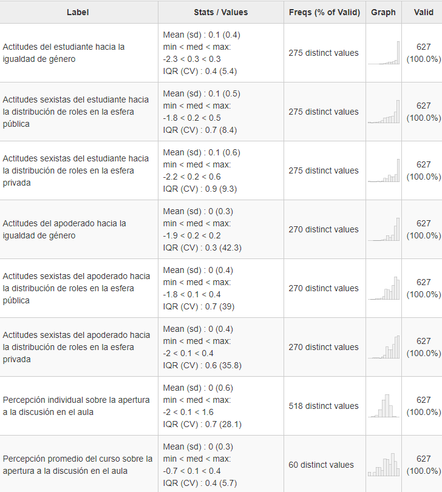
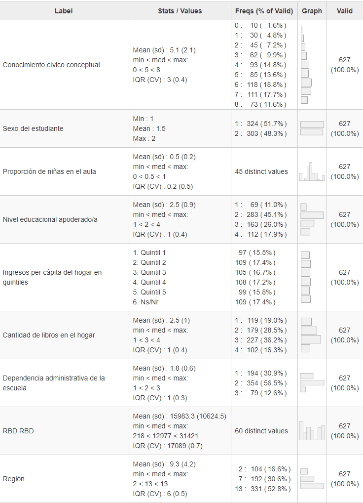

__\hfill Autores:__

\hfill Daniel Miranda, Pontificia Universidad Católica de Chile

\hfill Juan Carlos Castillo, Universidad de Chile

\hfill Julio Iturra, COES

\hfill Anaís Herrera, Universidad de Chile

\hfill Kevin Carrasco, Universidad de Chile

# Introducción
La igualdad de derechos es un principio básico de toda democracia. De hecho, los derechos humanos pueden ser entendidos como un imperativo ético para la construcción de una sociedad democrática [@ahlert_Etica_2007], pero su relevancia en la democracia traspasa los ámbitos puramente éticos. Distintos organismos internacionales plantean que la igualdad se encuentra íntimamente relacionada con las posibilidades de desarrollo social y progreso económico de los países [@onu_IGUALDAD_2016; @pnud_Desiguales_2017], con el sentimiento de plenitud y valía de las personas [@onu_IGUALDAD_2016], y con la vida democrática, la convivencia y la cohesión social en general [@pnud_Desiguales_2017]. Por lo tanto, avanzar en garantizar la igualdad “(…) no es sólo un imperativo ético, es también una exigencia para la sostenibilidad del desarrollo de los países” [@pnud_Desiguales_2017, p.7]. Pese a la importancia de la igualdad de derechos, las democracias latinoamericanas y caribeñas aún enfrentan grandes desafíos en este ámbito, manteniendo en el tiempo desigualdades sociales, políticas y económicas que afectan principalmente a grupos tradicionalmente desfavorecidos [@barcena_matriz_2016]. El problema es de tal magnitud que la Comisión Económica para América Latina y el Caribe (CEPAL) ha definido a Latinoamérica como la región más desigual del mundo [@cepal_Panorama_2017]. Estas desigualdades afectan especialmente a las mujeres, quienes se encuentran sobrerrepresentadas en los quintiles de menores ingresos, se enfrentan a una marcada brecha salarial (que, paradojalmente, se acentúa en función de los años de estudio), se ven afectadas por una distribución desigual del uso del tiempo y del trabajo no remunerado en los hogares (cargando con las labores domésticas y de cuidado), son la mayor parte de las personas en la región sin ingresos propios [@cepal_Panorama_2017], tienen una menor participación en actividades remuneradas formales a largo plazo, menores probabilidades de contar con una pensión para su vejez y, aquellas mujeres que acceden a una pensión, reciben un monto menor al recibido por los hombres [@barcena_matriz_2016]. En este contexto, la ONU ha determinado que garantizar la igualdad de género y reducir todas las desigualdades son parte de los objetivos de desarrollo sostenible, volviéndose cada vez más relevante buscar vías de acción que permitan avanzar al cumplimiento de estas metas.

En sociedades democráticas la promoción de políticas públicas que se orienten a garantizar la igualdad dependerá, en buena medida, de la existencia de una opinión pública favorable a la promoción y garantía de los derechos de todas las personas. La Organización de las Naciones Unidas para la Educación, la Ciencia y la Cultura (UNESCO) señala que esta “(...) actitud activa de reconocimiento de los derechos humanos universales y las libertades fundamentales de los demás” [@unesco_Declaracion_1995, p.79] puede ser denominada tolerancia. Según esta organización la educación cumple una función esencial en el fomento de actitudes tolerantes debido a que puede contribuir a formar actitudes vitalicias [@unesco_Declaracion_1995b]. En esta línea el gobierno chileno ha implementado un plan de Educación para la Igualdad de Género, que busca que “(…) las comunidades educativas y sus integrantes reconozcan y otorguen igual valor a las capacidades y habilidades de niños, niñas, jóvenes y personas adultas, en los distintos niveles educativos, independiente de su sexo e identidad de género” [@mineduc_Educacion_2017, p.7]. Teniendo en consideración la necesidad de fomentar actitudes tolerantes, la relevancia de la educación en este proceso y los esfuerzos de los organismos públicos por implementar programas que se orientan en este sentido, la presente investigación pretende aportar a la comprensión de los factores que influyen en el desarrollo de actitudes positivas hacia la igualdad de género en jóvenes en edad escolar, indagando principalmente en el rol que cumplen dos agentes de socialización: la familia y la escuela.

En esta área de investigación se ha indagado extensamente en las características individuales de los jóvenes que se relacionan con sus actitudes hacia la igualdad de derechos para grupos tradicionalmente desfavorecidos en general [ej. @torney-purta_How_2008; @miranda_Political_2018] y con sus actitudes hacia la igualdad de género en particular [ej. @sampermans_Teachers_2018a; @schulz_Students_2018a], destacando la relevancia del género (siendo las mujeres quienes tienen actitudes más tolerantes) y del nivel de conocimiento cívico. Asimismo, se han realizado investigaciones orientadas a comprender el rol de los agentes enunciados, pudiéndose encontrar múltiples estudios que indagan en las características de la escuela que influyen en la socialización política de estas actitudes [ej. @isac_Native_2012; @schulz_Students_2018a; @maurissen_Classroom_2020] y, pese a ser más escasa la literatura al respecto, también es posible encontrar una serie de estudios sobre la transmisión intergeneracional. En este último ámbito la investigación se ha enfocado en la transmisión intergeneracional de la desigualdad política [@miranda_Political_2018; @villalobos_School_2018; @isac_Native_2012], y en la transmisión intergeneracional de actitudes, tanto actitudes tolerantes y/o prejuiciosas [@meeusen_ParentChild_2015; @miklikowska_parent_2016; @miklikowska_Development_2017], como actitudes hacia la igualdad de género [@spierings_Gender_2015; @cunningham_Influence_2001].

Más específicamente, el estudio del rol de la familia y la escuela como agentes de socialización política ha abarcado distintos aspectos. Por un lado, en relación al rol de la escuela se ha evidenciado la relevancia de la apertura a la discusión en el aula [@schulz_Students_2018a; @trevino_Influence_2017], el clima escolar [@maurissen_Classroom_2020; @sampermans_Teachers_2018a], la confianza en el valor de la participación de los estudiantes en la escuela (es decir, la confianza de los estudiantes en que su participación en la escuela puede influir en su organización) [@torney-purta_How_2008; @degroof_Influence_2008] y las características de los compañeros que comparten en el aula, en términos de la proporción de estudiantes inmigrantes [@isac_Native_2012; @miklikowska_Driven_2019], y en relación con las actitudes y prejuicios de los compañeros [@miklikowska_Development_2017; @miklikowska_Driven_2019]. Por otro lado, la literatura sobre la transmisión intergeneracional de las actitudes tolerantes y/o prejuiciosas se ha aproximado al fenómeno de dos formas distintas. Mientras algunas investigaciones analizan la importancia de las características de la familia a partir del reporte de los estudiantes, otros estudios la analizan a partir de las respuestas de los apoderados. El primer grupo de investigaciones ha generado evidencias sobre la transmisión intergeneracional de la desigualdad política, destacando el efecto de los recursos socioeconómicos de la familia en las actitudes tolerantes de los estudiantes [@miranda_Political_2018; @isac_Native_2012]. El segundo grupo de estudios ha abordado la transmisión intergeneracional de las actitudes, constatando que las actitudes tolerantes y/o prejuiciosas de los padres se asocian con las de sus hijos. La mayoría de los artículos relativos a esta asociación refieren a actitudes prejuiciosas hacia inmigrantes [@meeusen_ParentChild_2015; @miklikowska_parent_2016], homosexuales, musulmanes y prejuicios sexistas [@meeusen_ParentChild_2015], actitudes antiinmigrantes [@miklikowska_Development_2017; @miklikowska_Driven_2019] y actitudes hacia los inmigrantes en términos generales [@miklikowska_parent_2016]. Sin embargo, existen algunas investigaciones en esta área que han constatado esta asociación en las actitudes hacia la igualdad de género, en la esfera pública [@spierings_Gender_2015] y privada [@cunningham_Influence_2001]. Adicionalmente, es relevante destacar que se han generado evidencias sobre el efecto moderador de la composición del aula de clases en la relación entre los prejuicios de los padres hacia inmigrantes y los prejuicios de su hijo, mostrando que el efecto de estos prejuicios del padre sobre los prejuicios de su hijo es menos pronunciado entre los niños pertenecientes a aulas donde hay una mayor proporción de estudiantes inmigrantes [@miklikowska_Driven_2019].

La presente investigación pretende aportar a las líneas de estudio referentes a la influencia de la familia y la escuela en la socialización de actitudes tolerantes y prejuiciosas, analizando la relación entre las actitudes de los apoderados hacia la igualdad de género y las actitudes de sus hijos hacia la igualdad de género. En referencia a investigaciones anteriores, este estudio aportará nuevos antecedentes en dos direcciones. En primer lugar, se pretende aunar los distintos enfoques utilizados en estudios previos sobre las actitudes hacia la igualdad de género, incorporando en la medición de estas actitudes tanto elementos relativos a la igualdad de derechos y oportunidades entre hombres y mujeres, así como indicadores orientados a comprender las actitudes de los jóvenes hacia la distribución de roles de género en las esferas pública y privada. De este modo se busca aportar con antecedentes sobre la transmisión intergeneracional de las actitudes hacia la igualdad de género abordando distintas dimensiones del constructo a la vez. En segundo lugar, este estudio pretende aportar antecedentes sobre el posible rol mitigador de la escuela en la transmisión intergeneracional de actitudes hacia la igualdad de género, cuestión que no ha sido abordada en los estudios revisados, evaluando si algunas características de la escuela permiten moderar la relación entre los recursos socioeconómicos de la familia y las actitudes de los estudiantes, y la relación entre las actitudes de los apoderados y las actitudes de sus hijos.

Los principales objetivos de esta investigación son: a) evaluar en qué medida los recursos de la familia se relacionan con las actitudes hacia la igualdad de género de los jóvenes y de los apoderados; b) evaluar en qué medida las actitudes de los apoderados hacia la igualdad de género se relacionan con las actitudes de sus hijos hacia la igualdad de género; c) evaluar en qué medida características de la escuela a la que asiste el estudiante (más precisamente, la proporción de niñas y la apertura a la discusión en el aula) se relacionan con sus actitudes hacia la igualdad de género; y finalmente, d) evaluar el rol de estas características de la escuela dentro del proceso de socialización como posibles mitigadores de la trasmisión intergeneracional. 

# Antecedentes teórico-empíricos
El estudio de las actitudes hacia la igualdad de género ha sido abordado desde distintas perspectivas teóricas, por lo que la evidencia empírica sobre esta temática ha operacionalizado este constructo enfocándose en distintos aspectos. Algunos estudios han comprendido las actitudes hacia la igualdad de género como las actitudes hacia la igualdad de derechos y oportunidades entre hombres y mujeres [ej. @miranda_Political_2018; @dottisani_Best_2017; @sampermans_Teachers_2018a], otras investigaciones han abordado la problemática poniendo el énfasis en las actitudes sexistas y en los estereotipos de género [ej. @azorinabellan_Actitudes_2017; @gutierrez_Heroes_2020; @solbes-canales_Socialization_2020], mientras que otros estudios se han enfocado en la distribución de roles de género en las esferas pública y privada [ej. @kaufman_Enduring_2017; @sapiro_Gender_2001; @yu_Decomposing_2013]. Como se enunció anteriormente, en esta investigación se ha intentado aunar los distintos enfoques, incorporando en la medición de las actitudes hacia la igualdad de género tanto elementos relativos a la igualdad de derechos y oportunidades entre hombres y mujeres, como indicadores orientados a comprender las actitudes de los jóvenes en relación con la distribución de roles en las esferas pública y privada. Para ello, se han distinguido tres dimensiones: (1) igualdad de derechos y oportunidades entre hombres y mujeres; (2) distribución igualitaria de roles en la esfera pública; y (3) distribución igualitaria de roles en la esfera privada. Las dos últimas dimensiones incorporan elementos que en otras investigaciones se han abordado como actitudes sexistas y/o estereotipos de género, pero diferenciándolos entre las esferas pública y privada. Cabe destacar que en el marco de este estudio las actitudes hacia la igualdad de género se entenderán como parte de las actitudes tolerantes, siguiendo la definición de tolerancia planteada en la introducción.

Diversos autores han indagado en los factores que inciden en las actitudes hacia la igualdad de género en la población adulta. Han generado evidencias sobre los factores individuales que inciden en estas actitudes, tales como el género, la edad, el nivel educacional y el estatus ocupacional [ej. @kyoore_Educational_2019; @charles_Gender_2020a], como también sobre las diferentes características de los países y contextos que influyen en las actitudes hacia la igualdad de género en general, como por ejemplo el grado de democratización del país, su PIB per cápita, el porcentaje de participación de la mujer en la fuerza laboral del país [@zagrebina_Attitudes_2020] o su porcentaje de participación en el gobierno [@yu_Decomposing_2013]. Mientras que otro conjunto de investigaciones ha puesto el énfasis en analizar las actitudes hacia la igualdad de género entre los jóvenes, principalmente estudiantes, en relación con sus características individuales y los procesos de socialización política que influyen en sus actitudes hacia distintos grupos sociales tradicionalmente desfavorecidos en general [@miranda_Political_2018] y hacia la igualdad de género en particular [@sampermans_Teachers_2018a; @azorinabellan_Actitudes_2017; @dottisani_Best_2017]. El presente estudio es parte de este segundo conjunto de investigaciones, por lo que en este apartado se profundizará en estos antecedentes.

Las principales características individuales de los estudiantes que han sido indagadas en la literatura previa y que se asocian con sus actitudes tolerantes son el nivel de conocimiento cívico, el género y la condición de inmigración. En primer lugar, diversas investigaciones han evidenciado que existe una asociación positiva entre el nivel de conocimiento cívico y las actitudes de los estudiantes hacia la igualdad de derechos para personas inmigrantes [@torney-purta_How_2008; @isac_Native_2012; @degroof_Influence_2008], hacia la igualdad de género y la igualdad de derechos para todos los grupos étnicos y raciales [@schulz_Students_2018a], hacia la igualdad de derechos y oportunidades entre hombres y mujeres [@sampermans_Teachers_2018a] y hacia la igualdad de derechos para personas homosexuales [@schulz_Percepciones_2018]. En segundo lugar, varias investigaciones han evidenciado que ser mujer se asocia con tener actitudes más positivas hacia la igualdad de derechos para personas inmigrantes [@torney-purta_How_2008; @isac_Native_2012; @miranda_Political_2018], con actitudes más positivas hacia minorías étnicas [@degroof_Influence_2008], hacia la igualdad de derechos para todos los grupos étnicos y raciales [@schulz_Students_2018a; @miranda_Political_2018], hacia la igualdad de derechos para personas homosexuales [@schulz_Percepciones_2018] y, en específico, hacia la igualdad de derechos y oportunidades entre hombres y mujeres [@miranda_Political_2018; @dottisani_Best_2017] y hacia un reparto equitativo de roles de género en el espacio público [@sapiro_Gender_2001; @kyoore_Educational_2019; @spierings_Gender_2015] y en el espacio privado [@yu_Decomposing_2013]. En tercer lugar, varias investigaciones han planteado que la condición de inmigración también es un factor que influye en las actitudes tolerantes de los jóvenes, concluyendo que las personas inmigrantes tienden a tener una actitud más positiva hacia la igualdad de derechos para inmigrantes [@villalobos_School_2018], hacia la igualdad de derechos para todos los grupos étnicos y raciales [@schulz_Students_2018a] y hacia la igualdad de derechos y oportunidades entre hombres y mujeres [@miranda_Political_2018], aunque @ojeda_Actitudes_2018 señalan que ser inmigrante se asocia positivamente con las actitudes sexistas en la distribución de roles de género en el espacio privado. En consideración de la evidencia disponible, se ha decidido focalizar el análisis hacia la influencia del género en las actitudes de los estudiantes, mientras que el nivel de conocimiento cívico de los estudiantes será utilizado como variable de control y la condición de inmigración no será tomada en consideración. Por lo tanto, se plantea la siguiente hipótesis:

>__*H1*__: Las niñas presentarán actitudes más positivas hacia la igualdad de género que los niños.

Un segundo conjunto de características que influyen en las actitudes de los estudiantes hacia la igualdad de género tiene que ver con la comprensión de la familia como un agente de socialización, la que se ha realizado a partir de dos teorías. En primer lugar, al tratar de explicar las diferencias en las actitudes de los estudiantes, varios autores han señalado la importancia de los recursos socioeconómicos de la familia. Los recursos socioeconómicos indican que, por ejemplo, al poseer un mayor nivel educacional, “más probable es que creamos en los valores democráticos y apoyemos las prácticas de igual tipo” [@lipset_hombre_1997, p. 50]. Esto es definido por @bobo_Education_1989 como “sofisticación cognitiva”, dando cuenta de la educación como un proceso por medio del cual el conocimiento y las habilidades cognitivas son adquiridas y, por lo tanto, incrementan la tolerancia hacia diferentes grupos u opiniones. En esta línea, @miranda_Political_2018 al estudiar la participación de los jóvenes en las actividades políticas, señalan que el modelo de recursos está fuertemente asociado con una posición social del individuo, que es su nivel educacional, el ingreso y/o el estatus ocupacional, así como por recursos como el tiempo, las habilidades sociales y el dinero. Así, un mayor nivel educacional estaría relacionado con una mayor tolerancia al tener más tiempo dentro del sistema educativo para internalizar las normas y valores sociales [@weber_educational_2020]. Por lo tanto, los recursos socioeconómicos afectan de dos formas en el proceso de socialización de actitudes.

Por un lado, algunos autores han demostrado que los recursos socioeconómicos de la familia influyen de manera positiva en las actitudes hacia la igualdad de derechos de inmigrantes [@miranda_Political_2018; @villalobos_School_2018; @isac_Native_2012] y sobre los cambios en las actitudes antiinmigrantes de los estudiantes [@miklikowska_Development_2017], en las actitudes de los estudiantes hacia la igualdad de derechos y oportunidades entre hombres y mujeres [@miranda_Political_2018; @dottisani_Best_2017] y en las creencias generales de los jóvenes con respecto a los comportamientos apropiados de hombres y mujeres en la familia [@cunningham_Influence_2001], aunque @schulz_Students_2018a señalan que no existe una relación significativa entre estos antecedentes y las actitudes hacia la igualdad de género y hacia la igualdad de derechos de todos los grupos étnicos y raciales. Por otro lado, también se ha demostrado que, en población adulta, mayores recursos socioeconómicos afectan de manera positiva las actitudes hacia un reparto equitativo de roles de género en el espacio público [@kyoore_Educational_2019] y en el espacio privado [@ojeda_Actitudes_2018; @yu_Decomposing_2013]. 

En segundo lugar, aunque ha sido menos estudiado en sociología, algunos autores han destacado la importancia de la transmisión intergeneracional de las actitudes entre padres e hijos sobre las actitudes de los estudiantes hacia grupos tradicionalmente desfavorecidos. Como señala @bandura_Sociallearning_1969, siguiendo la teoría del aprendizaje social, las actitudes y comportamientos de los padres y, en específico, los comportamientos de roles sexuales son un excelente ejemplo de entrenamiento activo de los padres sobre los intereses y modos de comportamiento apropiados de los niños pequeños. Desde esta perspectiva intergeneracional, la evidencia indica que una asociación positiva entre los recursos de los padres y la tolerancia política podrían ser transmitidos a las siguientes generaciones [@brady_Political_2015a].

Por ejemplo, @miklikowska_parent_2016 en un estudio longitudinal señala que las actitudes de los padres logran influir en las actitudes de los hijos al transmitirles parte de sus creencias ante el prejuicio y la tolerancia sobre inmigrantes, así como también los cambios en estas actitudes de los padres logran predecir cambios en los prejuicios y la tolerancia de los adolescentes sobre los inmigrantes. Por su parte, @spierings_Gender_2015 en un estudio comparativo entre jóvenes de Turquía y jóvenes turcos residentes en Europa, señala que las actitudes de los padres son una de las variables explicativas más fuertes de las actitudes de los jóvenes hacia la igualdad de género en el espacio público y que existen diferencias significativas al pertenecer a familias con padres que apoyan menos la igualdad de género en el espacio público entre los jóvenes de Turquía y aquellos residentes en Europa. De la misma forma, @cunningham_Influence_2001 señala que las actitudes de la madre hacia la igualdad en la distribución de roles de género en la familia influyen positivamente en las creencias generales de sus hijos con respecto a los comportamientos apropiados de hombres y mujeres en la familia. En esta línea, por un lado @meeusen_ParentChild_2015 incluyen que la similitud intergeneracional sobre el prejuicio hacia inmigrantes, musulmanes, homosexuales y mujeres está arraigada en las actitudes ideológicas de los padres y que el traspaso de actitudes prejuiciosas y hacia la tolerancia sobre estos grupos se acentúa según la frecuencia de la discusión sobre temas políticos y problemáticas sociales con sus hijos. Por otro lado, @miklikowska_Driven_2019 enfatizan en que los padres afectan la formación de las actitudes antiinmigrantes de los adolescentes a través de la socialización activa a largo plazo y mediante la gestión del mudo social de sus hijos, sentado la base del prejuicio. Sumado a lo anterior, como los recursos socioeconómicos de la familia influyen tanto en las actitudes de los padres como en las actitudes de los hijos y debido a que los padres juegan un rol preponderante en la socialización familiar de sus hijos, es esperable que las actitudes de los padres cumplan un rol mediador en la relación entre los recursos socioeconómicos de la familia y las actitudes de los estudiantes. Por lo tanto, a partir de estos antecedentes se desprenden cuatro hipótesis que pretenden abordar la relevancia del proceso de socialización familiar:

__*H2*__: Estudiantes que provienen de familias con mayores recursos socioeconómicos presentarán actitudes más positivas hacia la igualdad de género.

__*H3*__: Estudiantes con apoderados que poseen actitudes más positivas hacia la igualdad de género presentarán actitudes más positivas hacia la igualdad de género.

__*H4*__: Apoderados con mayores recursos socioeconómicos presentarán actitudes más positivas hacia la igualdad de género.

__*H4a*__: La relación entre los recursos de la familia y las actitudes de los estudiantes hacia la igualdad de género estará mediada por las actitudes de sus apoderados hacia la igualdad de género.

Un tercer conjunto de características que influyen en las actitudes tolerantes de los estudiantes son las que provienen desde el rol que juega la escuela como agente de socialización y de su posible efecto mitigador en la transmisión intergeneracional de las actitudes hacia la igualdad de género. Tradicionalmente se la ha adjudicado a la educación el objetivo de “suscitar y desarrollar en el niño un cierto número de estados físicos, intelectuales y morales, que exigen de él tanto la sociedad política tomada en conjunto como el medio especial al que está destinado particularmente” [@durkheim_Educacion_1999, p.4], y que la función socializadora de la escuela “consiste en el desarrollo dentro de cada individuo de aquellas habilidades y actitudes que constituyen los requisitos esenciales para su futuro desenvolvimiento en la vida” [@parsons_clase_1976, p. 65]. En este sentido, investigaciones recientes continúan analizando este rol de la escuela como agente formador de ciudadanos. 

En primer lugar, varios autores han evidenciado que tener un ambiente abierto a la discusión dentro el aula promueve las actitudes de los estudiantes hacia la igualdad de derechos de personas inmigrantes [@isac_Native_2012; @degroof_Influence_2008; @torney-purta_How_2008] y hacia la igualdad de derechos de inmigrantes, grupos étnicos y mujeres [@schulz_Students_2018a], mientras que @maurissen_Classroom_2020 plantean que la apertura a la discusión en el aula no se asocia significativamente con las actitudes hacia la igualdad de derechos de personas inmigrantes. En segundo lugar, otros autores señalan que el clima del aula influye de manera positiva en las actitudes de los estudiantes hacia la igualdad de derechos de personas inmigrantes [@maurissen_Classroom_2020] y hacia la igualdad de derechos de inmigrantes, grupos étnicos y mujeres [@schulz_Students_2018a]. En tercer lugar, algunas investigaciones indican que la confianza de los estudiantes en los procesos deliberativos en que participan y la confianza en que estas discusiones puedan influir en la organización y funcionamiento de la escuela también se asocia con actitudes positivas hacia las minorías étnicas [@degroof_Influence_2008] y hacia la igualdad de derechos para personas inmigrantes [@torney-purta_How_2008]. En cuarto lugar, también se señala que las actitudes antiinmigrantes de los compañeros en general tendrían un efecto sobre las actitudes antiinmigrantes de los estudiantes [@miklikowska_Development_2017] y que los cambios en estas actitudes antiinmigrantes de los compañeros durante el tiempo afectan las actitudes de los estudiantes [@miklikowska_Driven_2019]. En quinto lugar, algunos estudios evidencian la influencia de la composición de la escuela sobre las actitudes tolerantes de los estudiantes. Más precisamente, se ha constatado que la presencia de estudiantes de diversos orígenes étnicos y/o raciales, siguiendo lo planteado por la teoría del contacto, generan un mayor apoyo hacia la tolerancia e igualdad de derechos para inmigrantes [@villalobos_School_2018; @gorodzeisky_Terms_2009]. Asimismo, algunos estudios señalan que, en aulas con una mayor proporción de estudiantes inmigrantes, se logra moderar el efecto del prejuicio de los padres [@miklikowska_Driven_2019] y moderar la asociación entre no ser inmigrante y estar a favor de la igualdad de derechos para inmigrantes [@isac_Native_2012]. Sin embargo, no se posee suficiente evidencia sobre el efecto que podría tener la proporción de niñas en el aula sobre las actitudes de los estudiantes hacia la igualdad de género, ya que esta característica se incluye en el estudio de @sampermans_Teachers_2018a, pero esta asociación no es significativa al controlar por el género de los estudiantes y las relaciones que existen entre alumnos y maestros. Debido a que en la mayoría de las investigaciones previas el grupo en que se enfoca el estudio de los efectos de la composición del aula refieren al mismo grupo sobre el cual se están investigando las actitudes hacia la igualdad de derechos (por ej., la relación entre proporción de inmigrantes y actitudes hacia la igualdad de derechos para los inmigrantes), en este estudio corresponde indagar en el posible efecto de la proporción de niñas en las actitudes hacia la igualdad de género.

En miras de lograr una mayor parsimonia en este estudio, se ha decidido centrar el análisis del efecto de las características de la escuela en sólo dos variables: la apertura a la discusión en el aula y la proporción de niñas en el aula. Se espera que ambas características continúen la tendencia general revisada en la evidencia, por lo que se plantean dos hipótesis que analizan los efectos directos de las características de la escuela y su efecto mitigador sobre el proceso de socialización familiar, respectivamente:

__*H5*__: Las características de la escuela (proporción de niñas; apertura a la discusión en el aula) se asocian positivamente con las actitudes de los estudiantes hacia la igualdad de género.

__*H6*__: Las características de la escuela (proporción de niñas; apertura a la discusión en el aula) mitigan la influencia de los recursos familiares y actitudes de los apoderados sobre las actitudes de los estudiantes hacia la igualdad de género.

Finalmente, debido a la especificidad que representa el género dentro de este estudio, se plantea una última hipótesis que pretende abordar los diferentes efectos que esta característica puede representar sobre las distintas hipótesis antes planteadas:

__*H7*__: Los efectos planteados en las hipótesis 2, 3, 5 y 6 estarán condicionados por el género del estudiante.

# Datos, variables y métodos
## *Datos*
Para abordar estos objetivos se ha realizado una investigación cuantitativa a partir de datos provenientes de la encuesta PACES, correspondientes a una muestra representativa de estudiantes de segundo año medio (décimo grado) que asisten a escuelas de 3 regiones chilenas: Región de Antofagasta, Región Metropolitana y Región del Maule. La muestra es representativa de los distintos tipos de establecimientos educacionales existentes en el país, tanto en relación con los distintos tipos de dependencia administrativa (Particulares pagados, particulares subvencionados y Municipales o públicos), como en relación con el tipo de enseñanza que se imparte (Humanistas/Científicos y Técnicos-Profesionales). En total se seleccionaron 64 escuelas (14 establecimientos de la Región de Antofagasta, 35 de la Región metropolitana y 15 de la Región del Maule). En cada establecimiento educacional seleccionado se consideró encuestar a un curso completo, sus apoderados y sus docentes de historia, ciencias sociales y/o formación ciudadana. En concreto, se cuenta con los datos de 1635 estudiantes, 744 apoderados y 103 profesores. Los datos fueron producidos entre agosto y diciembre del año 2019. La muestra final utilizada en los análisis considera 627 casos de 60 escuelas, correspondientes a casos con respuestas completas de estudiantes y apoderados.

## *Variables*
El foco principal del estudio está en las actitudes hacia la igualdad de género, las cuales fueron medidas a partir de una escala que posteriormente se subdividió en tres dimensiones. Se presentó la misma batería de preguntas a estudiantes y apoderados. Las variables dependientes corresponden a las respuestas de los estudiantes, mientras que las respuestas de los apoderados son parte de las variables independientes de nivel individual. Se estimaron Análisis Factoriales Confirmatorios (AFC) para evaluar el grado de ajuste del modelo de medida de la escala en la muestra de estudiantes y apoderados, logrando un ajuste adecuado al dividirla en las tres dimensiones enunciadas previamente: (1) Igualdad de derechos y oportunidades entre hombres y mujeres; (2) distribución igualitaria de roles en la esfera pública; y (3) distribución igualitaria de roles en la esfera privada. En consecuencia, se utilizaron 6 variables para medir las actitudes de estudiantes y apoderados hacia la igualdad de género, las cuales fueron generadas utilizando puntuaciones factoriales.

En términos generales la escala de actitudes hacia la igualdad de género sigue la propuesta de medición del Estudio Internacional de Educación Cívica y Formación Ciudadana (ICCS) del año 2009, aunque se han incorporado algunos nuevos indicadores de la encuesta ISSP. Más específicamente, a los encuestados se les presentaron 9 frases precedidas por la pregunta “Existen diferentes visiones sobre el papel de las mujeres y los hombres en la sociedad. ¿Cuán de acuerdo o en desacuerdo estás con las siguientes afirmaciones?”. Las alternativas van de “Muy en desacuerdo” (1) a “Muy de acuerdo” (4). Con el objetivo de facilitar el análisis de los resultados, aquellos indicadores que representaban actitudes contrarias a la igualdad de género fueron invertidos para que las tres dimensiones hicieran alusión a actitudes favorables a la igualdad de género. A continuación se expone la batería de preguntas:

**Tabla 2.**

En relación con las variables independientes, cabe destacar que a grandes rasgos el estudio cuenta con dos tipos de variables independientes: variables de nivel individual y variables de nivel escolar (en las cuales todos los estudiantes de una misma escuela tienen el mismo valor).

Por un lado, se incorporaron 3 tipos de variables independientes de nivel individual. El primero corresponde al sexo del estudiante. El segundo corresponde a las actitudes de los apoderados hacia la igualdad de género, que fueron medidas a partir de tres variables basadas en los indicadores presentados en la tabla 1 (cada variable corresponde a una dimensión del constructo y sólo fue utilizada como predictor de las actitudes del estudiante hacia la misma dimensión). El tercero corresponde a los recursos socioeconómicos de la familia, que fueron medidos a través de tres variables: (a) Nivel educacional del apoderado; (b) Cantidad de libros en el hogar; y (c) Quintiles de ingresos mensuales per cápita. Para dos de estas tres preguntas (cantidad de libros en el hogar y nivel educacional de los padres) se poseen dos fuentes de información: las respuestas de los estudiantes y las respuestas de los apoderados. La pregunta sobre los ingresos sólo es presentada a los apoderados. Por esta razón, se utilizaron las respuestas de los apoderados a las preguntas correspondientes a estas tres variables. El nivel educacional fue medido a partir de la pregunta “¿Cuál es el último curso o nivel de estudios que completó usted?”, ante la cual se presentaron 4 alternativas: (1) 8vo básico o menos; (2) Educación Media; (3) Educación Técnica Superior (IP o CFT); y (4) Una carrera en la Universidad o estudios de Posgrado. Para la cantidad de libros en el hogar se les preguntó a los apoderados “Aproximadamente ¿Cuántos libros hay en su hogar?” y las respuestas se distribuyeron en 4 alternativas: (1) Entre 0 y 10 libros; (2) Entre 11 y 25 libros; (3) Entre 26 y 100 libros; y (4) Más de 100 libros. La variable quintiles de ingresos per cápita fue construida por el equipo de investigación a partir de las respuestas a dos preguntas, una referida a los ingresos mensuales de los miembros del hogar (líquidos) y otra referida a la cantidad de personas que residen en el domicilio. En esta variable se agregó la categoría “No sabe / No responde” para disminuir los casos perdidos (n=109). Adicionalmente, se agregaron tres variables de control: el nivel de conocimiento cívico, la región de residencia y el tipo de dependencia administrativa.

Por otro lado, se incorporaron dos variables independientes de nivel escolar. Una de las variables refiere a la proporción de niñas en el aula, la cual fue estimada a partir de la pregunta sobre el sexo del estudiante. La segunda variable refiere a la percepción general sobre la apertura a la discusión en el aula (se calculó un promedio por aula) a partir de las respuestas de los estudiantes a una batería de preguntas basada en la propuesta de medición utilizada en el estudio ICCS. A los estudiantes se les presentaron 6 afirmaciones precedidas por la pregunta “Cuando se discuten temas políticos y sociales durante las clases, ¿Con qué frecuencia suceden las siguientes situaciones?” con cuatro alternativas: (1) Nunca; (2) Casi nunca; (3) A veces; y (4) Siempre. Las frases son las siguientes: (a) Los(as) profesores(as) estimulan a los estudiantes a expresar sus opiniones; (b) Los estudiantes plantean hechos políticos de actualidad para ser discutidos en clases; (c) Los estudiantes expresan sus opiniones en clases, aún cuando sean distintas a las de los demás; (d) Los(as) profesores(as) estimulan a los estudiantes a conversar los temas con gente que opina distinto; (e) Los(as) profesores(as) exponen los temas desde distintos puntos de vista al explicarlos en clases; (f) Los(as) profesores(as) fomentan la reflexión y la crítica. Cabe destacar que, al igual que con las actitudes hacia la igualdad de derechos, la variable fue generada utilizando puntuaciones factoriales. Adicionalmente, siguiendo las recomendaciones de @campbell_Voice_2008 se agregó la percepción individual sobre la apertura a la discusión en el aula como variable de control.

## *Métodos*
El análisis estadístico de esta investigación se realizará mediante el software R versión 4.0.0

Debido a que la muestra posee una estructura jerárquica (estudiantes anidados en escuelas), los principales análisis de datos fueron realizados mediante la estimación de regresiones multinivel, evaluándose las pendientes aleatorias, interacciones entre variables y efectos de mediación, siguiendo los pasos recomendados para este tipo de modelos (Aguinis et al., 2013). Previamente, la validez de las variables latentes utilizadas en los análisis fue evaluada a través de la estimación de modelos de análisis factorial confirmatorio, utilizando la librería “lavaan”. Todas las variables presentaron un ajuste adecuado según los criterios de @brown_Confirmatory_2015, por lo que posteriormente se crearon nuevas variables a partir de puntuaciones factoriales.

Hay cinco tipos de hipótesis a testear:

1. Hipótesis de efectos directos a nivel individual (1, 2, 3 y 4). Estas fueron testeadas estimando una serie de modelos que incorporan las respectivas variables independientes de nivel individual y se evaluó su significancia estadística.
2. Hipótesis de efectos directos a nivel agregado (5). Estas fueron testeadas estimando una serie de modelos que incorporan las respectivas variables independientes de nivel escuela y se evaluó su significancia estadística.
3. Hipótesis de mediación (4a). Para testear esta hipótesis se descompuso el efecto de los recursos familiares sobre las actitudes hacia la igualdad de género, diferenciando entre el efecto directo y el efecto indirecto. Para corroborar que la relación de mediación corresponde efectivamente a una relación intragrupo. 
4. Hipótesis de moderación (6 y 7). 
    * Moderación a nivel 1: se estimaron múltiples modelos de regresión que incorporan las variables y los respectivos términos de interacción. Esto permitió evaluar el efecto moderador del género sobre las asociaciones evaluadas en los modelos anteriores, como se plantea en la hipótesis 7.
    * Moderación entre niveles: se estimaron modelos de regresión multinivel con interacción cruzada entre niveles, siguiendo los pasos recomendados por Aguinis et al. (2013). Esto implicó incluir los términos de interacción doble para la hipótesis 6 y términos de interacción triple para la hipótesis 7. 

Para todos estos análisis se utilizó la librería “lme4”.

# Resultados
## Análisis descriptivo
En relación con las tres dimensiones de actitudes hacia la igualdad de género de estudiantes y apoderados, el análisis descriptivo presentado en la tabla 2 muestra que las actitudes de los estudiantes hacia la igualdad de derechos y oportunidades entre hombres y mujeres, calculadas a partir de puntuaciones factoriales, poseen valores entre -2.3 y 0.3, con al menos un 50% de estudiantes que poseen el valor máximo en sus respuestas para esta dimensión. Asimismo, las actitudes de los estudiantes hacia una distribución igualitaria de roles en la esfera pública poseen valores entre -1.8 y 0.5, con una mediana de 0.2, mientras que las actitudes de los estudiantes hacia una distribución igualitaria de roles en la esfera privada poseen valores entre -2.2 y 0.6, con una mediana de 0.2. En estas tres dimensiones la media de las actitudes de los estudiantes es de 0.1. En cuanto a las actitudes de los apoderados, las puntuaciones factoriales obtenidas poseen valores entre -1.9 y 0.2 (mediana=0.2) para la dimensión de igualdad de derechos y oportunidades entre hombres y mujeres; valores entre -1.8 y 0.4 (mediana=0.1) para la dimensión de distribución igualitaria de roles en la esfera pública; y valores entre -2 y 0.4 (mediana=0.1) para la dimensión de distribución igualitaria de roles en la esfera privada. La media de estas tres dimensiones es de 0.

En cuanto a las variables independientes que aluden a ambos procesos de socialización, por un lado, los recursos socioeconómicos de la familia se distribuyen de la siguiente manera en la muestra final del estudio: En relación con el nivel educacional de los apoderados, 11% de ellos poseen una educación de 8vo básico o menos; un 45.1% de los apoderados posee educación media completa; un 26% de los apoderados posee educación técnica superior; y un 17.9% de los apoderados posee educación universitaria o posgrado. En cuanto a la cantidad de libros en el hogar reportada por los apoderados, un 19% de los hogares poseen entre 0 y 10 libros; un 28,5% de los hogares poseen entre 11 y 25 libros; un 36.2% de los hogares poseen entre 26 y 100 libros; y un 16.3% de los hogares poseen más de 100 libros. Finalmente, los ingresos per cápita del hogar al estar distribuidos en quintiles no poseen una mayor diferencia en sus categorías. Por otro lado, las características de la escuela se distribuyen de la siguiente manera: la percepción individual sobre la apertura a la discusión en el aula, calculada a partir de puntuaciones factoriales, posee valores entre -2 y 1.6 (mediana=0.1) y una media de 0, mientras que la proporción de niñas en el aula posee valores entre 0 y 1, donde 0 representa un curso completamente de niños y 1 representa un curso completamente de niñas.

Finalmente, en relación con las variables de control del estudio, el nivel de conocimiento cívico conceptual de los estudiantes varía entre 0 y 8, con una mediana de 5 y una media de 5.1. En cuanto a la dependencia administrativa, un 30.9% de los estudiantes asisten a escuelas municipales; un 56.5% a escuelas particulares subvencionadas y un 12.6% a escuelas privadas. Asimismo, un 16.6% de los estudiantes viven en la Región de Antofagasta; un 30.6% vive en la Región del Maule; y un 52.8% vive en la Región Metropolitana.

\newpage

**Tabla 2. Descripción de las variables utilizadas en los análisis**




## Análisis bivariado
**Figura 1. Actitudes de los estudiantes hacia la igualdad de género según los recursos socioeconómicos de la familia.**


En la Figura 1 se muestran los bivariados correspondientes a la hipótesis dos, según la cual existe una relación positiva entre recursos y actitudes hacia la igualdad de género. En cada gráfico la línea horizontal representa el promedio general de cada una de las tres dimensiones de las actitudes hacia la igualdad de género. Así, es posible comparar a partir de la línea horizontal si quienes poseen determinados recursos en el hogar como padres con educación terciaria, mayor cantidad de libros o mayores ingresos poseen niveles por sobre el promedio en su aceptación de la igualdad de género. En cada una de las tres dimensiones de actitudes a la igualdad de género se puede apreciar que sistemáticamente los estudiantes cuyos padres poseen educación terciaria (técnica-superior o universitaria) y quienes poseen más de 26 libros en el hogar, presentan promedios mayores que los demás estudiantes con menos recursos de tipo sociocultural. En suma, quienes poseen mayores recursos socioculturales, poseen actitudes más positivas a la igualdad de género en sus tres dimensiones. Por su parte, los quintiles de ingreso per cápita poseen efectos menos definidos, aunque es posible apreciar que, en cada una de las dimensiones, quienes están en el primer quintil poseen actitudes menos positivas hacia la igualdad de género que quienes están en el quintil más alto. Dicho de otro modo, mayores recursos socioeconómicos implican, en alguna medida, mayores niveles de aceptación de la igualdad de género.

## Modelos multinivel
```{r, echo=FALSE}
pacman::p_load(summarytools,haven,sjPlot,dplyr,lme4,haven,texreg,knitr,kableExtra,bda,lmerTest)
load("input/data-proc/data.rda")
data_proc <- data %>% dplyr::select(
    igualdad.est,
    esp_publico.est,
    esp_privado.est,
    igualdad.pad,
    esp_publico.pad,
    esp_privado.pad,
    ap_discusion,
    mean_discusion,
    c_civic,
    Sexo,
    num_fem,
    Educacion,
    quintiles_ingresos_pc_factor,
    Libros_apod_rec,
    dependencia,
    RBD,
    REGION
) %>% as.data.frame() %>%  na.omit()

coef_names <- c(
          "Niña Ref. Niño)",
          "Conocimiento cívico",
          "Educación Media (Ref. 8vo básico o menos)",
          "Educación Técnica Superior (IP o CFT)",
          "Educación universitaria o Posgrado",
          "Entre 11 y 25 libros (Ref. Entre 0 y 10 libros)",
          "Entre 26 y 100 libros",
          "Más de 100 libros",
          "Quintil 2 (Ref. Quintil 1)",
          "Quintil 3",
          "Quintil 4",
          "Quintil 5",
          "No sabe / No responde"
          )
omit_coef <- "(dependencia)|(REGION)|(Intercept)|(quintiles_ingresos_pc_factorNs/Nr)"
footnote<- "$***p <$ 0.001, $**p <$ 0.01, $*p <$ 0.05 Todos los modelos son controlados por la región de residencia (p>0.05) y dependencia administrativa de la escuela (p>0.05)"
scale_box <- 0.65
```

### Actitudes del estudiante hacia la igualdad de derechos y oportunidades entre hombres y mujeres
En la tabla 3 se presentan los principales resultados obtenidos a partir del análisis multinivel realizado para la dimensión de actitudes de los estudiantes hacia la igualdad de derechos y oportunidades entre hombres y mujeres. Para esta dimensión la correlación intraclase obtenida representa que la variación entre escuelas corresponde a un 23% de la varianza de las actitudes de los estudiantes.

Primero, en función de la primera hipótesis planteada, en el modelo 1 se puede observar que ser niña se asocia con actitudes más positivas hacia la igualdad de derechos y oportunidades entre hombres y mujeres en comparación con los niños. Este efecto se mantiene estable al controlar por el resto de las variables en el modelo 9.

Segundo, con respecto a la hipótesis planteada que aborda la relación entre los recursos socioeconómicos de la familia con las actitudes de los apoderados y con las actitudes de los estudiantes hacia la igualdad de derechos y oportunidades entre hombres y mujeres. Los análisis de las actitudes de los apoderados expuestos en el Anexo 1 evidencian que aquellos con más recursos socioeconómicos (nivel educacional y mayor cantidad de libros en el hogar) poseen actitudes más positivas hacia esta dimensión que aquellos con menos recursos socioeconómicos. En torno a los estudiantes se evidencia, en el modelo 3 de la tabla 3, que el nivel educacional del apoderado no posee efectos significativos sobre sus actitudes hacia esta dimensión. Luego, en relación con la cantidad de libros en el hogar, en el modelo 4 solo las categorías “entre 11 y 25 libros” y “entre 26 y 100 libros” poseen un efecto positivo sobre la dimensión analizada, pero este efecto deja de ser significativo en la categoría “entre 26 y 100 libros” al controlar por el resto de las variables en el modelo 9. Finalmente, los ingresos per cápita del hogar, como se observa en el modelo 5, no poseen un efecto significativo sobre esta dimensión.

Tercero, en cuanto a la hipótesis que plantea una relación entre las actitudes de los estudiantes y las actitudes de sus apoderados, los resultados muestran que existe una transmisión intergeneracional de las actitudes, que se observa en la consistencia actitudinal de ambas generaciones. En otras palabras, en el modelo 6 se puede observar que las actitudes de los apoderados hacia la dimensión de igualdad de derechos afectan positivamente las actitudes de los estudiantes hacia esta dimensión. Este efecto sigue siendo significativo al controlar por el resto de las variables en el modelo 9.

Siguiendo con la quinta hipótesis, por un lado, tanto la percepción individual de apertura a la discusión en el aula, como la percepción general del curso (el promedio por aula) afectan positivamente las actitudes de los estudiantes hacia la dimensión de igualdad de derechos. Ambos efectos mantienen su significancia al controlar por el resto de las variables en el modelo 9. Por otro lado, la proporción de niñas en el aula también posee un efecto positivo sobre esta dimensión, pero al controlar por el resto de las variables en el modelo 9 este efecto deja de ser significativo.

Finalmente, en relación con las hipótesis 6 y 7, los efectos de las interacciones entre las variables propuestas no resultaron estadísticamente significativas para la dimensión de igualdad de derechos. Más precisamente, las características de la escuela como la proporción de niñas y, principalmente, el promedio de apertura a la discusión en el aula, si bien logran afectar positivamente las actitudes de los estudiantes hacia la igualdad de género de forma directa, no logran mitigar el efecto de la transmisión intergeneracional de las actitudes tolerantes de los padres hacia los hijos. Asimismo, no hay ninguna interacción significativa entre el género del estudiante y las variables analizadas en los modelos.
```{r, echo=FALSE, results='asis'}
reg_igualdad1 <- lmer(igualdad.est ~ 1 + Sexo + factor(dependencia) + factor(REGION) + (1 | RBD), data=data_proc)
reg_igualdad2 <- lmer(igualdad.est ~ 1 + c_civic + factor(dependencia) + factor(REGION) + (1 | RBD), data=data_proc)
reg_igualdad3 <- lmer(igualdad.est ~ 1 + factor(Educacion) + factor(dependencia) + factor(REGION) + (1 | RBD), data=data_proc)
reg_igualdad4 <- lmer(igualdad.est ~ 1 + factor(Libros_apod_rec) + factor(dependencia) + factor(REGION) + (1 | RBD), data=data_proc)
reg_igualdad5 <- lmer(igualdad.est ~ 1 + factor(quintiles_ingresos_pc_factor) + factor(dependencia) + factor(REGION) + (1 | RBD), data=data_proc)
reg_igualdad6 <- lmer(igualdad.est ~ 1 + igualdad.pad + factor(dependencia) + factor(REGION) + (1 | RBD), data=data_proc)
reg_igualdad7 <- lmer(igualdad.est ~ 1 + ap_discusion + mean_discusion + factor(dependencia) + factor(REGION) + (1 | RBD), data=data_proc)
reg_igualdad8 <- lmer(igualdad.est ~ 1 + num_fem + factor(dependencia) + factor(REGION) + (1 | RBD), data=data_proc)
reg_igualdad9 <- lmer(igualdad.est ~ 1 + Sexo + factor(Educacion) + factor(Libros_apod_rec) + factor(quintiles_ingresos_pc_factor) + igualdad.pad + ap_discusion + mean_discusion + num_fem + factor(dependencia) + factor(REGION) + c_civic + (1 | RBD), data=data_proc)

caption <- "Modelo de regresión multinivel para Igualdad de derechos y oportunidades"
knitreg(list(reg_igualdad1,reg_igualdad2,reg_igualdad3,reg_igualdad4,
             reg_igualdad5,reg_igualdad6,reg_igualdad7,reg_igualdad8,reg_igualdad9),
        custom.model.names = c("Modelo 1",  "Modelo 2",  "Modelo 3",  "Modelo 4",  
                               "Modelo 5",  "Modelo 6",  "Modelo 7",  "Modelo 8",  "Modelo 9"),
        custom.note = footnote,
        omit.coef = omit_coef, 
        custom.coef.names = c(coef_names,
          "Actitudes igualdad de derechos (apod.)",
          "Apertura a la discusión (individual)",
          "Apertura a la discusión (promedio)",
          "Proporción de niñas en el aula"
        ),
       scalebox = scale_box,
       threeparttable = F,
       caption.above = T,
       caption=caption
       )
```
\newpage

### Actitudes del estudiante hacia la distribución igualitaria de roles en la esfera pública
En la tabla 4 se presentan los resultados obtenidos de las actitudes de los estudiantes hacia la dimensión de distribución igualitaria de roles en la esfera pública. Para esta dimensión la correlación intraclase obtenida representa que la variación entre escuelas corresponde a un 26% de la varianza de las actitudes de los estudiantes. 

En primer lugar, en función de la hipótesis inicial y analizando el primer modelo, se puede observar que las niñas, en comparación con los niños, poseen actitudes más positivas hacia esta la igualdad de derechos entre ambos géneros. En el modelo 9 se puede ver que este efecto se mantiene estable al controlar por el resto de las variables.

En segundo lugar, este estudio encuentra evidencia que respalda parcialmente la hipótesis respecto a la relación entre los recursos socioeconómicos de la familia con las actitudes de los apoderados y de los estudiantes hacia la igualdad de género. En el Anexo 1 se puede ver en relación con las actitudes de los apoderados que aquellos con mayores recursos socioeconómicos (nivel educacional y mayor cantidad de libros en el hogar) poseen actitudes más positivas hacia una distribución igualitaria de roles en la esfera pública que aquellos con menos recursos socioeconómicos. En cuanto a las actitudes de los estudiantes, en el modelo 3 se puede observar que el nivel educacional de los apoderados no posee efectos significativos sobre esta dimensión. Luego, en el modelo 4 se muestra que estudiantes que poseen más de 26 libros en el hogar poseen actitudes más positivas hacia esta dimensión de la igualdad de género que aquellos que poseen menos de 10 libros. Sin embargo, esta relación deja de ser significativa al controlar por el resto de las variables en el modelo 9. Finalmente, en el modelo 5 se puede apreciar que los estudiantes que pertenecen a los quintiles 2, 3 y 5 poseen actitudes más positivas sobre esta dimensión que aquellos pertenecientes al quintil 1, pero al controlar por el resto de las variables en el modelo 9 solo los quintiles 2 y 3 mantienen su significancia.

En tercer lugar, en cuanto a la hipótesis que plantea una relación entre las actitudes de los estudiantes y las actitudes de sus apoderados, se puede observar una consistencia actitudinal de ambas generaciones en las actitudes hacia una distribución igualitaria de roles en la esfera pública. Específicamente, es posible observar que en el modelo 6 las actitudes de los apoderados hacia esta dimensión afectan positivamente las actitudes de los estudiantes, y que este efecto mantiene su significancia en el modelo 9 al controlar por el resto de las variables.

En relación con la quinta hipótesis, en el modelo 7 se puede observar que tanto la percepción individual de apertura a la discusión en el aula, como la percepción general del curso (el promedio por aula) afectan positivamente las actitudes de los estudiantes hacia esta dimensión y que ambos efectos se mantienen consistentes al controlar por el resto de las variables en el modelo 9. Como se muestra en el modelo 8, la proporción de niñas en el aula no posee un efecto significativo sobre esta dimensión.

Finalmente, en relación con las hipótesis 6 y 7, los efectos de las interacciones entre las variables propuestas no resultaron estadísticamente significativas para la dimensión de distribución igualitaria de roles en la esfera pública. Más precisamente, las características de la escuela como la proporción de niñas y, principalmente, el promedio de apertura a la discusión en el aula, si bien logran afectar positivamente las actitudes de los estudiantes hacia la igualdad de género de forma directa, no logran mitigar el efecto de la transmisión intergeneracional de las actitudes tolerantes de los padres hacia los hijos. Asimismo, no hay ninguna interacción significativa entre el género del estudiante y las variables analizadas en los modelos.

```{r, echo=FALSE}
reg_esp.pub1 <- lmer(esp_publico.est ~ 1 + Sexo + factor(dependencia) + factor(REGION) + (1 | RBD), data=data_proc)
reg_esp.pub2 <- lmer(esp_publico.est ~ 1 + c_civic + factor(dependencia) + factor(REGION) + (1 | RBD), data=data_proc)
reg_esp.pub3 <- lmer(esp_publico.est ~ 1 + factor(Educacion) + factor(dependencia) + factor(REGION) + (1 | RBD), data=data_proc)
reg_esp.pub4 <- lmer(esp_publico.est ~ 1 + factor(Libros_apod_rec) + factor(dependencia) + factor(REGION) + (1 | RBD), data=data_proc)
reg_esp.pub5 <- lmer(esp_publico.est ~ 1 + factor(quintiles_ingresos_pc_factor) + factor(dependencia) + factor(REGION) + (1 | RBD), data=data_proc)
reg_esp.pub6 <- lmer(esp_publico.est ~ 1 + esp_publico.pad + factor(dependencia) + factor(REGION) + (1 | RBD), data=data_proc)
reg_esp.pub7 <- lmer(esp_publico.est ~ 1 + ap_discusion + mean_discusion + factor(dependencia) + factor(REGION) + (1 | RBD), data=data_proc)
reg_esp.pub8 <- lmer(esp_publico.est ~ 1 + num_fem + factor(dependencia) + factor(REGION) + (1 | RBD), data=data_proc)
reg_esp.pub9 <- lmer(esp_publico.est ~ 1 + Sexo + factor(Educacion) + factor(Libros_apod_rec) + factor(quintiles_ingresos_pc_factor) + esp_publico.pad + ap_discusion + mean_discusion + num_fem + factor(dependencia) + factor(REGION) + c_civic + (1 | RBD), data=data_proc)
#screenreg(list(reg_esp.pub1,reg_esp.pub2,reg_esp.pub3,reg_esp.pub4,reg_esp.pub5,reg_esp.pub6,reg_esp.pub7,reg_esp.pub8,reg_esp.pub9))
```
```{r, echo=FALSE,results='asis'}
caption <- "Modelo de regresión multinivel para Distribución igualitaria de roles en la esfera pública"
knitreg(list(reg_esp.pub1,reg_esp.pub2,reg_esp.pub3,reg_esp.pub4,reg_esp.pub5,reg_esp.pub6,reg_esp.pub7,reg_esp.pub8,reg_esp.pub9), 
        custom.model.names = c("Modelo 1","Modelo 2","Modelo 3","Modelo 4","Modelo 5","Modelo 6","Modelo 7","Modelo 8","Modelo 9"), 
        custom.note = footnote,
        omit.coef = omit_coef, 
        custom.coef.names = c(coef_names,
          "Actitudes distribución en esfera pública (apod.)",
          "Apertura a la discusión (individual)",
          "Apertura a la discusión (promedio)",
          "Proporción de niñas en el aula"
        ),
        scalebox = scale_box,
        threeparttable = F,
        caption.above = T,
        caption=caption
        )
```

\newpage

### Actitudes del estudiante hacia la distribución igualitaria de roles en la esfera privada
En la tabla 5 están presentes los resultados obtenidos de las actitudes de los estudiantes hacia la dimensión de distribución igualitaria de roles en la esfera privada. Para esta dimensión la correlación intraclase obtenida representa que la variación entre escuelas corresponde a un 25% de la varianza de las actitudes de los estudiantes. Primero, en relación con la primera hipótesis planteada, en el modelo 1 es posible observar que ser niña se asocia con actitudes más positivas hacia esta dimensión, en comparación con los niños. Este efecto se mantiene estable al controlar por el resto de las variables en el modelo 9.

Segundo, en cuanto a la hipótesis planteada que aborda la relación entre los recursos socioeconómicos de la familia con las actitudes de los apoderados y las actitudes de los estudiantes hacia la igualdad de género. Por un lado, los resultados sobre las actitudes de los apoderados (expuestos en el Anexo 1) demuestran que aquellos con más recursos socioeconómicos (nivel educacional y mayor cantidad de libros en el hogar) poseen actitudes más positivas hacia una distribución igualitaria de roles en la esfera privada que aquellos que poseen menos recursos socioeconómicos. Por otro lado, en relación con las actitudes de los estudiantes, el modelo 3 muestra que el nivel educacional de los apoderados no posee un efecto significativo sobre esta dimensión. Luego, en el modelo 4 se observa que estudiantes con más de 26 libros en sus hogares poseen actitudes más positivas hacia esta dimensión de la igualdad de género que quienes poseen entre 0 y 10 libros, pero este efecto deja de ser significativo en el modelo 9 al controlar por el resto de las variables. Finalmente, el modelo 5 muestra que quienes pertenecen a quintiles más altos poseen actitudes más positivas hacia esta dimensión de la igualdad de género que quienes pertenecen al quintil 1. Al controlar por el resto de las variables en el modelo 9, este efecto mantiene su significancia en los quintiles 2, 3 y 4.

Tercero, en función de la hipótesis que plantea una relación entre las actitudes de los estudiantes y las actitudes de sus apoderados, se puede observar una consistencia actitudinal de ambas generaciones en las actitudes hacia una distribución igualitaria de roles en la esfera privada. Más específicamente, el modelo 6 muestra que las actitudes de los apoderados hacia esta dimensión afectan positivamente las actitudes de los estudiantes, y que este efecto mantiene su significancia en el modelo 9 al controlar por el resto de las variables.

En relación con la quinta hipótesis, el modelo 7 muestra que tanto la percepción individual de apertura a la discusión en el aula como la percepción general del curso (el promedio por aula) afectan positivamente las actitudes de los estudiantes hacia esta dimensión de la igualdad de género, pero que al controlar por el resto de las variables en el modelo 9 la percepción individual pierde su significancia. Así, en el modelo 8 se puede observar que la proporción de niñas en el aula no posee un efecto significativo sobre esta dimensión.

Finalmente, en relación con las hipótesis 6 y 7, los efectos de las interacciones entre las variables propuestas no resultaron estadísticamente significativas para la dimensión de distribución igualitaria de roles en la esfera privada. Más precisamente, las características de la escuela como la proporción de niñas y, principalmente, el promedio de apertura a la discusión en el aula, si bien logran afectar positivamente las actitudes de los estudiantes hacia la igualdad de género de forma directa, no logran mitigar el efecto de la transmisión intergeneracional de las actitudes tolerantes de los padres hacia los hijos. Asimismo, no hay ninguna interacción significativa entre el género del estudiante y las variables analizadas en los modelos.

```{r, echo=FALSE}
reg_esp.priv1 <- lmer(esp_privado.est ~ 1 + Sexo + factor(dependencia) + factor(REGION) + (1 | RBD), data=data_proc)
reg_esp.priv2 <- lmer(esp_privado.est ~ 1 + c_civic + factor(dependencia) + factor(REGION) + (1 | RBD), data=data_proc)
reg_esp.priv3 <- lmer(esp_privado.est ~ 1 + factor(Educacion) + factor(dependencia) + factor(REGION) + (1 | RBD), data=data_proc)
reg_esp.priv4 <- lmer(esp_privado.est ~ 1 + factor(Libros_apod_rec) + factor(dependencia) + factor(REGION) + (1 | RBD), data=data_proc)
reg_esp.priv5 <- lmer(esp_privado.est ~ 1 + factor(quintiles_ingresos_pc_factor) + factor(dependencia) + factor(REGION) + (1 | RBD), data=data_proc)
reg_esp.priv6 <- lmer(esp_privado.est ~ 1 + esp_privado.pad + factor(dependencia) + factor(REGION) + (1 | RBD), data=data_proc)
reg_esp.priv7 <- lmer(esp_privado.est ~ 1 + ap_discusion + mean_discusion + factor(dependencia) + factor(REGION) + (1 | RBD), data=data_proc)
reg_esp.priv8 <- lmer(esp_privado.est ~ 1 + num_fem + factor(dependencia) + factor(REGION) + (1 | RBD), data=data_proc)
reg_esp.priv9 <- lmer(esp_privado.est ~ 1 + Sexo + factor(Educacion) + factor(Libros_apod_rec) + factor(quintiles_ingresos_pc_factor) + esp_privado.pad + ap_discusion + mean_discusion + num_fem + factor(dependencia) + factor(REGION) + c_civic + (1 | RBD), data=data_proc)
```
```{r, echo=FALSE,results='asis'}
caption <- "Modelo de regresión multinivel Distribución igualitaria de roles en la esfera privada"
knitreg(list(reg_esp.priv1,reg_esp.priv2,reg_esp.priv3,reg_esp.priv4,reg_esp.priv5,reg_esp.priv6,reg_esp.priv7,reg_esp.priv8,reg_esp.priv9), 
        custom.model.names = c("Modelo 1","Modelo 2","Modelo 3","Modelo 4","Modelo 5","Modelo 6","Modelo 7","Modelo 8","Modelo 9"),
        custom.note = footnote,
        omit.coef = omit_coef, 
        custom.coef.names = c(coef_names,
          "Actitudes distribución en esfera privada (apod.)",
          "Apertura a la discusión (individual)",
          "Apertura a la discusión (promedio)",
          "Proporción de niñas en el aula"
        ),
        scalebox = scale_box,
        threeparttable = F,
        caption.above = T,
        caption=caption
        )
```

\newpage

### Tabla de mediaciones
En la tabla 6 se expone los análisis de mediación. Esta tabla tiene como objetivo general testear si el efecto de las variables de recursos sobre las actitudes de los estudiantes es mediado por las actitudes de sus apoderados. En otras palabras, se evaluará si existe un mecanismo causal de tres etapas en que mayores recursos en la familia fomentan creencias más favorables a la igualdad en los apoderados, los que a su vez transmiten estos valores a sus pupilos. La tabla venidera expone los efectos totales de las variables de recursos sobre las actitudes de estudiantes, los Efectos directos correspondiente a los Efectos totales controlados por la actitud de los padres y los Efectos indirectos, es decir, el efecto de las de recursos sobre las actitudes de los estudiantes que pasa a través de las creencias de los apoderados. Además, para exponer la magnitud de la mediación, se expone el % de Efectos indirectos sobre los efectos totales, lo cual señala el porcentaje de la relación que es explicado por la mediación señalada.

En la tabla 6 se muestra un análisis de mediación realizado para evaluar la hipótesis 4a. Preliminarmente, este análisis de mediación indica que las actitudes de los apoderados hacia la igualdad de género funcionan como un mediador de la relación entre los recursos socioeconómicos de la familia y las actitudes de los estudiantes hacia la igualdad de género. 

En los distintos modelos referidos a las tres dimensiones el patrón es el mismo. Padres con mayores recursos socioeconómicos (nivel educacional y cantidad de libros en el hogar) presentan actitudes más favorables hacia esta dimensión y, al mismo tiempo, esas actitudes igualitarias de los apoderados se asocian con actitudes más igualitarias por parte de los estudiantes. En este sentido, los recursos de la familia, específicamente el nivel educacional de los padres y la cantidad de libros en el hogar, se vinculan de manera indirecta con el desarrollo de las actitudes de los estudiantes a través de las actitudes que los apoderados presentan. El efecto indirecto de los ingresos per cápita no es significativo en ninguna de las tres dimensiones y sólo son significativos los efectos directos en las dimensiones de actitudes hacia la distribución igualitaria en la esfera pública y en la esfera privada.

```{r, echo=FALSE}
### Igualdad de derechos y oportunidades
reg_igual1E <- lmer(igualdad.pad ~ 1 + factor(Educacion) + (1 | RBD), data=data_proc) # Efecto al mediador
sreg_igual1E <- summary(reg_igual1E)
reg_igual2E <- lmer(igualdad.est ~ 1 + factor(Educacion) + (1 | RBD), data=data_proc) # Efecto Total
sreg_igual2E <- summary(reg_igual2E)
reg_igual3E <- lmer(igualdad.est ~ 1 + igualdad.pad + (1 | RBD), data=data_proc) # Efecto del mediador
reg_igual4E <- lmer(igualdad.est ~ 1 + factor(Educacion) + igualdad.pad + (1 | RBD), data=data_proc) # Efecto directo + mediado (del*al)
sreg_igual4E <- summary(reg_igual4E)
reg_igual1L <- lmer(igualdad.pad ~ 1 + factor(Libros_apod_rec) + (1 | RBD), data=data_proc)
reg_igual2L <- lmer(igualdad.est ~ 1 + factor(Libros_apod_rec) + (1 | RBD), data=data_proc)
sreg_igual2L <- summary(reg_igual2L)
reg_igual3L <- lmer(igualdad.est ~ 1 + esp_publico.pad + (1 | RBD), data=data_proc)
reg_igual4L <- lmer(igualdad.est ~ 1 + factor(Libros_apod_rec) + igualdad.pad + (1 | RBD), data=data_proc)
sreg_igual4L <- summary(reg_igual4L)
reg_igual1Q <- lmer(igualdad.pad ~ 1 + factor(quintiles_ingresos_pc_factor) + (1 | RBD), data=data_proc)
reg_igual2Q <- lmer(igualdad.est ~ 1 + factor(quintiles_ingresos_pc_factor) + (1 | RBD), data=data_proc)
sreg_igual2Q <- summary(reg_igual2Q)
reg_igual3Q <- lmer(igualdad.est ~ 1 + esp_publico.pad + (1 | RBD), data=data_proc)
reg_igual4Q <- lmer(igualdad.est ~ 1 + factor(quintiles_ingresos_pc_factor) + igualdad.pad + (1 | RBD), data=data_proc)
sreg_igual4Q <- summary(reg_igual4Q)
### Espacio publico
reg_esp.pub1E <- lmer(esp_publico.pad ~ 1 + factor(Educacion) + (1 | RBD), data=data_proc)
reg_esp.pub2E <- lmer(esp_publico.est ~ 1 + factor(Educacion) + (1 | RBD), data=data_proc)
sreg_esp.pub2E <- summary(reg_esp.pub2E)
reg_esp.pub3E <- lmer(esp_publico.est ~ 1 + esp_publico.pad + (1 | RBD), data=data_proc)
reg_esp.pub4E <- lmer(esp_publico.est ~ 1 + factor(Educacion) + esp_publico.pad + (1 | RBD), data=data_proc)
sreg_esp.pub4E <- summary(reg_esp.pub4E)
reg_esp.pub1L <- lmer(esp_publico.pad ~ 1 + factor(Libros_apod_rec) + (1 | RBD), data=data_proc)
reg_esp.pub2L <- lmer(esp_publico.est ~ 1 + factor(Libros_apod_rec) + (1 | RBD), data=data_proc)
sreg_esp.pub2L <- summary(reg_esp.pub2L)
reg_esp.pub3L <- lmer(esp_publico.est ~ 1 + esp_publico.pad + (1 | RBD), data=data_proc)
reg_esp.pub4L <- lmer(esp_publico.est ~ 1 + factor(Libros_apod_rec) + esp_publico.pad + (1 | RBD), data=data_proc)
sreg_esp.pub4L <- summary(reg_esp.pub4L)
reg_esp.pub1Q <- lmer(esp_publico.pad ~ 1 + factor(quintiles_ingresos_pc_factor) + (1 | RBD), data=data_proc)
reg_esp.pub2Q <- lmer(esp_publico.est ~ 1 + factor(quintiles_ingresos_pc_factor) + (1 | RBD), data=data_proc)
sreg_esp.pub2Q <- summary(reg_esp.pub2Q)
reg_esp.pub3Q <- lmer(esp_publico.est ~ 1 + esp_publico.pad + (1 | RBD), data=data_proc)
reg_esp.pub4Q <- lmer(esp_publico.est ~ 1 + factor(quintiles_ingresos_pc_factor) + esp_publico.pad + (1 | RBD), data=data_proc)
sreg_esp.pub4Q <- summary(reg_esp.pub4Q)
### Espacio privado
reg_esp.priv1E <- lmer(esp_privado.pad ~ 1 + factor(Educacion) + (1 | RBD), data=data_proc)
reg_esp.priv2E <- lmer(esp_privado.est ~ 1 + factor(Educacion) + (1 | RBD), data=data_proc)
sreg_esp.priv2E <- summary(reg_esp.priv2E)
reg_esp.priv3E <- lmer(esp_privado.est ~ 1 + esp_privado.pad + (1 | RBD), data=data_proc)
reg_esp.priv4E <- lmer(esp_privado.est ~ 1 + factor(Educacion) + esp_privado.pad + (1 | RBD), data=data_proc)
sreg_esp.priv4E <- summary(reg_esp.priv4E)
reg_esp.priv1L <- lmer(esp_privado.pad ~ 1 + factor(Libros_apod_rec) + (1 | RBD), data=data_proc)
reg_esp.priv2L <- lmer(esp_privado.est ~ 1 + factor(Libros_apod_rec) + (1 | RBD), data=data_proc)
sreg_esp.priv2L <- summary(reg_esp.priv2L)
reg_esp.priv3L <- lmer(esp_privado.est ~ 1 + esp_privado.pad + (1 | RBD), data=data_proc)
reg_esp.priv4L <- lmer(esp_privado.est ~ 1 + factor(Libros_apod_rec) + esp_privado.pad + (1 | RBD), data=data_proc)
sreg_esp.priv4L <- summary(reg_esp.priv4L)
reg_esp.priv1Q <- lmer(esp_privado.pad ~ 1 + factor(quintiles_ingresos_pc_factor) + (1 | RBD), data=data_proc)
reg_esp.priv2Q <- lmer(esp_privado.est ~ 1 + factor(quintiles_ingresos_pc_factor) + (1 | RBD), data=data_proc)
sreg_esp.priv2Q <- summary(reg_esp.priv2Q)
reg_esp.priv3Q <- lmer(esp_privado.est ~ 1 + esp_privado.pad + (1 | RBD), data=data_proc)
reg_esp.priv4Q <- lmer(esp_privado.est ~ 1 + factor(quintiles_ingresos_pc_factor) + esp_privado.pad + (1 | RBD), data=data_proc)
sreg_esp.priv4Q <- summary(reg_esp.priv4Q)
### Test de Sobel
iE1_E4<-mediation.test(data_proc$igualdad.pad,data_proc$Educacion,data_proc$igualdad.est)
iL1_L4<-mediation.test(data_proc$igualdad.pad,data_proc$Libros_apod,data_proc$igualdad.est)
iQ1_Q4<-mediation.test(data_proc$igualdad.pad,data_proc$quintiles_ingresos_pc_factor,data_proc$igualdad.est)
puE1_E4<-mediation.test(data_proc$esp_publico.pad,data_proc$Educacion,data_proc$esp_publico.est)
puL1_L4<-mediation.test(data_proc$esp_publico.pad,data_proc$Libros_apod,data_proc$esp_publico.est)
puQ1_Q4<-mediation.test(data_proc$esp_publico.pad,data_proc$quintiles_ingresos_pc_factor,data_proc$esp_publico.est)
prE1_E4<-mediation.test(data_proc$esp_privado.pad,data_proc$Educacion,data_proc$esp_privado.est)
prL1_L4<-mediation.test(data_proc$esp_privado.pad,data_proc$Libros_apod,data_proc$esp_privado.est)
prQ1_Q4<-mediation.test(data_proc$esp_privado.pad,data_proc$quintiles_ingresos_pc_factor,data_proc$esp_privado.est)
```

```{r echo=FALSE, results='asis'}
table_format = if(is_html_output()) {
  "html"
} else if(is_latex_output()) {
  "latex"
}


data_proc$Educacion <- 
  factor(data_proc$Educacion, 
         levels = c(1,2,3,4), 
         labels = c("Educación Básica", "Educación Media (Ref. 8vo Básico)", "Educación Téc.Superior (IP o CFT)", "Universidad o Posgrado"))
data_proc$Libros_apod_rec <- 
  factor(data_proc$Libros_apod_rec, 
         levels = c(1,2,3,4), 
         labels = c("Entre 0 y 10 libros", "Entre 11 y 25 libros (Ref. Entre 0 y 10 libros)", "Entre 26 y 100 libros", "Más de 100 libros"))
data_proc$quintiles_ingresos_pc_factor <- 
  factor(data_proc$quintiles_ingresos_pc_factor, 
         levels = c(1,2,3,4,5,99), 
         labels = c("Quintil 1", "Quintil 2 (Ref. Quintil 1)", "Quintil 3", "Quintil 4", "Quintil 5", "Ns/Nr"))

 collapse_rows_dt <- data.frame(Variable = c(rep("Educación de los padres", 3), rep("Cantidad de libros", 3), rep("Quintiles de ingreso",5)),
                    Categorias = c(sjlabelled::get_labels(data_proc$Educacion)[-1],
                                   sjlabelled::get_labels(data_proc$Libros_apod_rec)[-1],
                                   sjlabelled::get_labels(data_proc$quintiles_ingresos_pc_factor)[-1]),
                   
                     Efectos_Directos = c(paste0(round(reg_igual4E@beta[2:4],3),gtools::stars.pval(sreg_igual4E$coefficients[2:4,5])),
                                         paste0(round(reg_igual4L@beta[2:4],3),gtools::stars.pval(sreg_igual4L$coefficients[2:4,5])),
                                         paste0(round(reg_igual4Q@beta[2:6],3),gtools::stars.pval(sreg_igual4Q$coefficients[2:6,5]))),
                    Efectos_Indirectos = c(
                                           paste0(round(reg_igual1E@beta[2:4]*reg_igual4E@beta[5],3),gtools::stars.pval(iE1_E4[2,1])),
                                           paste0(round(reg_igual1L@beta[2:4]*reg_igual4L@beta[4],3),   gtools::stars.pval(iL1_L4[2,1])),
                                           paste0(round(reg_igual1Q@beta[2:6]*reg_igual4Q@beta[7],3), gtools::stars.pval(iQ1_Q4[2,1]))
                                           ),
                    Efectos_Totales =  c(
                                         paste0(round(reg_igual2E@beta[2:4],3),gtools::stars.pval(sreg_igual2E$coefficients[2:4,5])),
                                         paste0(round(reg_igual2L@beta[2:4],3),gtools::stars.pval(sreg_igual2L$coefficients[2:4,5])),
                                         paste0(round(reg_igual2Q@beta[2:6],3),gtools::stars.pval(sreg_igual2Q$coefficients[2:6,5]))
                                         ),
                    Porcentaje_Indirecto = c(
                                             paste(round(reg_igual1E@beta[2:4]*reg_igual4E@beta[5]*100/reg_igual2E@beta[2:4],1),"%"),
                                             paste(round(reg_igual1L@beta[2:4]*reg_igual4L@beta[4]*100/reg_igual2L@beta[2:4],1),"%"),
                                             paste(round(reg_igual1Q@beta[2:6]*reg_igual4Q@beta[7]*100/reg_igual2Q@beta[2:6],1),"%")
                                             ),
                   
 
                    Efectos_Directos = c(
                                         paste0(round(reg_esp.pub4E@beta[2:4],3),gtools::stars.pval(sreg_esp.pub4E$coefficients[2:4,5])),
                                         paste0(round(reg_esp.pub4L@beta[2:4],3), gtools::stars.pval(sreg_esp.pub4L$coefficients[2:4,5])),
                                         paste0(round(reg_esp.pub4Q@beta[2:6],3), gtools::stars.pval(sreg_esp.pub4Q$coefficients[2:6,5]))
                                          )
                                         
                                         ,
                   
                   
                    Efectos_Indirectos = c(
                                          paste0(round(reg_esp.pub1E@beta[2:4]*reg_esp.pub4E@beta[5],3),gtools::stars.pval(puE1_E4[2,1])),
                                           paste0(round(reg_esp.pub1L@beta[2:4]*reg_esp.pub4L@beta[4],3), gtools::stars.pval(puL1_L4[2,1])),
                                           paste0(round(reg_esp.pub1Q@beta[2:6]*reg_esp.pub4Q@beta[7],3),gtools::stars.pval(puQ1_Q4[2,1]))),
                   
                   
                   
                    Efectos_Totales =  c(
                                          paste0(round(reg_esp.pub2E@beta[2:4],3),gtools::stars.pval(sreg_esp.pub2E$coefficients[2:4,5])),
                                         paste0(round(reg_esp.pub2L@beta[2:4],3),gtools::stars.pval(sreg_esp.pub2L$coefficients[2:4,5])),
                                         paste0(round(reg_esp.pub2Q@beta[2:6],3),gtools::stars.pval(sreg_esp.pub2Q$coefficients[2:6,5]))
                                         ),
                   
                   
                    Porcentaje_Indirecto = c(paste(round(reg_esp.pub1E@beta[2:4]*reg_esp.pub4E@beta[5]*100/reg_esp.pub2E@beta[2:4],1),"%"),
                                             paste(round(reg_esp.pub1L@beta[2:4]*reg_esp.pub4L@beta[4]*100/ reg_esp.pub2L@beta[2:4],1),"%"),                   paste(round(reg_esp.pub1Q@beta[2:6]*reg_esp.pub4Q@beta[7]*100/reg_esp.pub2Q@beta[2:6],1),"%")),
                   
 
                    Efectos_Directos = c(
                                         paste0(round(reg_esp.priv4E@beta[2:4],3), gtools::stars.pval(sreg_esp.priv4E$coefficients[2:4,5])),
                                         paste0(round(reg_esp.priv4L@beta[2:4],3),gtools::stars.pval(sreg_esp.priv4L$coefficients[2:4,5])),
                                         paste0(round(reg_esp.priv4Q@beta[2:6],3),gtools::stars.pval(sreg_esp.priv4Q$coefficients[2:6,5]))),
                   
 
 
                   Efectos_Indirectos = c(paste0(round(reg_esp.priv1E@beta[2:4]*reg_esp.priv4E@beta[5],3), gtools::stars.pval(prE1_E4[2,1])),
                                           paste0(round(reg_esp.priv1L@beta[2:4]*reg_esp.priv4L@beta[4],3),gtools::stars.pval(prL1_L4[2,1])),
                                           paste0(round(reg_esp.priv1Q@beta[2:6]*reg_esp.priv4Q@beta[7],3),gtools::stars.pval(prQ1_Q4[2,1]))),
                 
                    Efectos_Totales = c(
                                        paste0(round(reg_esp.priv2E@beta[2:4],3),gtools::stars.pval(sreg_esp.priv2E$coefficients[2:4,5])),
                                        paste0(round(reg_esp.priv2L@beta[2:4],3),gtools::stars.pval(sreg_esp.priv2L$coefficients[2:4,5])),
                                        paste0(round(reg_esp.priv2Q@beta[2:6],3),gtools::stars.pval(sreg_esp.priv2Q$coefficients[2:6,5]))
                                      ),
                   Porcentaje_Indirecto = c(paste(round(reg_esp.priv1E@beta[2:4]*reg_esp.priv4E@beta[5]*100/reg_esp.priv2E@beta[2:4],1),"%"),
  paste(round(reg_esp.priv1L@beta[2:4]*reg_esp.priv4L@beta[4]*100/ reg_esp.priv2L@beta[2:4],1),"%"),
  paste(round(reg_esp.priv1Q@beta[2:6]*reg_esp.priv4Q@beta[7]*100/reg_esp.priv2Q@beta[2:6],1),"%")))
 
  kable(collapse_rows_dt, align = "llcccccccccccc",format = table_format,booktabs=T, col.names = c(
   "Variable",
   "Categorías",
   "Efectos Directos",
   "Efectos Indirectos",
   "Efectos Totales",
   "% de Efectos Indirectos",
   "Efectos Directos",
   "Efectos Indirectos",
   "Efectos Totales",
   "% de Efectos Indirectos",
   "Efectos Directos",
   "Efectos Indirectos",
   "Efectos Totales",
   "% de Efectos Indirectos"
 ), caption="Efectos de mediación") %>%
 add_header_above(c(" " = 2,
                    "Igualdad de derechos y oportunidades"=4,
                    "Distribución igualitaria de roles en la esfera pública"=4,
                    "Distribución igualitaria de roles en la esfera privada"=4), bold = T)%>%
   kable_paper("hover",full_width = F,latex_options = c("scale_down")) %>%
    column_spec(1, bold = T,width = "1.5cm") %>%
    column_spec(3:14, width = "1.5cm") %>%
    collapse_rows(columns = 1:2, valign = "top") %>% 
    landscape()
```

# Anexo 1: Actitudes del apoderado.
```{r, echo=FALSE}
pacman::p_load(summarytools,haven,sjPlot,dplyr,lme4,haven,texreg,knitr,kableExtra,bda,lmerTest)
load("input/data-proc/data.rda")
data_proc <- data %>% dplyr::select(
  RBD,
  igualdad.pad,
  esp_publico.pad,
  esp_privado.pad,
  Educacion,
  Libros_apod_rec,
  quintiles_ingresos_pc_factor,
  REGION,
) %>% as.data.frame() %>%  na.omit()
scale_box <- 0.65
```

```{r, echo=FALSE}
h4_igualdad.apod <- lmer(igualdad.pad ~ 1 + factor(Educacion) + factor(Libros_apod_rec) + factor(quintiles_ingresos_pc_factor) + factor(REGION) + (1 | RBD), data=data_proc)
h4_esp_pub.apod <- lmer(esp_publico.pad ~ 1 + factor(Educacion) + factor(Libros_apod_rec) + factor(quintiles_ingresos_pc_factor) + factor(REGION) + (1 | RBD), data=data_proc)
h4_esp_priv.apod <- lmer(esp_privado.pad ~ 1 + factor(Educacion) + factor(Libros_apod_rec) + factor(quintiles_ingresos_pc_factor) + factor(REGION) + (1 | RBD), data=data_proc)
```

```{r, echo=FALSE, results='asis'}
caption <- "Modelo de regresión multinivel para Actitudes de los apoderados"
knitreg(list(h4_igualdad.apod,h4_esp_pub.apod,h4_esp_priv.apod), custom.model.names = c("Igualdad de derechos y oportunidades", "Distribución igualitaria en la esfera pública", "Distribución igualitaria en la esfera privada"), custom.note = "$***p <$ 0.001, $**p <$ 0.01, $*p <$ 0.05",  custom.coef.names = c("Intercepto", "Educación Media (Ref. 8vo básico o menos)", "Educación Técnica Superior (IP o CFT)", "Educación universitaria o Posgrado", "Entre 11 y 25 libros (Ref. Entre 0 y 10 libros)", "Entre 26 y 100 libros", "Más de 100 libros", "Quintil 2 (Ref. Quintil 1)", "Quintil 3", "Quintil 4", "Quintil 5", "No sabe / No responde","Reg. del Maule (Ref. Reg. de Antofagasta)", "Reg. Metropolitana"),
       scalebox = scale_box,
       threeparttable = F,
       caption.above = T,
       caption=caption
       )
```

\newpage

# Referencias