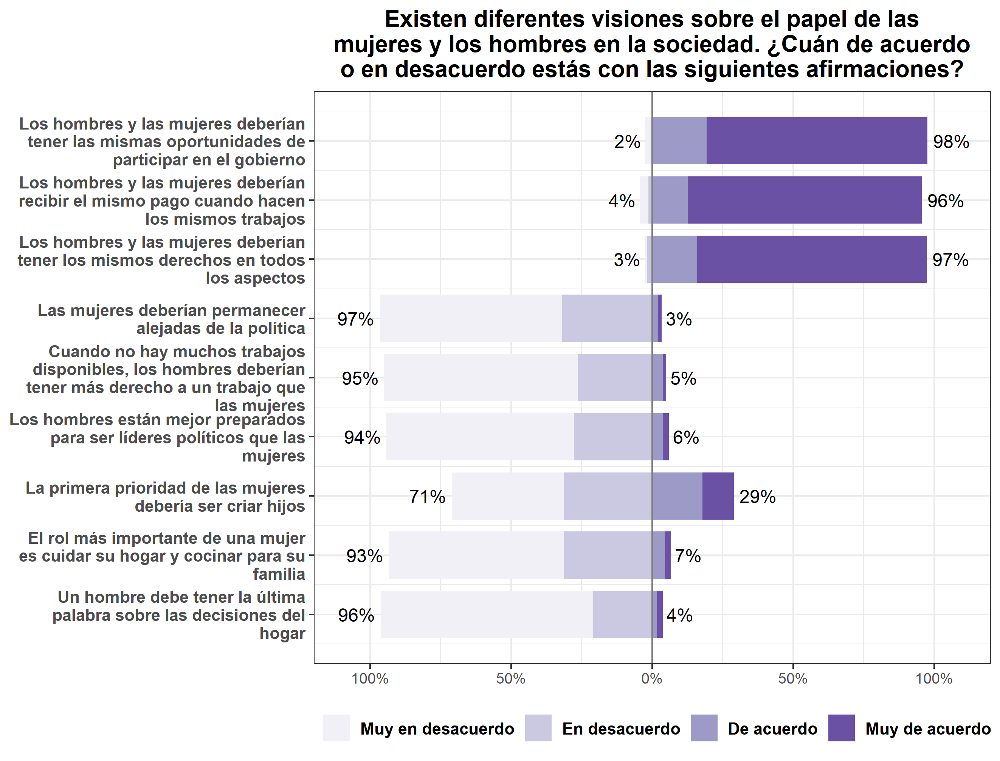

```{r setup}
knitr::opts_chunk$set(warning = FALSE, 
                      message = FALSE,
                      error = TRUE)
options(scipen=999)
```

```{r}
pacman::p_load(stargazer, ggplot2, sjmisc, car, sjlabelled, haven, cowplot,
               summarytools, kableExtra, corrplot, coefplot, ltm, polycor,
               psych, lme4, ppcor, texreg, skimr, gtools, bda, lmerTest, Matrix, extrafont, sessioninfo,sjPlot, dplyr)

##sessionInfo()
#R version 4.0.2 (2020-06-22)
#Platform: x86_64-w64-mingw32/x64 (64-bit)
#Running under: Windows 10 x64 (build 19042)

#Matrix products: default

#locale:
#[1] LC_COLLATE=Spanish_Chile.1252  LC_CTYPE=Spanish_Chile.1252    LC_MONETARY=Spanish_Chile.1252 LC_NUMERIC=C                   LC_TIME=Spanish_Chile.1252    

#attached base packages:
#[1] stats     graphics  grDevices utils     datasets  methods   base     

#other attached packages:
#[1] sessioninfo_1.1.1  dplyr_1.0.2        skimr_2.1.2        texreg_1.37.5      ppcor_1.1          lme4_1.1-26        Matrix_1.3-2       psych_2.0.12      
#[9] ltm_1.1-1          polycor_0.7-10     msm_1.6.8          MASS_7.3-53        coefplot_1.2.7     corrplot_0.84      kableExtra_1.3.1   summarytools_0.9.8
#[17] sjPlot_2.8.7       cowplot_1.1.1      haven_2.3.1        sjlabelled_1.1.7   car_3.0-10         carData_3.0-4      sjmisc_2.8.6       ggplot2_3.3.3     
#[25] stargazer_5.2.2 


# Cargar base
load("../input/data-proc/data.rda")
```
# Descriptivos
```{r, results='asis'}
data$igualdad.est <- set_label(x = data$igualdad.est,label = "Actitudes del estudiante hacia la igualdad de género")
data$esp_publico.est <- set_label(x = data$esp_publico.est,label = "Actitudes del estudiante hacia la distribución igualitaria de roles en la esfera pública")
data$esp_privado.est <- set_label(x = data$esp_privado.est,label = "Actitudes del estudiante hacia la distribución igualitaria de roles en la esfera privada")
data$igualdad.pad <- set_label(x = data$igualdad.pad,label = "Actitudes del apoderado hacia la igualdad de género")
data$esp_publico.pad <- set_label(x = data$esp_publico.pad,label = "Actitudes del apoderado hacia la distribución igualitaria de roles en la esfera pública")
data$esp_privado.pad <- set_label(x = data$esp_privado.pad,label = "Actitudes del apoderado hacia la distribución igualitaria de roles en la esfera privada")
data$Sexo <- set_label(x = data$Sexo,label = "Sexo del estudiante")
data$Educacion <- set_label(x = data$Educacion,label = "Nivel educacional apoderado/a") # Etiquetar variable
data$Libros_apod_rec <- set_label(x = data$Libros_apod_rec,label = "Cantidad de libros en el hogar")
data$quintiles_ingresos_pc_factor <- set_label(x = data$quintiles_ingresos_pc_factor, label = "Ingresos per cápita del hogar en quintiles")
data$ap_discusion <- set_label(x = data$ap_discusion,label = "Percepción individual sobre la apertura a la discusión en el aula")
data$mean_discusion <- set_label(x = data$mean_discusion,label = "Percepción promedio del curso sobre la apertura a la discusión en el aula")
data$num_fem <- set_label(x = data$num_fem,label = "Proporción de niñas en el aula")
data$dependencia <- set_label(x=data$dependencia, label = "Dependencia administrativa de la escuela")
data$REGION <- set_label(x=data$REGION, label = "Región")
data$c_civic <- set_label(x = data$c_civic, label = "Conocimiento cívico conceptual")

descr <-
  data %>% select(
    igualdad.est,
    esp_publico.est,
    esp_privado.est,
    Sexo,
    ap_discusion,
    mean_discusion,
    num_fem,
    RBD,
    igualdad.pad,
    esp_publico.pad,
    esp_privado.pad,
    Educacion,
    Libros_apod_rec,
    quintiles_ingresos_pc_factor,
    dependencia,
    REGION,
    c_civic
  ) %>% ungroup()
st_css()
print(dfSummary(descr,
               plain.ascii = FALSE,
               style = "grid",
               tmp.img.dir = "/tmp",
               graph.magnif = 0.75,
               headings = F,  # encabezado
               varnumbers = F, # num variable
               labels.col = T, # etiquetas
               na.col = T,    # missing
               graph.col = T, # plot
               valid.col = T, # n valido
               # col.widths = c(5,5,10,10,10,10)
               ),
     method = "render")
```

## Indicadores igualdad de género

### Estudiantes


### Apoderados


# Bivariados: Correlaciones
## Igualdad de género estudiantes
### Indicadores
```{r}
png("../output/cor_indicadores_ig_est.png",width=600,height=600)
corrplot.mixed(cor(dplyr::select(data,Igualdad1_rec.est, Igualdad5_rec.est, Igualdad7_rec.est, Igualdad3_rec.est, Igualdad4_rec.est, Igualdad6_rec.est, Igualdad2_rec.est, Igualdad8_rec.est, Igualdad9_rec.est),
                   use = "na.or.complete", method="spearman"))

dev.off()

#png("../output/cor_indicadores_ig_est.png",width=600,height=400)
windowsFonts(A = windowsFont("Times New Roman"))
cormat <- cor(dplyr::select(data,Igualdad1_rec.est, Igualdad5_rec.est, Igualdad7_rec.est, Igualdad3_rec.est, Igualdad4_rec.est, Igualdad6_rec.est, Igualdad2_rec.est, Igualdad8_rec.est, Igualdad9_rec.est), use = "na.or.complete", method="spearman")
#rownames(cormat) <-c(
 #   "A. Iguales oportunidades de participar en el gobierno",
  #  "B. Hombres y mujeres deberían recibir el mismo pago",
   # "C. Hombres y mujeres deberían tener los mismos derechos",
    #"D. Mujeres deberían permanecer alejadas de la política",
    #"E. Hombres deberían tener más derecho a un trabajo",
    #"F. Hombres están más preparados para ser líderes políticos",
    #"G. Primera prioridad de las mujeres es criar hijos",
    #"H. El rol de una mujer es cuidar su hogar y familia",
    #"I. Hombres deben tener la última palabra sobre el hogar")
#colnames(cormat) <-c("(A)", "(B)","(C)","(D)","(E)", "(F)","(G)","(H)","(I)")
corrplot(
cormat,
  method = "color",
  type = "upper",
  tl.col = "black",
  addCoef.col = "black",
  diag = TRUE,
  family = "A",
  number.font = 6,
  tl.cex =0.75,
  number.cex = 1)
```

### Puntuaciones factoriales
```{r}
png("../output/cor_punt_fact_ig_est.png",width=600,height=600)
corrplot.mixed(cor(dplyr::select(data, igualdad.est, esp_publico.est, esp_privado.est),
                   use = "na.or.complete"))
dev.off()

windowsFonts(A = windowsFont("Times New Roman"))
cormat <- cor(dplyr::select(data, igualdad.est, esp_publico.est, esp_privado.est),
                   use = "na.or.complete")

#rownames(cormat) <-c(
 #   "A. Igualdad de derechos en general",
  #  "B. Supremacía masculina en el espacio publico",
   # "C. Supremacía masculina en el espacio privado")
#colnames(cormat) <-c("(A)", "(B)","(C)")
corrplot(
cormat,
  method = "color",
  type = "upper",
  tl.col = "black",
  addCoef.col = "black",
  diag = TRUE,
  family = "A",
  number.font = 6,
  tl.cex =0.75,
  number.cex = 1)
```

### Sexo

Se estimaron correlaciones biseriales. A continuación aparecen los valores de las correlaciones para cada dimensión y más adelante se presentan los mismos resultados ordenados en una tabla.

#### Igualdad de derechos y oportunidades
```{r}
# level = 2 es la categoría a utilizar, en este caso mujer (2)
biserial.cor(data$igualdad.est,data$Sexo, use = c("complete.obs"), level = 2) 
```
#### Distribución igualitaria en el espacio público
```{r}
biserial.cor(data$esp_publico.est,data$Sexo, use = c("complete.obs"), level = 2)
```
#### Distribución igualitaria en el espacio privado
```{r}
biserial.cor(data$esp_privado.est,data$Sexo, use = c("complete.obs"), level = 2)
```
#### Tabla de correlaciones biseriales

| Variable                                     	| Sexo  |
|----------------------------------------------	|-------|
| Igualdad de derechos entre hombres y mujeres 	| 0.164 |
| Distribución de poder en el espacio público  	| 0.208 |
| Distribución de poder en el espacio privado  	| 0.207 |

### Recursos de la familia
```{r}
data$Educacion. <-as.numeric(data$Educacion)
data$Libros_apod_rec. <-as.numeric(data$Libros_apod_rec)

png("../output/cor_ig_est_recursos.png",width=600,height=600)
corrplot.mixed(cor(dplyr::select(data, igualdad.est, esp_publico.est, esp_privado.est, Educacion., Libros_apod_rec., ingresos_tramos),
                   use = "na.or.complete"))
dev.off()

windowsFonts(A = windowsFont("Times New Roman"))
cormat <- cor(dplyr::select(data, igualdad.est, esp_publico.est, esp_privado.est, Educacion., Libros_apod_rec., ingresos_tramos),
                   use = "na.or.complete")

corrplot(
cormat,
  method = "color",
  type = "upper",
  tl.col = "black",
  addCoef.col = "black",
  diag = TRUE,
  family = "A",
  number.font = 6,
  tl.cex =0.75,
  number.cex = 1)
```

### Igualdad de género apoderados
```{r}
png("../output/cor_fact_ig_est_apod.png",width=600,height=600)
corrplot.mixed(cor(dplyr::select(data, igualdad.est, esp_publico.est, esp_privado.est, igualdad.pad, esp_publico.pad, esp_privado.pad),
                   use = "na.or.complete"))
dev.off()

windowsFonts(A = windowsFont("Times New Roman"))
cormat <- cor(dplyr::select(data, igualdad.est, esp_publico.est, esp_privado.est, igualdad.pad, esp_publico.pad, esp_privado.pad),
                   use = "na.or.complete")

corrplot(
cormat,
  method = "color",
  type = "upper",
  tl.col = "black",
  addCoef.col = "black",
  diag = TRUE,
  family = "A",
  number.font = 6,
  tl.cex =0.75,
  number.cex = 1)
```

### Apertura a la discusion en el aula y proporción de niñas
```{r}
png("../output/cor_ig_est_escuela.png",width=600,height=600)
corrplot.mixed(cor(dplyr::select(data, igualdad.est, esp_publico.est, esp_privado.est, ap_discusion, mean_discusion, num_fem),
                   use = "na.or.complete"))
dev.off()

windowsFonts(A = windowsFont("Times New Roman"))
cormat <- cor(dplyr::select(data, igualdad.est, esp_publico.est, esp_privado.est, ap_discusion, mean_discusion, num_fem),
                   use = "na.or.complete")

corrplot(
cormat,
  method = "color",
  type = "upper",
  tl.col = "black",
  addCoef.col = "black",
  diag = TRUE,
  family = "A",
  number.font = 6,
  tl.cex =0.75,
  number.cex = 1)
```

## Igualdad de género apoderados
### Indicadores
```{r}
png("../output/cor_indicadores_ig_apod.png",width=600,height=600)
corrplot.mixed(cor(dplyr::select(data,Igualdad1_rec.pad, Igualdad5_rec.pad, Igualdad7_rec.pad, Igualdad3_rec.pad, Igualdad4_rec.pad, Igualdad6_rec.pad, Igualdad2_rec.pad, Igualdad8_rec.pad, Igualdad9_rec.pad),
                   use = "na.or.complete", method="spearman"))
dev.off()

windowsFonts(A = windowsFont("Times New Roman"))
cormat <- cor(dplyr::select(data,Igualdad1_rec.pad, Igualdad5_rec.pad, Igualdad7_rec.pad, Igualdad3_rec.pad, Igualdad4_rec.pad, Igualdad6_rec.pad, Igualdad2_rec.pad, Igualdad8_rec.pad, Igualdad9_rec.pad),
                   use = "na.or.complete", method="spearman")

corrplot(
cormat,
  method = "color",
  type = "upper",
  tl.col = "black",
  addCoef.col = "black",
  diag = TRUE,
  family = "A",
  number.font = 6,
  tl.cex =0.75,
  number.cex = 1)
```

### Puntuaciones factoriales
```{r}
png("../output/cor_punt_fact_ig_apod.png",width=600,height=600)
corrplot.mixed(cor(dplyr::select(data, igualdad.pad, esp_publico.pad, esp_privado.pad),
                   use = "na.or.complete"))
dev.off()

windowsFonts(A = windowsFont("Times New Roman"))
cormat <- cor(dplyr::select(data,igualdad.pad, esp_publico.pad, esp_privado.pad),
                   use = "na.or.complete")

corrplot(
cormat,
  method = "color",
  type = "upper",
  tl.col = "black",
  addCoef.col = "black",
  diag = TRUE,
  family = "A",
  number.font = 6,
  tl.cex =0.75,
  number.cex = 1)
```

### Recursos de la familia
```{r}
png("../output/cor_ig_apod_recursos.png",width=600,height=600)
corrplot.mixed(cor(dplyr::select(data, igualdad.pad, esp_publico.pad, esp_privado.pad, Educacion., Libros_apod_rec., ingresos_tramos),
                   use = "na.or.complete"))
dev.off()

windowsFonts(A = windowsFont("Times New Roman"))
cormat <- cor(dplyr::select(data, igualdad.pad, esp_publico.pad, esp_privado.pad, Educacion., Libros_apod_rec., ingresos_tramos),
                   use = "na.or.complete")

corrplot(
cormat,
  method = "color",
  type = "upper",
  tl.col = "black",
  addCoef.col = "black",
  diag = TRUE,
  family = "A",
  number.font = 6,
  tl.cex =0.75,
  number.cex = 1)
```

# Modelos de regresión
## Modelo nulo
```{r}
data$RBD <- as.factor(data$RBD)

reg0_igualdad <- lme4::lmer(igualdad.est ~ 1 + (1 | RBD), data=data)
reg0_pub <- lme4::lmer(esp_publico.est ~ 1 + (1 | RBD), data=data)
reg0_priv <- lme4::lmer(esp_privado.est ~ 1 + (1 | RBD), data=data)

#stargazer::stargazer(reg0_igualdad, reg0_pub, reg0_priv,
 # column.labels=c("Igualdad","Espacio público", "Espacio privado"),
  #type ='text')

#screenreg(list(reg0_igualdad, reg0_pub, reg0_priv))
```

```{r results='asis'}
htmlreg(list(reg0_igualdad,reg0_pub, reg0_priv), custom.model.names = c("Actitudes del estudiante hacia la igualdad de derechos y oportunidades", "Actitudes del estudiante hacia la distribución igualitaria de roles en la esfera pública", "Actitudes del estudiante hacia la distribución igualitaria de roles en la esfera privada"), custom.note = "$***p <$ 0.001, $**p <$ 0.01, $*p <$ 0.05",  custom.coef.names = c("Intercepto"))
```
### Correlación intra-clase
#### Igualdad de derechos y oportunidades
```{r warning=FALSE, message=FALSE}
reghelper::ICC(reg0_igualdad)
```
#### Distribución igualitaria en el espacio público
```{r warning=FALSE, message=FALSE}
reghelper::ICC(reg0_pub)
```
#### Distribución igualitaria en el espacio privada
```{r warning=FALSE, message=FALSE}
reghelper::ICC(reg0_priv)
```

## Modelos de regresión 
```{r}
reg_igualdad <- lmer(igualdad.est ~ 1 + Sexo + factor(Educacion) + factor(Libros_apod_rec) + factor(quintiles_ingresos_pc_factor) + igualdad.pad + ap_discusion + mean_discusion + num_fem + factor(dependencia) + factor(REGION) + c_civic + (1 | RBD), data=data)
reg_esp.pub <- lmer(esp_publico.est ~ 1 + Sexo + factor(Educacion) + factor(Libros_apod_rec) + factor(quintiles_ingresos_pc_factor) + esp_publico.pad + ap_discusion + mean_discusion + num_fem + factor(dependencia) + factor(REGION) + c_civic + (1 | RBD), data=data)
reg_esp.priv <- lmer(esp_privado.est ~ 1 + Sexo + factor(Educacion) + factor(Libros_apod_rec) + factor(quintiles_ingresos_pc_factor) + esp_privado.pad + ap_discusion + mean_discusion + num_fem + factor(dependencia) + factor(REGION) + c_civic + (1 | RBD), data=data)
#screenreg(list(reg_igualdad,reg_esp.pub,reg_esp.priv))
```
### Hipótesis 1.
*H1: Las niñas presentarán actitudes más positivas hacia la igualdad de género que los niños.*
```{r results='asis'}
htmlreg(list(reg_igualdad,reg_esp.pub,reg_esp.priv), custom.model.names = c("Actitudes del estudiante hacia la igualdad de derechos y oportunidades", "Actitudes del estudiante hacia la distribución igualitaria de roles en la esfera pública", "Actitudes del estudiante hacia la distribución igualitaria de roles en la esfera privada"), omit.coef = "(Educacion)|(Libros_apod_rec)|(quintiles_ingresos_pc_factor)|(igualdad.pad)|(esp_publico.pad)|(esp_privado.pad)|(ap_discusion)|(mean_discusion)|(num_fem)|(dependencia)|(REGION)|(c_civic)", custom.note = "$***p <$ 0.001, $**p <$ 0.01, $*p <$ 0.05 <br> Todos los modelos están controlados por el resto de las variables analizadas, la dependencia administrativa de la escuela, la región y el nivel de conocimiento cívico del estudiante.",  custom.coef.names = c("Intercepto", "Sexo<br> <i>(Ref. Niño)</i>"))
```

### Hipótesis 2.
*H2: Estudiantes que provienen de familias con mayores recursos socioeconómicos presentarán actitudes más positivas hacia la igualdad de género.*

#### Educación
```{r results='asis'}
htmlreg(list(reg_igualdad,reg_esp.pub,reg_esp.priv), custom.model.names = c("Actitudes del estudiante hacia la igualdad de derechos y oportunidades", "Actitudes del estudiante hacia la distribución igualitaria de roles en la esfera pública", "Actitudes del estudiante hacia la distribución igualitaria de roles en la esfera privada"), omit.coef = "(Sexo)|(Libros_apod_rec)|(quintiles_ingresos_pc_factor)|(igualdad.pad)|(esp_publico.pad)|(esp_privado.pad)|(ap_discusion)|(mean_discusion)|(num_fem)|(dependencia)|(REGION)|(c_civic)", custom.note = "$***p <$ 0.001, $**p <$ 0.01, $*p <$ 0.05 <br> Todos los modelos están controlados por el resto de las variables analizadas, la dependencia administrativa de la escuela, la región y el nivel de conocimiento cívico del estudiante.",  custom.coef.names = c("Intercepto", "Educación Media <br> <i>(Ref. 8vo básico o menos)</i>", "Educación Técnica Superior (IP o CFT)", "Una carrera en la Universidad o estudios de Posgrado"))
```
#### Cantidad de libros en el hogar
```{r results='asis'}
htmlreg(list(reg_igualdad,reg_esp.pub,reg_esp.priv), custom.model.names = c("Actitudes del estudiante hacia la igualdad de derechos y oportunidades", "Actitudes del estudiante hacia la distribución igualitaria de roles en la esfera pública", "Actitudes del estudiante hacia la distribución igualitaria de roles en la esfera privada"), omit.coef = "(Sexo)|(Educacion)|(quintiles_ingresos_pc_factor)|(igualdad.pad)|(esp_publico.pad)|(esp_privado.pad)|(ap_discusion)|(mean_discusion)|(num_fem)|(dependencia)|(REGION)|(c_civic)", custom.note = "$***p <$ 0.001, $**p <$ 0.01, $*p <$ 0.05 <br> Todos los modelos están controlados por el resto de las variables analizadas, la dependencia administrativa de la escuela, la región y el nivel de conocimiento cívico del estudiante.",  custom.coef.names = c("Intercepto", "Entre 11 y 25 libros <br> <i>(Ref. Entre 0 y 10 libros)</i>", "Entre 26 y 100 libros", "Más de 100 libros"))
```
#### Ingresos
```{r results='asis'}
htmlreg(list(reg_igualdad,reg_esp.pub,reg_esp.priv), custom.model.names = c("Actitudes del estudiante hacia la igualdad de derechos y oportunidades", "Actitudes del estudiante hacia la distribución igualitaria de roles en la esfera pública", "Actitudes del estudiante hacia la distribución igualitaria de roles en la esfera privada"), omit.coef = "(Sexo)|(Educacion)|(Libros_apod_rec)|(igualdad.pad)|(esp_publico.pad)|(esp_privado.pad)|(ap_discusion)|(mean_discusion)|(num_fem)|(dependencia)|(REGION)|(c_civic)", custom.note = "$***p <$ 0.001, $**p <$ 0.01, $*p <$ 0.05 <br> Todos los modelos están controlados por el resto de las variables analizadas, la dependencia administrativa de la escuela, la región y el nivel de conocimiento cívico del estudiante.",  custom.coef.names = c("Intercepto", "Quintil 2 <br> <i>(Ref. Quintil 1)</i>", "Quintil 3", "Quintil 4", "Quintil 5", "No sabe / No responde"))
```

### Hipótesis 3.
*H3: Estudiantes con apoderados que poseen actitudes más positivas hacia la igualdad de género presentarán actitudes más positivas hacia la igualdad de género.*
```{r results='asis'}
htmlreg(list(reg_igualdad,reg_esp.pub,reg_esp.priv), custom.model.names = c("Actitudes del estudiante hacia la igualdad de derechos y oportunidades", "Actitudes del estudiante hacia la distribución igualitaria de roles en la esfera pública", "Actitudes del estudiante hacia la distribución igualitaria de roles en la esfera privada"), omit.coef = "(Sexo)|(Educacion)|(Libros_apod_rec)|(quintiles_ingresos_pc_factor)|(ap_discusion)|(mean_discusion)|(num_fem)|(dependencia)|(REGION)|(c_civic)", custom.note = "$***p <$ 0.001, $**p <$ 0.01, $*p <$ 0.05 <br> Todos los modelos están controlados por el resto de las variables analizadas, la dependencia administrativa de la escuela, la región y el nivel de conocimiento cívico del estudiante.",  custom.coef.names = c("Intercepto", "Actitudes del apoderado hacia la igualdad de derechos y oportunidades", "Actitudes del apoderado hacia la distribución igualitaria de roles en la esfera pública", "Actitudes del apoderado hacia la distribución igualitaria de roles en la esfera privada"))
```
### Hipótesis 4.
*H4: Apoderados con mayores recursos socioeconómicos presentarán actitudes más positivas hacia la igualdad de género.*
```{r}
h4_igualdad.apod <- lmer(igualdad.pad ~ 1 + factor(Educacion) + factor(Libros_apod_rec) + factor(quintiles_ingresos_pc_factor) + factor(REGION) + (1 | RBD), data=data)
h4_esp_pub.apod <- lmer(esp_publico.pad ~ 1 + factor(Educacion) + factor(Libros_apod_rec) + factor(quintiles_ingresos_pc_factor) + factor(REGION) + (1 | RBD), data=data)
h4_esp_priv.apod <- lmer(esp_privado.pad ~ 1 + factor(Educacion) + factor(Libros_apod_rec) + factor(quintiles_ingresos_pc_factor) + factor(REGION) + (1 | RBD), data=data)
#screenreg(list(h4_igualdad.apod,h4_esp_pub.apod,h4_esp_priv.apod))
```
#### Educación
```{r results='asis'}
htmlreg(list(h4_igualdad.apod,h4_esp_pub.apod,h4_esp_priv.apod), custom.model.names = c("Actitudes del apoderado hacia  la igualdad de derechos  y oportunidades", "Actitudes del apoderado hacia  la distribución igualitaria de roles en la esfera pública", "Actitudes del apoderado hacia  la distribución igualitaria de roles en la esfera privada"), omit.coef = "(Libros_apod_rec)|(quintiles_ingresos_pc_factor)|(REGION)", custom.note = "$***p <$ 0.001, $**p <$ 0.01, $*p <$ 0.05 <br> Los modelos están controlados por la cantidad de libros en el hogar, los ingresos mensuales de los miembros del hogar y la región en que residen.",  custom.coef.names = c("Intercepto", "Educación Media <br> <i>(Ref. 8vo básico o menos)</i>", "Educación Técnica Superior (IP o CFT)", "Una carrera en la Universidad o  estudios de Posgrado"))
```
#### Cantidad de libros en el hogar
```{r results='asis'}
htmlreg(list(h4_igualdad.apod,h4_esp_pub.apod,h4_esp_priv.apod), custom.model.names = c("Actitudes del apoderado hacia  la igualdad de derechos  y oportunidades", "Actitudes del apoderado hacia  la distribución igualitaria de roles en la esfera pública", "Actitudes del apoderado hacia  la distribución igualitaria de roles en la esfera privada"), omit.coef = "(Educacion)|(quintiles_ingresos_pc_factor)|(REGION)", custom.note = "$***p <$ 0.001, $**p <$ 0.01, $*p <$ 0.05 <br> Los modelos están controlados por el nivel educativo del apoderado, los ingresos mensuales de los miembros del hogar y la región en que residen.",  custom.coef.names = c("Intercepto", "Entre 11 y 25 libros <br> <i>(Ref. Entre 0 y 10 libros)</i>", "Entre 26 y 100 libros", "Más de 100 libros"))
```
#### Ingresos
```{r results='asis'}
htmlreg(list(h4_igualdad.apod,h4_esp_pub.apod,h4_esp_priv.apod), custom.model.names = c("Actitudes del apoderado hacia  la igualdad de derechos  y oportunidades", "Actitudes del apoderado hacia  la distribución igualitaria de roles en la esfera pública", "Actitudes del apoderado hacia  la distribución igualitaria de roles en la esfera privada"), omit.coef = "(Libros_apod_rec)|(Educacion)|(REGION)", custom.note = "$***p <$ 0.001, $**p <$ 0.01, $*p <$ 0.05 <br> Los modelos están controlados por el nivel educativo del apoderado, la cantidad de libros en el hogar y la región en que residen.",  custom.coef.names = c("Intercepto", "Quintil 2 <br> <i>(Ref. Quintil 1)</i>", "Quintil 3", "Quintil 4", "Quintil 5", "No sabe / No responde"))
```
#### Modelo H4 completo 
```{r results='asis'}
htmlreg(list(h4_igualdad.apod,h4_esp_pub.apod,h4_esp_priv.apod), custom.model.names = c("Actitudes del apoderado hacia  la igualdad de derechos  y oportunidades", "Actitudes del apoderado hacia  la distribución igualitaria de roles en la esfera pública", "Actitudes del apoderado hacia  la distribución igualitaria de roles en la esfera privada"), custom.note = "$***p <$ 0.001, $**p <$ 0.01, $*p <$ 0.05",  custom.coef.names = c("Intercepto", "Educación Media <br> <i>(Ref. 8vo básico o menos)</i>", "Educación Técnica Superior (IP o CFT)", "Una carrera en la Universidad o  estudios de Posgrado", "Entre 11 y 25 libros <br> <i>(Ref. Entre 0 y 10 libros)</i>", "Entre 26 y 100 libros", "Más de 100 libros", "Quintil 2 <br> <i>(Ref. Quintil 1)</i>", "Quintil 3", "Quintil 4", "Quintil 5", "No sabe / No responde", "Reg. del Maule <br> <i>(Ref. Reg. de Antofagasta)</i>", "Reg. Metropolitana"))
```

### Hipótesis 5.
*H5: Las características de la escuela (proporción de niñas; apertura a la discusión en el aula) se asocian positivamente con las actitudes de los estudiantes hacia la igualdad de género.*

#### Apertura a la discusión en el aula
```{r results='asis'}
htmlreg(list(reg_igualdad,reg_esp.pub,reg_esp.priv), custom.model.names = c("Actitudes del estudiante hacia  la igualdad de derechos  y oportunidades", "Actitudes del estudiante hacia  la distribución igualitaria de roles en la esfera pública", "Actitudes del estudiante hacia  la distribución igualitaria de roles en la esfera privada"), omit.coef = "(Sexo)|(Educacion)|(Libros_apod_rec)|(quintiles_ingresos_pc_factor)|(igualdad.pad)|(esp_publico.pad)|(esp_privado.pad)|(num_fem)|(dependencia)|(REGION)|(c_civic)", custom.note = "$***p <$ 0.001, $**p <$ 0.01, $*p <$ 0.05 <br> Todos los modelos están controlados por el resto de las variables analizadas, la dependencia administrativa de la escuela, la región y el nivel de conocimiento cívico del estudiante.",  custom.coef.names = c("Intercepto", "Percepción individual sobre la apertura  a la discusión en el aula", "Percepción general sobre la apertura  a la discusión en el aula"))
```
#### Proporción de niñas
```{r results='asis'}
htmlreg(list(reg_igualdad,reg_esp.pub,reg_esp.priv), custom.model.names = c("Actitudes del estudiante hacia  la igualdad de derechos  y oportunidades", "Actitudes del estudiante hacia  la distribución igualitaria de roles en la esfera pública", "Actitudes del estudiante hacia  la distribución igualitaria de roles en la esfera privada"), omit.coef = "(Sexo)|(Educacion)|(Libros_apod_rec)|(quintiles_ingresos_pc_factor)|(igualdad.pad)|(esp_publico.pad)|(esp_privado.pad)|(ap_discusion)|(mean_discusion)|(dependencia)|(REGION)|(c_civic)", custom.note = "$***p <$ 0.001, $**p <$ 0.01, $*p <$ 0.05 <br> Todos los modelos están controlados por el resto de las variables analizadas, la dependencia administrativa de la escuela, la región y el nivel de conocimiento cívico del estudiante.",  custom.coef.names = c("Intercepto", "Proporción de niñas en el aula"))
```
### Pendientes fijas y aleatorias
#### Igualdad de género
```{r}
reg_igualdad_pf <- lmer(igualdad.est ~ 1 + Sexo + factor(Educacion) + factor(Libros_apod_rec) + factor(quintiles_ingresos_pc_factor) + igualdad.pad + ap_discusion + mean_discusion + num_fem + factor(dependencia) + factor(REGION) + c_civic + (1 | RBD), data=data)
# Educación
reg_igualdad_pa1 <- lmer(igualdad.est ~ 1 + Sexo + factor(Educacion) + factor(Libros_apod_rec) + factor(quintiles_ingresos_pc_factor) + igualdad.pad + ap_discusion + mean_discusion + num_fem + factor(dependencia) + factor(REGION) + c_civic + (1 + factor(Educacion) | RBD), data=data)
anova(reg_igualdad_pf,reg_igualdad_pa1) #no
# Libros
reg_igualdad_pa2 <- lmer(igualdad.est ~ 1 + Sexo + factor(Educacion) + factor(Libros_apod_rec) + factor(quintiles_ingresos_pc_factor) + igualdad.pad + ap_discusion + mean_discusion + num_fem + factor(dependencia) + factor(REGION) + c_civic + (1 + factor(Libros_apod_rec) | RBD), data=data)
anova(reg_igualdad_pf,reg_igualdad_pa2) #no
# Ingresos
#reg_igualdad_pa3 <- lmer(igualdad.est ~ 1 + Sexo + factor(Educacion) + factor(Libros_apod_rec) + factor(quintiles_ingresos_pc_factor) + igualdad.pad + ap_discusion + mean_discusion + num_fem + factor(dependencia) + factor(REGION) + c_civic + (1 + factor(quintiles_ingresos_pc_factor) | RBD), data=data) ###no es posible estimar el modelo: "Error: number of observations (=627) <= number of random effects (=720) for term (1 + factor(ingresos_tramos) | RBD); the random-effects parameters and the residual variance (or scale parameter) are probably unidentifiable"
# Actitudes del apoderado
reg_igualdad_pa4 <- lmer(igualdad.est ~ 1 + Sexo + factor(Educacion) + factor(Libros_apod_rec) + factor(quintiles_ingresos_pc_factor) + igualdad.pad + ap_discusion + mean_discusion + num_fem + factor(dependencia) + factor(REGION) + c_civic + (1 + igualdad.pad | RBD), data=data)
anova(reg_igualdad_pf,reg_igualdad_pa4) #sí
# Sexo
reg_igualdad_pa5 <- lmer(igualdad.est ~ 1 + Sexo + factor(Educacion) + factor(Libros_apod_rec) + factor(quintiles_ingresos_pc_factor) + igualdad.pad + ap_discusion + mean_discusion + num_fem + factor(dependencia) + factor(REGION) + c_civic + (1 + Sexo | RBD), data=data)
anova(reg_igualdad_pf,reg_igualdad_pa5) #sí
```
#### Espacio público
```{r}
reg_esp.pub_pf <- lmer(esp_publico.est ~ 1 + Sexo + factor(Educacion) + factor(Libros_apod_rec) + factor(quintiles_ingresos_pc_factor) + esp_publico.pad + ap_discusion + mean_discusion + num_fem + factor(dependencia) + factor(REGION) + c_civic + (1 | RBD), data=data)
# Educación
reg_esp.pub_pa1 <- lmer(esp_publico.est ~ 1 + Sexo + factor(Educacion) + factor(Libros_apod_rec) + factor(quintiles_ingresos_pc_factor) + esp_publico.pad + ap_discusion + mean_discusion + num_fem + factor(dependencia) + factor(REGION) + c_civic + (1 + factor(Educacion) | RBD), data=data)
anova(reg_esp.pub_pf,reg_esp.pub_pa1) #no
# Libros
reg_esp.pub_pa2 <- lmer(esp_publico.est ~ 1 + Sexo + factor(Educacion) + factor(Libros_apod_rec) + factor(quintiles_ingresos_pc_factor) + esp_publico.pad + ap_discusion + mean_discusion + num_fem + factor(dependencia) + factor(REGION) + c_civic + (1 + factor(Libros_apod_rec) | RBD), data=data)
anova(reg_esp.pub_pf,reg_esp.pub_pa2) #no
# Ingresos
#reg_esp.pub_pa3 <- lmer(esp_publico.est ~ 1 + Sexo + factor(Educacion) + factor(Libros_apod_rec) + factor(quintiles_ingresos_pc_factor) + esp_publico.pad + ap_discusion + mean_discusion + num_fem + factor(dependencia) + factor(REGION) + c_civic + (1 + factor(quintiles_ingresos_pc_factor) | RBD), data=data) ###no es posible estimar el modelo: "Error: number of observations (=627) <= number of random effects (=720) for term (1 + factor(ingresos_tramos) | RBD); the random-effects parameters and the residual variance (or scale parameter) are probably unidentifiable"
# Actitudes del apoderado
reg_esp.pub_pa4 <- lmer(esp_publico.est ~ 1 + Sexo + factor(Educacion) + factor(Libros_apod_rec) + factor(quintiles_ingresos_pc_factor) + esp_publico.pad + ap_discusion + mean_discusion + num_fem + factor(dependencia) + factor(REGION) + c_civic + (1 + esp_publico.pad | RBD), data=data)
anova(reg_esp.pub_pf,reg_esp.pub_pa4) #sí
# Sexo
reg_esp.pub_pa5 <- lmer(esp_publico.est ~ 1 + Sexo + factor(Educacion) + factor(Libros_apod_rec) + factor(quintiles_ingresos_pc_factor) + esp_publico.pad + ap_discusion + mean_discusion + num_fem + factor(dependencia) + factor(REGION) + c_civic + (1 + Sexo | RBD), data=data)
anova(reg_esp.pub_pf,reg_esp.pub_pa5) #no
```
#### Espacio privado
```{r}
reg_esp.priv_pf <- lmer(esp_privado.est ~ 1 + Sexo + factor(Educacion) + factor(Libros_apod_rec) + factor(quintiles_ingresos_pc_factor) + esp_privado.pad + ap_discusion + mean_discusion + num_fem + factor(dependencia) + factor(REGION) + c_civic + (1 | RBD), data=data)
# Educación
reg_esp.priv_pa1 <- lmer(esp_privado.est ~ 1 + Sexo + factor(Educacion) + factor(Libros_apod_rec) + factor(quintiles_ingresos_pc_factor) + esp_privado.pad + ap_discusion + mean_discusion + num_fem + factor(dependencia) + factor(REGION) + c_civic + (1 + factor(Educacion) | RBD), data=data)
anova(reg_esp.priv_pf,reg_esp.priv_pa1) #no
# Libros
reg_esp.priv_pa2 <- lmer(esp_privado.est ~ 1 + Sexo + factor(Educacion) + factor(Libros_apod_rec) + factor(quintiles_ingresos_pc_factor) + esp_privado.pad + ap_discusion + mean_discusion + num_fem + factor(dependencia) + factor(REGION) + c_civic + (1 + factor(Libros_apod_rec) | RBD), data=data)
anova(reg_esp.priv_pf,reg_esp.priv_pa2) #no
# Ingresos
#reg_esp.priv_pa3 <- lmer(esp_privado.est ~ 1 + Sexo + factor(Educacion) + factor(Libros_apod_rec) + factor(quintiles_ingresos_pc_factor) + esp_privado.pad + ap_discusion + mean_discusion + num_fem + factor(dependencia) + factor(REGION) + c_civic + (1 + factor(quintiles_ingresos_pc_factor) | RBD), data=data) ###no es posible estimar el modelo: "Error: number of observations (=627) <= number of random effects (=720) for term (1 + factor(ingresos_tramos) | RBD); the random-effects parameters and the residual variance (or scale parameter) are probably unidentifiable"
# Actitudes del apoderado
reg_esp.priv_pa4 <- lmer(esp_privado.est ~ 1 + Sexo + factor(Educacion) + factor(Libros_apod_rec) + factor(quintiles_ingresos_pc_factor) + esp_privado.pad + ap_discusion + mean_discusion + num_fem + factor(dependencia) + factor(REGION) + c_civic + (1 + esp_privado.pad | RBD), data=data)
anova(reg_esp.priv_pf,reg_esp.priv_pa4) #sí
# Sexo
reg_esp.priv_pa5 <- lmer(esp_privado.est ~ 1 + Sexo + factor(Educacion) + factor(Libros_apod_rec) + factor(quintiles_ingresos_pc_factor) + esp_privado.pad + ap_discusion + mean_discusion + num_fem + factor(dependencia) + factor(REGION) + c_civic + (1 + Sexo | RBD), data=data)
anova(reg_esp.priv_pf,reg_esp.priv_pa5) #no
```
### Hipótesis 6.
*H6: Las características de la escuela (proporción de niñas; apertura a la discusión en el aula) mitigan la influencia de los recursos familiares y actitudes de los apoderados sobre las actitudes de los estudiantes hacia la igualdad de género.*
#### Igualdad de género
```{r}
h6a_igualdad <- lmer(igualdad.est ~ 1 + Sexo + factor(Educacion) + factor(Libros_apod_rec) + factor(quintiles_ingresos_pc_factor) + igualdad.pad*mean_discusion + ap_discusion + num_fem + factor(dependencia) + factor(REGION) + c_civic + (1 + igualdad.pad | RBD), data=data)
h6b_igualdad <- lmer(igualdad.est ~ 1 + Sexo + factor(Educacion) + factor(Libros_apod_rec) + factor(quintiles_ingresos_pc_factor) + igualdad.pad*num_fem + ap_discusion + mean_discusion + factor(dependencia) + factor(REGION) + c_civic + (1 + igualdad.pad | RBD), data=data)
h6c_igualdad <- lmer(igualdad.est ~ 1 + Sexo*mean_discusion + factor(Educacion) + factor(Libros_apod_rec) + factor(quintiles_ingresos_pc_factor) + igualdad.pad + ap_discusion + num_fem + factor(dependencia) + factor(REGION) + c_civic + (1 + Sexo | RBD), data=data)
h6d_igualdad <- lmer(igualdad.est ~ 1 + Sexo*num_fem + factor(Educacion) + factor(Libros_apod_rec) + factor(quintiles_ingresos_pc_factor) + igualdad.pad + ap_discusion + mean_discusion + factor(dependencia) + factor(REGION) + c_civic + (1 + Sexo | RBD), data=data)
screenreg(list(reg_igualdad_pf,h6a_igualdad,h6b_igualdad,h6c_igualdad,h6d_igualdad))
```
#### Espacio publico
```{r}
h6a_esp.pub <- lmer(esp_publico.est ~ 1 + Sexo + factor(Educacion) + factor(Libros_apod_rec) + factor(quintiles_ingresos_pc_factor) + esp_publico.pad*mean_discusion + ap_discusion + num_fem + factor(dependencia) + factor(REGION) + c_civic + (1 + esp_publico.pad | RBD), data=data)
h6b_esp.pub <- lmer(esp_publico.est ~ 1 + Sexo + factor(Educacion) + factor(Libros_apod_rec) + factor(quintiles_ingresos_pc_factor) + esp_publico.pad*num_fem + ap_discusion + mean_discusion + factor(dependencia) + factor(REGION) + c_civic + (1 + esp_publico.pad | RBD), data=data)
screenreg(list(reg_esp.pub_pf,h6a_esp.pub,h6b_esp.pub))
```
#### Espacio privado
```{r}
h6a_esp.priv <- lmer(esp_privado.est ~ 1 + Sexo + factor(Educacion) + factor(Libros_apod_rec) + factor(quintiles_ingresos_pc_factor) + esp_privado.pad*mean_discusion + ap_discusion + num_fem + factor(dependencia) + factor(REGION) + c_civic + (1 + esp_privado.pad | RBD), data=data)
h6b_esp.priv <- lmer(esp_privado.est ~ 1 + Sexo + factor(Educacion) + factor(Libros_apod_rec) + factor(quintiles_ingresos_pc_factor) + esp_privado.pad*num_fem + ap_discusion + mean_discusion + factor(dependencia) + factor(REGION) + c_civic + (1 + esp_privado.pad | RBD), data=data)
screenreg(list(reg_esp.priv_pf,h6a_esp.priv,h6b_esp.priv))
```
### Hipótesis 7
*H7: Los efectos planteados en la hipótesis 2, 3, 4, 4a, 5 y 6 estarán condicionados por  el género del estudiante.*
#### H2: igualdad de derechos
```{r}
h7_h2a_igualdad <- lmer(igualdad.est ~ 1 + factor(Educacion)*Sexo + factor(Libros_apod_rec) + factor(quintiles_ingresos_pc_factor) + igualdad.pad + ap_discusion + mean_discusion + num_fem + factor(dependencia) + factor(REGION) + c_civic + (1 + Sexo | RBD), data=data)
h7_h2b_igualdad <- lmer(igualdad.est ~ 1 + factor(Educacion) + factor(Libros_apod_rec)*Sexo + factor(quintiles_ingresos_pc_factor) + igualdad.pad + ap_discusion + mean_discusion + num_fem + factor(dependencia) + factor(REGION) + c_civic + (1 + Sexo | RBD), data=data)
h7_h2c_igualdad <- lmer(igualdad.est ~ 1 + factor(Educacion) + factor(Libros_apod_rec) + factor(quintiles_ingresos_pc_factor)*Sexo + igualdad.pad + ap_discusion + mean_discusion + num_fem + factor(dependencia) + factor(REGION) + c_civic + (1 + Sexo | RBD), data=data)
screenreg(list(h7_h2a_igualdad, h7_h2b_igualdad, h7_h2c_igualdad))
```
#### H2: espacio publico
```{r}
h7_h2a_esp.pub <- lmer(esp_publico.est ~ 1 + factor(Educacion)*Sexo + factor(Libros_apod_rec) + factor(quintiles_ingresos_pc_factor) + esp_publico.pad + ap_discusion + mean_discusion + num_fem + factor(dependencia) + factor(REGION) + c_civic + (1 | RBD), data=data)
h7_h2b_esp.pub <- lmer(esp_publico.est ~ 1 + factor(Educacion) + factor(Libros_apod_rec)*Sexo + factor(quintiles_ingresos_pc_factor) + esp_publico.pad + ap_discusion + mean_discusion + num_fem + factor(dependencia) + factor(REGION) + c_civic + (1 | RBD), data=data)
h7_h2c_esp.pub <- lmer(esp_publico.est ~ 1 + factor(Educacion) + factor(Libros_apod_rec) + factor(quintiles_ingresos_pc_factor)*Sexo + esp_publico.pad + ap_discusion + mean_discusion + num_fem + factor(dependencia) + factor(REGION) + c_civic + (1 | RBD), data=data)
screenreg(list(h7_h2a_esp.pub, h7_h2b_esp.pub, h7_h2c_esp.pub))
```
#### H2: espacio privado
```{r}
h7_h2a_esp.priv <- lmer(esp_privado.est ~ 1 + factor(Educacion)*Sexo + factor(Libros_apod_rec) + factor(quintiles_ingresos_pc_factor) + esp_privado.pad + ap_discusion + mean_discusion + num_fem + factor(dependencia) + factor(REGION) + c_civic + (1 | RBD), data=data)
h7_h2b_esp.priv <- lmer(esp_privado.est ~ 1 + factor(Educacion) + factor(Libros_apod_rec)*Sexo + factor(quintiles_ingresos_pc_factor) + esp_privado.pad + ap_discusion + mean_discusion + num_fem + factor(dependencia) + factor(REGION) + c_civic + (1 | RBD), data=data)
h7_h2c_esp.priv <- lmer(esp_privado.est ~ 1 + factor(Educacion) + factor(Libros_apod_rec) + factor(quintiles_ingresos_pc_factor)*Sexo + esp_privado.pad + ap_discusion + mean_discusion + num_fem + factor(dependencia) + factor(REGION) + c_civic + (1 | RBD), data=data)
screenreg(list(h7_h2a_esp.priv, h7_h2b_esp.priv, h7_h2c_esp.priv))
```
#### H3
```{r}
h7_h3_igualdad <- lmer(igualdad.est ~ 1 + factor(Educacion) + factor(Libros_apod_rec) + factor(quintiles_ingresos_pc_factor) + igualdad.pad*Sexo + ap_discusion + mean_discusion + num_fem + factor(dependencia) + factor(REGION) + c_civic + (1 + igualdad.pad | RBD), data=data)
h7_h3_esp.pub <- lmer(esp_publico.est ~ 1 + factor(Educacion) + factor(Libros_apod_rec) + factor(quintiles_ingresos_pc_factor) + esp_publico.pad*Sexo + ap_discusion + mean_discusion + num_fem + factor(dependencia) + factor(REGION) + c_civic + (1 + esp_publico.pad | RBD), data=data)
h7_h3_esp.priv <- lmer(esp_privado.est ~ 1 + factor(Educacion) + factor(Libros_apod_rec) + factor(quintiles_ingresos_pc_factor) + esp_privado.pad*Sexo + ap_discusion + mean_discusion + num_fem + factor(dependencia) + factor(REGION) + c_civic + (1 + esp_privado.pad | RBD), data=data)
screenreg(list(h7_h3_igualdad, h7_h3_esp.pub, h7_h3_esp.priv))
```
#### H5: apertura a la discusión
```{r}
h7_h5a_igualdad <- lmer(igualdad.est ~ 1 + factor(Educacion) + factor(Libros_apod_rec) + factor(quintiles_ingresos_pc_factor) + igualdad.pad + ap_discusion + mean_discusion*Sexo + num_fem + factor(dependencia) + factor(REGION) + c_civic + (1 + Sexo | RBD), data=data)
h7_h5a_esp.pub <- lmer(esp_publico.est ~ 1 + Sexo + factor(Educacion) + factor(Libros_apod_rec) + factor(quintiles_ingresos_pc_factor) + esp_publico.pad + ap_discusion + mean_discusion*Sexo + num_fem + factor(dependencia) + factor(REGION) + c_civic + (1 | RBD), data=data)
h7_h5a_esp.priv <- lmer(esp_privado.est ~ 1 + Sexo + factor(Educacion) + factor(Libros_apod_rec) + factor(quintiles_ingresos_pc_factor) + esp_privado.pad + ap_discusion + mean_discusion*Sexo + num_fem + factor(dependencia) + factor(REGION) + c_civic + (1 | RBD), data=data)
screenreg(list(h7_h5a_igualdad, h7_h5a_esp.pub, h7_h5a_esp.priv))
```
#### H5: proporción de niñas
```{r}
h7_h5b_igualdad <- lmer(igualdad.est ~ 1 + factor(Educacion) + factor(Libros_apod_rec) + factor(quintiles_ingresos_pc_factor) + igualdad.pad + ap_discusion + mean_discusion + num_fem*Sexo + factor(dependencia) + factor(REGION) + c_civic + (1 + Sexo | RBD), data=data)
h7_h5b_esp.pub <- lmer(esp_publico.est ~ 1 + factor(Educacion) + factor(Libros_apod_rec) + factor(quintiles_ingresos_pc_factor) + esp_publico.pad + ap_discusion + mean_discusion + num_fem*Sexo + factor(dependencia) + factor(REGION) + c_civic + (1 | RBD), data=data)
h7_h5b_esp.priv <- lmer(esp_privado.est ~ 1 + factor(Educacion) + factor(Libros_apod_rec) + factor(quintiles_ingresos_pc_factor) + esp_privado.pad + ap_discusion + mean_discusion + num_fem*Sexo + factor(dependencia) + factor(REGION) + c_civic + (1 | RBD), data=data)
screenreg(list(h7_h5b_igualdad, h7_h5b_esp.pub, h7_h5b_esp.priv))
```
#### H6: apertura a la discusión
```{r}
h7_h6a_igualdad <- lmer(igualdad.est ~ 1 + factor(Educacion) + factor(Libros_apod_rec) + factor(quintiles_ingresos_pc_factor) + igualdad.pad*mean_discusion*Sexo + ap_discusion + num_fem + factor(dependencia) + factor(REGION) + c_civic + (1 + igualdad.pad | RBD), data=data)
screenreg(list(reg_igualdad_pf,h7_h6a_igualdad))
```
#### H6: apertura a la discusión
```{r}
h7_h6a_esp.pub <- lmer(esp_publico.est ~ 1 + factor(Educacion) + factor(Libros_apod_rec) + factor(quintiles_ingresos_pc_factor) + esp_publico.pad*mean_discusion*Sexo + ap_discusion + num_fem + factor(dependencia) + factor(REGION) + c_civic + (1 + esp_publico.pad | RBD), data=data)
screenreg(list(reg_esp.pub_pf,h7_h6a_esp.pub))
```
#### H6: apertura a la discusión
```{r}
h7_h6a_esp.priv <- lmer(esp_privado.est ~ 1 + factor(Educacion) + factor(Libros_apod_rec) + factor(quintiles_ingresos_pc_factor) + esp_privado.pad*mean_discusion*Sexo + ap_discusion + num_fem + factor(dependencia) + factor(REGION) + c_civic + (1 + esp_privado.pad | RBD), data=data)
screenreg(list(reg_esp.priv_pf,h7_h6a_esp.priv))
```
#### H6: proporción de niñas
```{r}
h7_h6b_igualdad <- lmer(igualdad.est ~ 1 + factor(Educacion) + factor(Libros_apod_rec) + factor(quintiles_ingresos_pc_factor) + igualdad.pad*num_fem*Sexo + ap_discusion + mean_discusion + factor(dependencia) + factor(REGION) + c_civic + (1 + igualdad.pad | RBD), data=data)
screenreg(list(reg_igualdad_pf,h7_h6b_igualdad))
```
#### H6: proporción de niñas
```{r}
h7_h6b_esp.pub <- lmer(esp_publico.est ~ 1 + factor(Educacion) + factor(Libros_apod_rec) + factor(quintiles_ingresos_pc_factor) + esp_publico.pad*num_fem*Sexo + ap_discusion + mean_discusion + factor(dependencia) + factor(REGION) + c_civic + (1 + esp_publico.pad | RBD), data=data)
screenreg(list(reg_esp.pub_pf,h7_h6b_esp.pub))
```
#### H6: proporción de niñas
```{r}
h7_h6b_esp.priv <- lmer(esp_privado.est ~ 1 + factor(Educacion) + factor(Libros_apod_rec) + factor(quintiles_ingresos_pc_factor) + esp_privado.pad*num_fem*Sexo + ap_discusion + mean_discusion + factor(dependencia) + factor(REGION) + c_civic + (1 + esp_privado.pad | RBD), data=data)
screenreg(list(reg_esp.priv_pf,h7_h6b_esp.priv))
```
